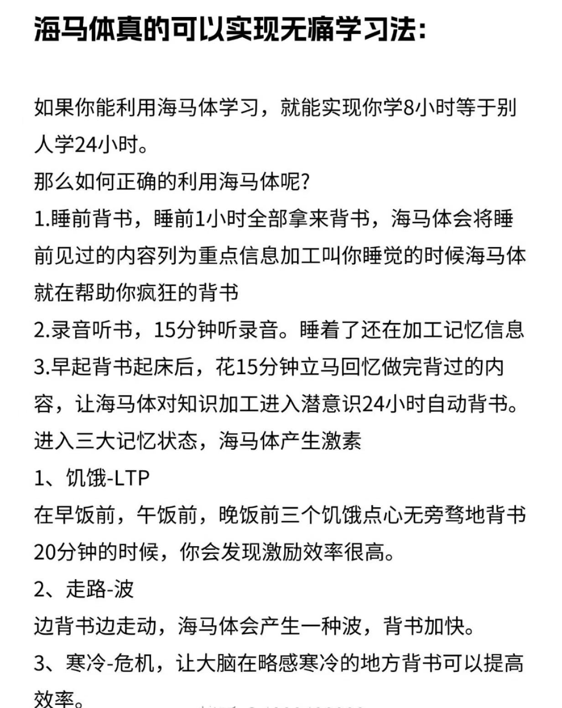
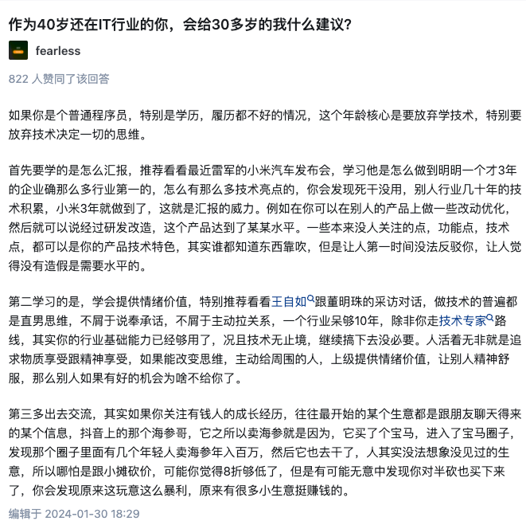

# 我如何强大

> 自省、自律

这篇文章（会持续补充更新），主要是讲我总结的立世准则，我写出来是想分享给看到的朋友一些我的成长经验。

28岁前我是个迷茫的人，是个稀里糊涂、不自信的人。28岁这年因为一些事情我决定要改变自己，因此我总结了从思想到行动上对自我的规范要求，并强迫自己做到。在坚持了一段时间后，我变得自信、上进、坚定。

最后，我想说，每个人成长环境不同，境遇不同，但无论怎样不要苛待内耗自己，要自信、积极的面对一切！

## 行事准则

敢问路在何方？路在脚下！

### **精神内核**

1. 心有静气，遇到困难不退缩，不慌张，寻找合理解决方案，修正目标、预期。
2. 当感觉没收获，不想做，要放弃时，一定要咬牙坚持住，风雨后见彩虹。
3. 不要让情绪左右决断，一定要强迫自己冷静，仔细思考该怎么做。
4. 做自己，发言敢于沉默，不为别人轻易动摇自己，要自信。
   >不为别人轻易动摇自己: 也指不羡慕别人、不为无关的事情影响自己，要做好自己的事情，完成自己制定的计划。
5. 不内耗自己，白费心神，要思想专注，摆脱心猿意马、避免患得患失。
6. 不对抗自己的身体，有了问题及时纠正治疗，哪怕是有重要的事情。
7. 不欺骗、敷衍自己，要实事求是。
8. 做到脸厚心硬，适当降低自我道德水平。
9. 尽人事，听天命，凡事不忧！
10. 不要沉浸在自以为的“假努力”中，要有真正的收获、真正的进步！

### **对人对事**

1. 对人先露三分善，形势逼人不露怯。
2. 遇恶人恶事、险阻困境，要敢争、不硬争、且会争。削弱敌方优势、扩大敌方劣势，提高我方优势、缩小我方劣势。
   > 打嘴架，嘴笨脑子慢怎么办啊？ 狠狠的练口才！
3. 跟人沟通，先带入对方视角思考，这样会考虑周到，方便下判断、做决定。
4. 做事说话，心有尺度，三思而行。思考事情影响、思考事后收益、思考事怎么办的漂亮。
5. 说话前先打腹稿，做到简洁明了，不墨迹。
6. 不要过度思量，虽说三思行事，但也要有度，过多思考会造成犹豫不决、怀疑自己。
7. 根据事实依据和知识做决断，不稀里糊涂办事，但实在想不明白，就立刻决定要不要做。
8. 不对任何人轻易下承诺，说了要做到。
9. 想要做什么，自己知道就行，别对人说，完成后再分享。
10. 针对某件事发表意见看法，要先观察其他人发表的观点，尽量最后说自己的想法，这样可以打开自己的思路，避免考虑不周。
11. 要做行动派，做事有目的性，想好要干嘛，快速达成，不拖延。
12. 学会交流沟通，学会提供情绪价值，学会拉近关系，说话办事让人舒服。
13. 乐观待人待事，以积极的眼光看到一切。
14. 动态规划自己的每一步，每一步尽量做到自己所能达成的最优解。
      >所谓动态规划是指某件事从开始做直到完成，每一步都去寻找自己可以做到的最优的解决方案并执行，即使最终没有达到期望值，那也已经是自己所能做到的最好结果了，这也是一种成功。

### **快速学习**

1. 设定合理目标计划、强迫自己完成。
2. 学习时，读出内容、采用记忆宫殿的方式记忆内容，更容易理解和记忆。按记忆曲线推荐时间来复习内容。
   > 遗忘是先快后慢，所以要及时、经常复习。在5分钟后重复一遍，20分钟后再重复一遍，1小时后，9小时后，1天后，2天后，5天后，8天后，14天后就会记得很牢
3. 观察他人长处，斟酌学习，完善自己。
4. 知识吸收最快的方式就是模仿成功案例，先模仿到掌握再到自己可以创造。
   > 如程序技术就是先仿照再掌握；再比如，读一本立世准则方面的书，我们也是学习其中的内容，先模仿，理解掌握后再结合自身进行创新并融入到自身，吸收成为自己的。
5. 最好的记忆时间段，睡前背书1小时、睡前录音听书15分钟、走路时、饥饿时、寒冷状态
6. 从做中学，即在真正的实践中去学习知识，这样可以快速吸收掌握所学的知识
   > 比如学习一门程序语言，可以直接找示例代码或是设定一个产品目标，立刻去编写制作，在做的过程中慢慢掌握不懂的知识。
7. 学习前辈知识时采用三步骤，以古为敌、以古为友、以古为徒。
   > 李宗吾研究学问说其有三步骤，以古为敌（视古人为敌人，找其漏洞）、以古为友（与古人当做朋友，辨证吸收）、以古为徒（视古人为弟子，指导创新）。

---

## 怎么提高自己？

1. 制定提高自身的目标，提高自身自律性
   1. 语言表达能力
   2. 知识水平
   3. 情商
   4. 领导思维
   5. 做人做事把握好尺度
2. 根据目标立项，学习时的阶段尾声，都建立一个目标项目。
3. 脚踏实地完成每个项目，记住，纸上得来终觉浅，凡事要亲自做过，才明白其中的细节
4. **人生** 2024.8.12记  （30岁的我怎么能摆拖现状，更上层楼？）
   - 持续学习，开发技术要学习但更重要的是从思想上提高自己，作为码农在30这个年纪不要只去死磕技术，要转换思想，争取成为管理，学会管理思维。
   - 交流，学会交流沟通，说话办事让人舒服
   - 厚黑，不要脸，要学会笑对一切事
   - 学会汇报，将基础平凡能讲的高大上
   - 提供情绪价值，为领导提供情绪价值，要学会奉承、学会拉关系。
   - 

---

## 实践记录

1. 演示现场问题复盘，客观描述现象、问题、以及与测试时情况对比，如果某些问题没有证据不下决定，不能直接归因。
2. 工作中，其他项目人员找己方帮忙，要谨慎，不帮最好，避免将问题烧到己方。
3. 某方告知有问题需要排查或解决，那么你不能只考虑这事能不能解决，更要在判断不能解决后把原因各个方面都排查清楚，并向此方讲明白。
