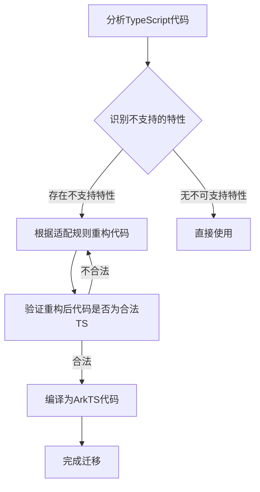

# 从TypeScript到ArkTS的适配规则

原地址：[https://developer.huawei.com/consumer/cn/doc/harmonyos-guides/typescript-to-arkts-migration-guide](https://developer.huawei.com/consumer/cn/doc/harmonyos-guides/typescript-to-arkts-migration-guide)
>ArkTS 针对TS有很多改进，TS是由JS向Java语法靠近，而ArkTs我认为则在TS基础上再迈进一步。

下面是部分摘要内容，还是看原官文说明。

## 一、概述

ArkTS是HarmonyOS应用开发的推荐语言，其基于TypeScript（TS）但约束了部分TS特性，目的是提升开发正确性、减少运行时开销。核心特点包括：

- 保留TS大部分语法特性，未约束的特性完全支持（如自定义装饰器，语法与TS一致）。
- 重构后的代码仍为合法的TS代码。
- 约束分为两个级别：
  - 错误：必须遵从，否则编译失败。
  - 警告：推荐遵从，未来可能变为错误。
- 不支持的特性主要涉及动态类型（降低性能）、增加构建时间的特性，未来可能根据反馈减少限制。

## 二、核心约束原则

### 1. 强制使用静态类型

- 禁止使用`any`和`unknown`类型，要求显式指定具体类型。
- 原因：静态类型可在编译时验证正确性，减少运行时类型检查，提升性能。
- 示例：

  ```typescript
  // TS（不支持）
  let res: any = some_api_function('hello', 'world');

  // ArkTS（支持）
  class CallResult {
    public succeeded(): boolean { ... }
    public errorMessage(): string { ... }
  }
  let res: CallResult = some_api_function('hello', 'world');
  ```

### 2. 禁止在运行时变更对象布局

- 不允许添加/删除对象属性/方法、给属性赋任意类型值。
- 原因：对象布局在编译时确定，动态变更会降低可读性和性能，与静态类型冲突。
- 示例：

  ```typescript
  // TS（部分不报错，ArkTS均报错）
  class Point { x: number = 0; y: number = 0 }
  let p = new Point();
  delete p.x; // TS报错，ArkTS报错
  (p as any).z = 'Label'; // TS不报错，ArkTS报错
  ```

### 3. 限制运算符的语义

- 部分运算符仅适用于特定类型（如一元运算符`+`、`-`、`~`仅适用于数值类型）。
- 原因：减少语言复杂度，避免不必要的运行时开销，使代码更清晰。
- 示例：

  ```typescript
  // TS（支持）
  let s = +'42'; // 隐式转换为number

  // ArkTS（不支持）
  let s = +'42'; // 编译时错误
  ```

### 4. 不支持structural typing

- TS中，结构相同的类型（如具有相同public API的类）可互相赋值；ArkTS不支持，需通过继承、接口等显式建立关系。
- 原因：支持structural typing需额外编译器和运行时开销，与静态类型设计冲突。
- 示例：

  ```typescript
  // TS（支持）
  class T { name: string; greet(): void {} }
  class U { name: string; greet(): void {} }
  let u: U = new T(); // 合法

  // ArkTS（不支持）
  interface Z { name: string; greet(): void }
  class T implements Z { name: string; greet(): void {} }
  class U implements Z { name: string; greet(): void {} }
  let u: Z = new T(); // 需通过接口关联才合法
  ```

## 三、详细约束说明（按类别划分）

### （一）类型与命名约束

| 规则 | 级别 | 错误码 | 说明 | 示例 |
|------|------|--------|------|------|
| 对象的属性名必须是合法的标识符 | 错误 | 10605001 | 不允许数字/字符串作为属性名（例外：字符串字面量、枚举字符串值），数组用数值索引访问 | TS：`{ 'name': 'x', 2: '3' }` → ArkTS：用`class`或`Map` |
| 不支持Symbol() API | 错误 | 10605002 | 仅支持`Symbol.iterator`，因对象布局固定，Symbol无实际意义 | TS：`let prop = Symbol(); p[prop] = 1` → ArkTS：编译错误 |
| 不支持以#开头的私有字段 | 错误 | 10605003 | 改用`private`关键字 | TS：`class C { #foo: number }` → ArkTS：`class C { private foo: number }` |
| 类型、命名空间的命名必须唯一 | 错误 | 10605004 | 类型（类、接口、枚举）和命名空间名称不可重复，且不与变量/函数名冲突 | TS：`let X: string; type X = number[]` → ArkTS：`let X: string; type T = number[]` |

### （二）变量与类型声明约束

| 规则 | 级别 | 错误码 | 说明 | 示例 |
|------|------|--------|------|------|
| 使用let而非var | 错误 | 10605005 | `let`有块级作用域，避免`var`的作用域问题 | TS：`var x = 10` → ArkTS：`let x = 10` |
| 使用具体的类型而非any或unknown | 错误 | 10605008 | 禁止`any`/`unknown`，需显式指定类型 | TS：`let v: any = 10` → ArkTS：`let v: number = 10` |
| 使用class而非具有call signature的类型 | 错误 | 10605014 | 不支持对象类型中的call signature，改用类的方法 | TS：`type F = { (arg: string): string }` → ArkTS：`class F { invoke(arg: string): string }` |
| 仅支持一个静态块 | 错误 | 10605016 | 类中多个静态块需合并为一个 | TS：`class C { static { ... }; static { ... } }` → ArkTS：合并为一个静态块 |

### （三）函数与类约束

| 规则 | 级别 | 错误码 | 说明 | 示例 |
|------|------|--------|------|------|
| 不支持在constructor中声明字段 | 错误 | 10605025 | 字段需在class中声明，而非构造函数参数 | TS：`class P { constructor(private name: string) {} }` → ArkTS：`class P { private name: string; constructor(name: string) { this.name = name } }` |
| 类不允许implements类 | 错误 | 10605051 | 仅允许implements接口 | TS：`class C1 implements C { ... }`（C是类）→ ArkTS：`interface C { ... }; class C1 implements C { ... }` |
| 不支持修改对象的方法 | 错误 | 10605052 | 类方法不可动态修改，需用继承扩展 | TS：`c.foo = bar` → ArkTS：`class Derived extends C { foo() { ... } }` |
| 不支持在函数内声明函数 | 错误 | 10605092 | 改用箭头函数 | TS：`function outer() { function inner() {} }` → ArkTS：`function outer() { let inner = () => {} }` |

### （四）运算符与语句约束

| 规则 | 级别 | 错误码 | 说明 | 示例 |
|------|------|--------|------|------|
| 类型转换仅支持as T语法 | 错误 | 10605053 | 不支持`<type>`语法 | TS：`<Circle>createShape()` → ArkTS：`createShape() as Circle` |
| 不支持delete运算符 | 错误 | 10605059 | 对象布局固定，无法删除属性，可用null替代 | TS：`delete p.y` → ArkTS：`p.y = null` |
| 不支持解构赋值 | 错误 | 10605069 | 需用临时变量获取值 | TS：`let [a, b] = [1, 2]` → ArkTS：`let a = arr[0]; let b = arr[1]` |
| 不支持for .. in | 错误 | 10605080 | 因对象布局固定，需用索引循环 | TS：`for (let i in arr)` → ArkTS：`for (let i = 0; i < arr.length; i++)` |

### （五）模块与导入约束

| 规则 | 级别 | 错误码 | 说明 | 示例 |
|------|------|--------|------|------|
| 不支持require和import赋值表达式 | 错误 | 10605121 | 改用`import * as m from 'mod'` | TS：`import m = require('mod')` → ArkTS：`import * as m from 'mod'` |
| 不支持export = ...语法 | 错误 | 10605126 | 改用常规export/import | TS：`export = Point` → ArkTS：`export class Point { ... }` |
| 不支持在import语句前使用其他语句 | 错误 | 10605150 | 除动态import外，import需在其他语句前 | TS：`class C {}; import foo from 'm'` → ArkTS：`import foo from 'm'; class C {}` |

### （六）其他重要约束

- **不支持生成器函数**：需用`async`/`await`处理并行任务（错误码10605094）。
- **不支持JSX表达式**：完全禁止使用（错误码10605054）。
- **强制严格类型检查**：启用`noImplicitReturns`、`strictNullChecks`等严格模式（错误码10605145）。
- **限制使用标准库**：禁止`eval`、`Object.assign`、`Proxy`等与动态特性相关的接口（错误码10605144）。

## 四、ArkTS与TypeScript迁移流程（mermaid流程图）



## 五、总结

ArkTS通过约束TypeScript的动态特性（如`any`类型、运行时对象修改等），实现了更严格的静态类型检查和更高的运行时性能。迁移时需重点关注类型声明、对象操作、函数与类定义、运算符使用等方面的差异，按照规则重构代码即可确保兼容性和性能。
