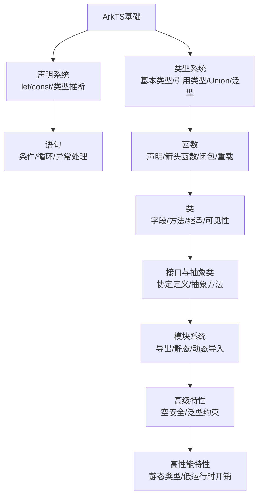

# ArkTS语言介绍

原地址：[https://developer.huawei.com/consumer/cn/doc/harmonyos-guides/introduction-to-arkts](https://developer.huawei.com/consumer/cn/doc/harmonyos-guides/introduction-to-arkts)

## 一、ArkTS概述

ArkTS是专为构建高性能移动应用设计的编程语言，核心特点如下：

- **继承与优化**：基于TypeScript语法扩展，保留大部分TS语法，确保TS开发者无缝过渡。
- **性能聚焦**：限制TypeScript的动态类型特性，减少运行时开销，提升执行效率（更快启动、更低功耗）。
- **互通性**：支持与JavaScript无缝集成，便于重用现有TS/JS代码和库。
- **设计目标**：解决传统语言在移动设备上的低效问题，适配移动环境需求。

## 二、基本知识

### 1. 声明

- **变量声明**：使用`let`，可在执行期间修改值。  
  示例：`let hi: string = 'hello'; hi = 'hello, world';`
- **常量声明**：使用`const`，仅能赋值一次，重新赋值会编译错误。  
  示例：`const hello: string = 'hello';`
- **自动类型推断**：若声明包含初始值，可省略类型标注（编译时自动确定类型）。  
  示例：`let hi1: string = 'hello'; let hi2 = 'hello, world';`（两者均为`string`类型）。

### 2. 类型

ArkTS是静态类型语言，所有类型编译时确定，分为基本类型和引用类型。

| 类型类别 | 具体类型 | 说明 | 示例 |
|----------|----------|------|------|
| 基本类型 | `number` | 整数、浮点数，支持十进制、十六进制（`0x`）、八进制（`0o`）、二进制（`0b`） | `let n1 = 3.14; let n2 = 0x11;` |
|  | `boolean` | 布尔值`true`/`false`，用于条件判断 | `let isDone: boolean = false; if (isDone) { ... }` |
|  | `string` | 字符序列，支持单引号、双引号、模板字面量（`${}`） | `let s3 =`Result: ${a}`;` |
|  | `void` | 函数无返回值，仅可作为泛型参数 | `function hi(): void { console.log('hi'); }` |
| 引用类型 | `Object` | 所有引用类型的基类型，基本类型会自动装箱 | `let obj: Object = 123;`（数字装箱为`Object`） |
|  | `array` | 元素类型一致的集合，索引从0开始 | `let names: string[] = ['Alice', 'Bob'];` |
|  | `enum` | 预定义命名值集合，使用时需加类型前缀 | `enum ColorSet { Red, Green }; let c: ColorSet = ColorSet.Red;` |
|  | `Union` | 多类型组合，变量可赋值为任一组成类型 | `type Animal = Cat | Dog | number; let a: Animal = new Cat();` |
|  | `Aliases` | 为匿名类型或已有类型起别名 | `type Matrix = number[][]; type Handler = (s: string) => string;` |

### 3. 运算符

- **赋值运算符**：`=`及复合赋值（`+=`、`-=`等），如`x += y`等价于`x = x + y`。
- **比较运算符**：`===`（严格相等）、`!==`（严格不等）、`==`（相等）、`!=`（不等）、`>`、`<`等。
- **算术运算符**：一元（`-`、`+`、`--`、`++`）、二元（`+`、`-`、`*`、`/`、`%`）。
- **位运算符**：`&`（与）、`|`（或）、`^`（异或）、`~`（非）、`<<`（左移）等。
- **逻辑运算符**：`&&`（与）、`||`（或）、`!`（非）。

### 4. 语句

- **条件语句**：  
  - `if-else`：根据条件执行分支，非`boolean`类型会隐式转换。  
    示例：`if (s1) { console.log(s1); } else if (s2) { ... }`  
  - `switch`：匹配表达式值执行对应代码块，支持多标签共享代码块，`break`可选。  
    示例：`switch (x) { case 1: ...; case 2: ...; break; default: ... }`  
  - 条件表达式：`condition ? expr1 : expr2`，如`let msg = Math.random() > 0.5 ? 'Valid' : 'Failed';`

- **循环语句**：  
  - `for`：初始化、条件、更新三步循环，如`for (let i = 0; i < 10; i++) { ... }`  
  - `for-of`：遍历数组或字符串，如`for (let ch of 'string') { ... }`  
  - `while`/`do-while`：条件为真时重复执行，`do-while`至少执行一次。  

- **跳转语句**：  
  - `break`：终止循环或`switch`，可带标识符跳出嵌套块。  
  - `continue`：跳过当前循环迭代，进入下一次。  

- **异常处理**：  
  - `throw`：抛出异常（如`throw new Error('error')`）。  
  - `try-catch-finally`：捕获异常并处理，`finally`始终执行。  
    示例：`try { ... } catch (e) { ... } finally { ... }`  

## 三、函数

### 1. 声明与结构

- 包含参数类型、返回类型、函数体，参数必须标注类型。  
  示例：`function add(x: string, y: string): string { return`${x} ${y}`; }`

### 2. 特殊参数

- **可选参数**：格式`name?: Type`或带默认值`name: Type = value`。  
  示例：`function hello(name?: string) { ... }`；`function multiply(n: number, coeff = 2) { ... }`  
- **Rest参数**：最后一个参数用`...restArgs`接收剩余实参（数组形式）。  
  示例：`function sum(...numbers: number[]): number { ... }`

### 3. 其他特性

- **返回类型推断**：若函数体可推断返回类型，可省略标注。  
- **箭头函数**：简化函数表达式，如`let sum = (x: number, y: number) => x + y;`  
- **闭包**：函数捕获外部环境变量，如：  

  ```typescript
  function f(): () => number { let count = 0; return () => { count++; return count; }; }
  let z = f(); z(); // 1；z(); // 2
  ```

- **重载**：多个同名不同签名的函数头，共享实现。  
  示例：`function foo(x: number): void; function foo(x: string): void; function foo(x: any) { ... }`  

## 四、类

### 1. 基本结构

- 声明类时需定义字段、方法、构造函数，通过`new`创建实例。  
  示例：  

  ```typescript
  class Person {
    name: string = '';
    surname: string = '';
    constructor(n: string, sn: string) { this.name = n; this.surname = sn; }
    fullName(): string { return `${this.name} ${this.surname}`; }
  }
  let p = new Person('John', 'Smith');
  ```

### 2. 字段与方法

- **字段**：分实例字段（每个实例独有）和静态字段（类共享，用`static`修饰）。  
  要求：所有字段必须在声明时或构造函数中初始化（避免运行时错误）。  
- **方法**：分实例方法（通过实例调用）和静态方法（通过类名调用，`static`修饰）。  
- **getter/setter**：控制属性访问，如：  

  ```typescript
  class Person {
    private _age: number = 0;
    get age(): number { return this._age; }
    set age(x: number) { if (x >= 0) this._age = x; }
  }
  ```

### 3. 继承与可见性

- **继承**：用`extends`继承父类，子类可重写父类方法（参数类型、返回类型需兼容）。  
  示例：`class Employee extends Person { salary: number = 0; ... }`  
- **父类访问**：用`super`调用父类构造函数或方法，如`super(h, w);`  
- **可见性修饰符**：  
  - `public`：默认，任何地方可访问；  
  - `private`：仅类内部可访问；  
  - `protected`：类内部及子类可访问。  

## 五、接口与抽象类

### 1. 接口

- 定义代码协定（属性和方法声明），类通过`implements`实现接口需实现所有方法。  
  示例：  

  ```typescript
  interface AreaSize { calculateArea(): number; }
  class Rectangle implements AreaSize {
    width: number = 0; height: number = 0;
    calculateArea(): number { return this.width * this.height; }
  }
  ```

- 可继承其他接口，如`interface ExtendedStyle extends Style { ... }`。

### 2. 抽象类

- 带`abstract`修饰，不能实例化，可包含抽象方法（仅声明无实现）。  
  示例：  

  ```typescript
  abstract class Base {
    abstract method(): void; // 抽象方法
    concreteMethod() { ... } // 具体方法
  }
  class Derived extends Base { method() { ... } } // 必须实现抽象方法
  ```

### 3. 区别

| 特性 | 抽象类 | 接口 |
|------|--------|------|
| 继承 | 类只能继承一个抽象类 | 类可实现多个接口 |
| 方法实现 | 可包含具体方法 | 无方法实现（全抽象） |
| 静态成员 | 可包含静态代码块/方法 | 无静态成员 |
| 构造函数 | 有 | 无 |

## 六、泛型

- **作用**：使代码支持多种类型，提高通用性。  
- **泛型类/接口**：定义时带类型参数，使用时指定类型实参。  
  示例：  

  ```typescript
  class CustomStack<Element> { push(e: Element): void { ... } }
  let s = new CustomStack<string>(); s.push('hello');
  ```

- **泛型约束**：限制类型参数范围，如`class MyHashMap<Key extends Hashable, Value> { ... }`  
- **泛型函数**：如`function last<T>(x: T[]): T { return x[x.length - 1]; }`  
- **默认值**：类型参数可设默认值，如`class Base<T = number> { ... }`  

## 七、空安全

- **默认非空**：所有类型默认不允许为`null`/`undefined`（类似TS的`strictNullChecks`）。  
- **可空类型**：用`T | null`声明，如`let x: number | null = null;`  
- **非空断言**：`!`断言值非空，如`a!.value`（运行时为空会报错）。  
- **空值合并**：`??`取左侧非空值，如`this.nick ?? ''`（`nick`为`null`时取空字符串）。  
- **可选链**：`?.`访问属性，为空时返回`undefined`，如`this.spouse?.nick`。  

## 八、模块

- **导出**：用`export`导出变量、类、函数等，如`export class Point { ... }`。  
- **导入**：  
  - 静态导入：`import * as Utils from './utils';` 或 `import { X, Y } from './utils';`  
  - 动态导入：`import('./module').then(obj => { ... })`（按需加载，返回Promise）。  
- **导入HarmonyOS SDK**：支持导入单个模块、多个模块或整个Kit，如：  

  ```typescript
  import { UIAbility } from '@kit.AbilityKit';
  import * as Ability from '@kit.AbilityKit';
  ```

## 九、关键字

- **this**：仅在类的实例方法中使用，指向调用实例或正在构造的对象。  
  限制：不支持`this`类型，禁止在函数或静态方法中使用。  

## 十、ArkTS核心特性流程图



## 总结

ArkTS在TypeScript基础上优化，通过静态类型约束提升性能，同时保留TS语法便利性。核心特性包括严格的类型系统、类与接口的面向对象设计、泛型支持、空安全机制及模块管理，适配移动应用开发需求，便于开发者高效构建高性能应用。
