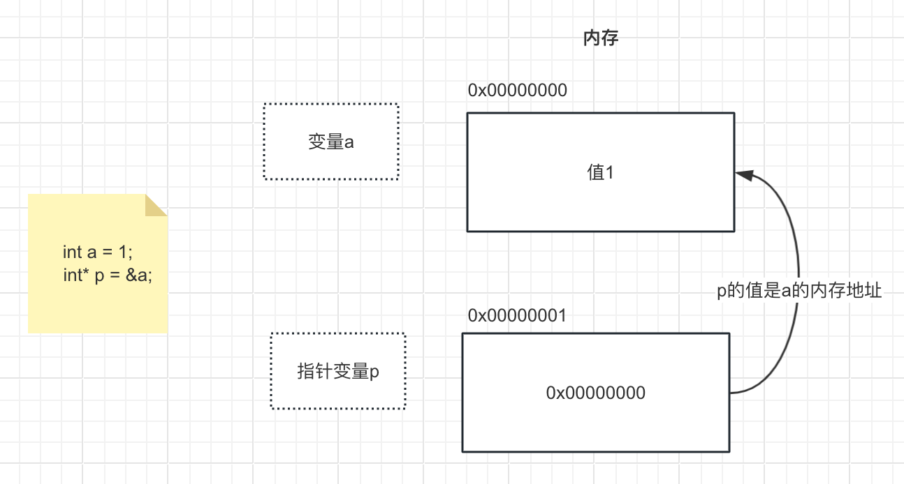

# 指针

（与C相同）每个变量、常量、函数、代码程序在内存中都有特定的位置。 指针就是指向内存地址的数据类型

内存地址 是一种用于软件及硬件等不同层级中的数据概念，用来访问电脑主存中的数据。

## 指针作用

通过指针可以间接访问内存地址。

* 内存地址从0开始记录，一般用十六进制数字表示。
* 可以利用指针变量保存地址。


图解：指针p是新内存地址，其持有变量a在内存中的地址，而a的值是个基本类型，所以a的值 1 直接存储在栈中

## 定义

语法：数据类型+符号 `*` +指针变量名；

指针类型，值是内存地址（十六进制数字）

符号 `&`：取地址符，顾名思义获取数据的内存地址

```cpp
int main(){
    int a = 1;
    //定义一个指针，会在内存中新开一个地址
    int* aPoint = &a;
}
```

## 使用

通过指针可以找到指针指向的内存

指针前+ 符号`*` 表示解引用，通过指针保存的内存地址找到数据

类或结构体中：指针`->`变量名，可访问数据

## 指针内存大小

32位操作系统：4字节（不论啥类型指针）  
64位操作系统：8字节（不论啥类型指针）

## 指针使用原则

1. 未知指针使用前要判断是否为空指针
2. 哪个类申请，哪个类释放，释放时将指针指向nullptr(编号为0的内存地址)，否则指针会成为迷途指针。
3. 有一种智能指针，无需手动申请、释放
4. 指针申请了内存必须要释放。释放原则同步骤2。
