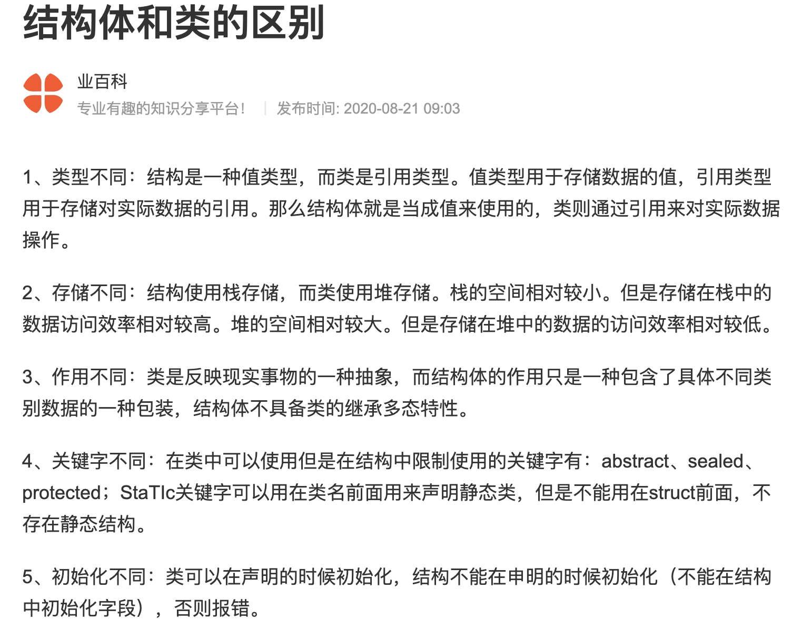

# 结构体

C++结构体与C相同，可查看 **c的基础语法[结构体](../../1.c%E7%9A%84%E5%9F%BA%E7%A1%80%E8%AF%AD%E6%B3%95/14.%E7%BB%93%E6%9E%84%E4%BD%93/)** 章节。

## 语法

struct 结构体名{结构体成员列表;}结构体声明(这个可不写);

```cpp
struct Test{
    int a;
    int b;
    float c;
} test;
```

## 结构体C、C++区别

1. C中`结构体内的变量`在声明时不能直接初始化,会报错，但是C++中可以初始化；
2. c++空结构体有1字节占用；c中空结构体无字节占用；

## 结构体和类的区别


图内容补充：

1. 区别5，C++中我测试是可以直接初始化的，c中确实会报错。  
2. 默认访问权限不同，结构体默认公共，class默认私有

其他资料:[结构体和类区别](https://www.zhihu.com/question/314981402/answer/2281387087)
