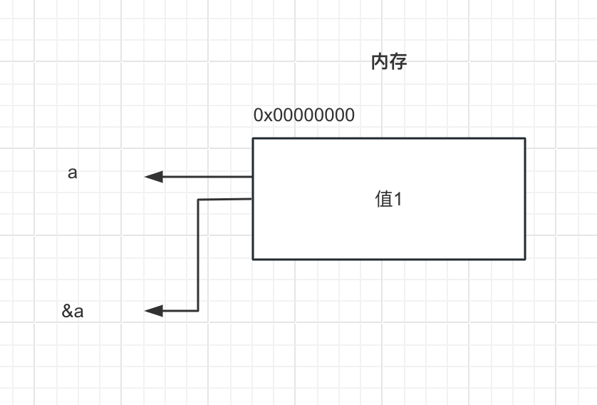

# 引用

>对比C语言，属于C++新增特性

相当于给已存在的变量起一个别名，指向其内存地址，使用关键字`&`标记。


参考资料:[c++引用](https://www.runoob.com/cplusplus/cpp-references.html)

## 引用使用注意

1. 引用必须初始化
2. 引用初始化后无法修改，不能重新指向其他内存
3. 常量没有引用

```cpp
int a = 1;
//int &b; //错误,必须给引用类型初始化 
int &b = a;

int c = 2;
b = c;//这是可以的，此时是赋值操作相当于a=c;，不是更改引用
```

## 引用本质

引用的本质是`指针常量`（例如：int * const）,引用类型由`编译器`自动编译转换为`指针常量`。

```cpp
int main(){
    int a= 1;
    int& b = a;//这里其实编译器会转换为 int* const b = &a; 所以也解释了，为啥引用不能修改指向，但不影响数值修改，因为它是个常量。
}
```
