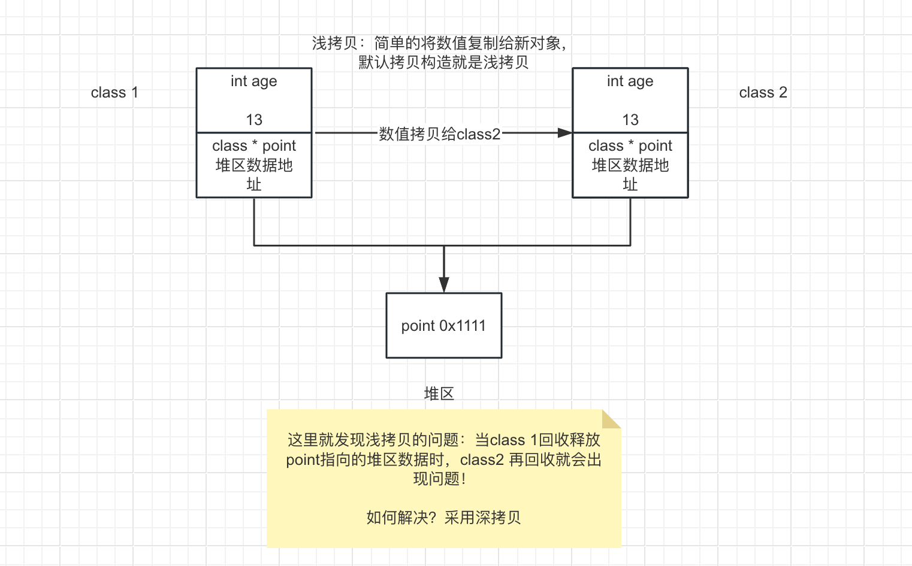
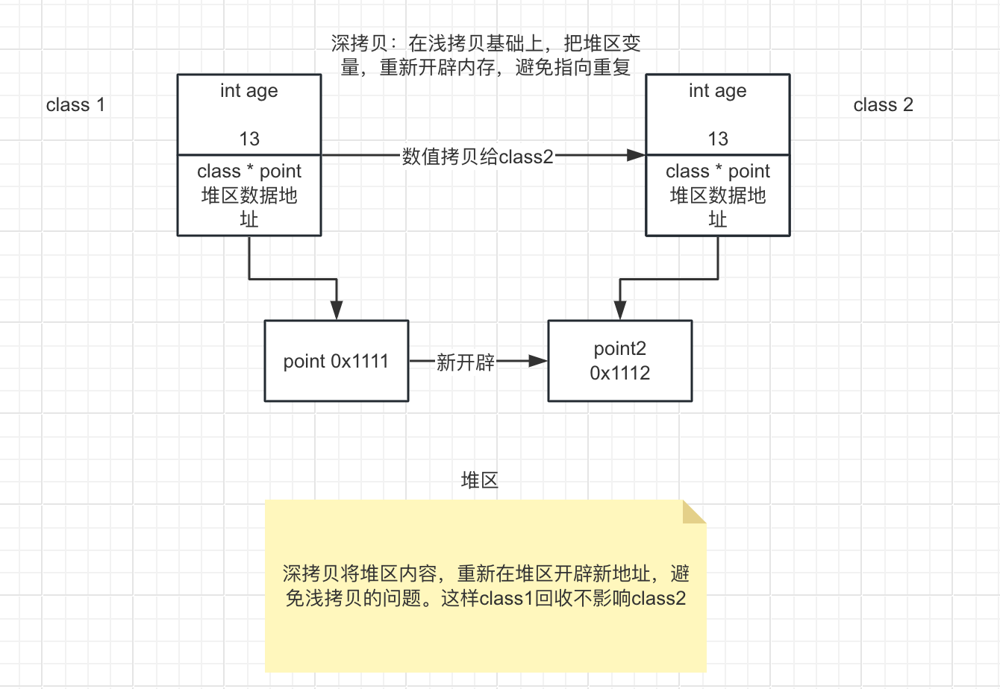

# 浅拷贝和深拷贝

类的构造有拷贝构造，系统默认拷贝构造是浅拷贝。

## 浅拷贝

浅拷贝，是将数据的值（不论是指针还是其他基础类型数据，取其值）复制给新对象。



通过此图可清晰了解，当class1 指针数据指向堆区时，浅拷贝就是把指针变量的值给新对象，其仍然指向同一块堆区地址。

## 深拷贝

深拷贝就是在浅拷贝的基础上，对于堆区新开辟一块地址，将指向分离，避免浅拷贝带来的堆内存指向重复的问题。



---

## 代码

```cpp
class T{
    public:
    int a;
    int* point;

    T(T &t){
        a = t.a;
        point = t.point;//浅拷贝就是这行代码，直接赋值
        point = new int(*t.point);//深拷贝，使用new在堆区新创建相同值的数据。
    }
    ~T(){
        if(point!=NULL){
            delete point;//深拷贝不会出现浅拷贝指针数据干扰问题。
            point = NULL;
        }
    }
};
```
