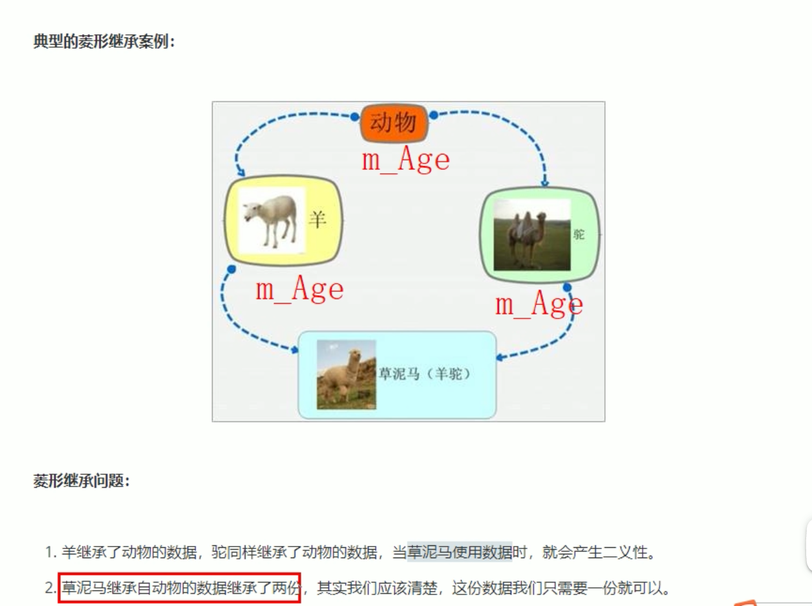
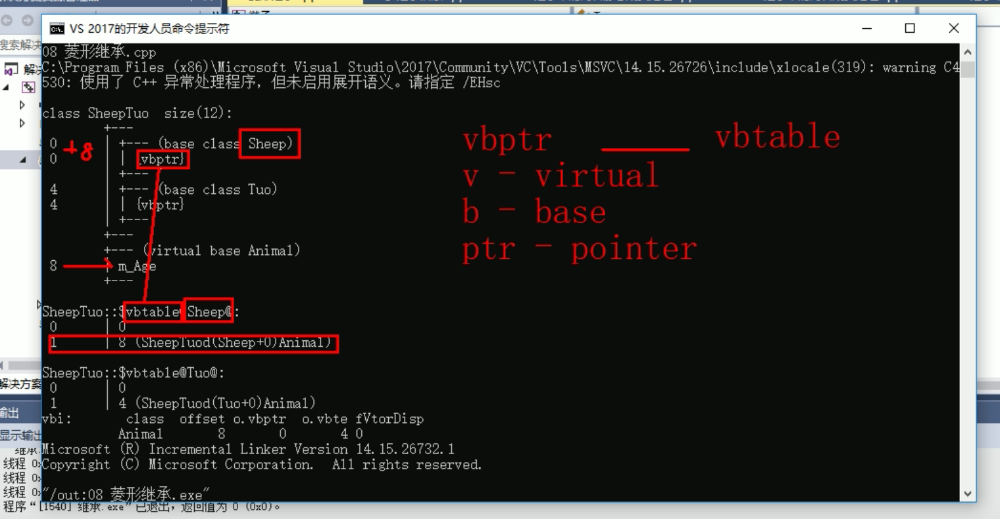

# 菱形继承

参考资料:[菱形继承](https://www.bilibili.com/video/BV1et411b73Z?p=134&vd_source=3509947f569e04aa5c144447e22d0ceb)

顾名思义，菱形继承问题的方式有多继承产生。子类继承俩基类，俩基类又都继承自同一基类。

解决方法：

方式1. 明确作用域  
方式2. 通过虚继承

---

## 示例

A:B,A:C, B:D,C:D ，B跟C都有同名成员，由此产生了二义性



```cpp
class Animal{};

class Sheep:public Animal{
    public:
    int m_Age;
};

class Tuo:public Animal{
    public:
    int m_Age;
};

class SheepTuo:public Sheep,public Tuo{};

int main(){
    SheepTuo st;
    st.Sheep::m_Age = 18;
    st.Tuo::m_Age = 28;
    // st.m_Age; 这样不能调用了，因为产生二义性，所以需要用下面方法区分

    //当菱形继承，两个父类拥有相同数据，需要增加作用域区分。父类名::
    cout<<"st.Sheep::m_Age"<<st.Sheep::m_Age<<endl;
    cout<<"st.Tuo::m_Age"<<st.Tuo::m_Age<<endl;
}

```

上面代码输出一个是18，一个是28，那这就有个问题了，如果想要父类保证数据一致这样怎么办呢？

这就得使用`虚继承`了~

---

## 虚继承

virtual修饰,此时的继承叫 虚继承，基类叫 虚基类

```cpp
class Sheep::virtual public Animal{}
class Tuo::virtual public Animal{}
//其他不变，这时虚继承就可以保证 Sheep与Tuo 的 m_Age 一致性
```

### 虚继承的原理是啥呢？

将父类二义性成员变为`虚基类指针`,并每个父类维护有各种的`虚基类表`,虚基类表记录内存地址偏移量，将二义性成员虚基类指针通过计算最终指向同一块地址。

细解：

通过vs 打印类的对象模型（如下图），可以看出：  

当使用虚继承后，产生二义性的同名成员，会变为一个 vbptr（虚基类指针） ，这是个指针，指向当前类的虚基类表，表中是记录`偏移值`。  
父类vbptr的内存地址 + 虚基类表偏移值 = 子类中m_Age的内存地址，这样两个基类可以使用这种机制最终都指向同一块 m_Age内存地址。



## 如何打印对象模型

对象模型 可以看到类的完整结构、内存大小、内存偏移量等

1.打开vs 开发人员命令符  
2.cl /d1 '类所在cpp文件地址'

---

## `virtual ~Filter() = default`

`virtual ~Filter() = default;` 不是纯虚析构函数，而是**虚析构函数**，并且使用了默认实现。

### 关键区别：

1. **纯虚析构函数**的声明形式是：

   ```cpp
   virtual ~Filter() = 0;  // 纯虚析构函数（必须在类外提供实现）
   ```

   - 带有 `= 0` 标记，属于纯虚函数的一种
   - 尽管是纯虚函数，但**必须提供实现**（因为派生类析构时会调用基类析构），否则会导致链接错误

2. **`virtual ~Filter() = default;`** 的含义是：
   - 声明析构函数为**虚函数**（确保派生类析构时能正确调用基类析构）
   - 使用 `= default` 要求编译器生成**默认实现**（等价于空析构函数，但更规范）
   - 不属于纯虚函数，因此包含该声明的类**不是抽象类**（可以实例化，除非有其他纯虚函数）

### 实际应用场景：

在你的滤镜框架中，`Filter` 类因为包含纯虚函数 `apply()`（`virtual int apply(...) = 0;`），所以本身是抽象类，无法实例化。而将析构函数声明为 `virtual ~Filter() = default;` 的作用是：

- 确保派生类（如 `GrayscaleFilter`）销毁时，能正确触发基类 `Filter` 的析构函数
- 用 `= default` 简化默认析构的写法，比手动写空析构函数（`virtual ~Filter() {}`）更符合现代C++规范

如果误将析构函数声明为纯虚析构（`= 0`），则必须在类外添加实现：

```cpp
// 类内声明
class Filter {
public:
    virtual ~Filter() = 0;  // 纯虚析构
    virtual int apply(...) = 0;
};

// 类外必须实现，否则链接错误
Filter::~Filter() {}
```
