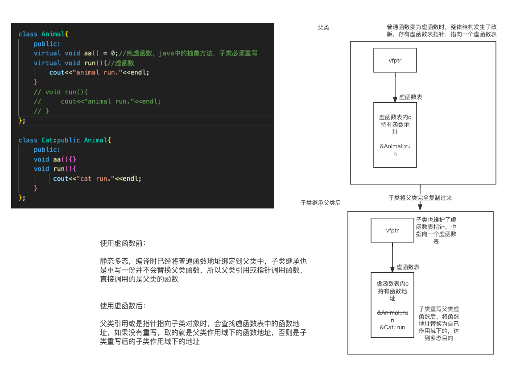

# 虚函数达成多态的原理

参考资料：[虚函数原理](https://www.bilibili.com/video/BV1et411b73Z?p=136&vd_source=3509947f569e04aa5c144447e22d0ceb)

虚函数和之前学过的虚继承，原理上来说很像，但是指针是函数类型：vfptr 虚函数指针（也叫虚函数表指针），  vftable 虚函数表

具体原理如下图：

