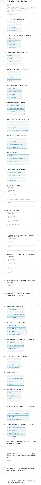

# 考题及答案



## 一、C语言基础单选题（1-10）

1. **关于`sizeof`**
   正确选项：`sizeof`的结果类型是`size_t`
   解析：`sizeof`是编译期运算符（变长数组除外），`sizeof(char)`恒为1，可用于数组计算总字节数，返回值类型为`size_t`（无符号整数类型）。

2. **数组名退化**
   正确选项：指向`a[0]`的指针
   解析：数组名在多数表达式中（除`sizeof`、`&`等场景）会退化为指向首元素的指针。

3. **缓冲区溢出风险**
   正确选项：`strcpy`
   解析：`strcpy`无长度检查，若源字符串长度超过目标缓冲区大小会直接溢出；`strncpy`、`snprintf`、带长度的`memcpy`更安全。

4. **空指针操作的未定义行为**
   正确选项：`*p = 0;`
   解析：空指针解引用是未定义行为；`if(p==NULL)`合法，`free(NULL)`安全，`p = malloc(...)`是合法赋值。

5. **`static`修饰函数的含义**
   正确选项：函数只在本文件可见（内部链接）
   解析：`static`修饰函数时，作用域限于当前编译单元（文件），与内存分配、内联无关。

6. **`const int *p`的含义**
   正确选项：`*p`是常量，不能通过`p`修改所指向的值
   解析：`const int *p`表示指针`p`指向的内容不可修改，但`p`本身可指向其他地址；`int *const p`才是指针本身不可变。

7. **有符号左移溢出**
   正确选项：可能引发未定义/实现相关行为（与标准及实现有关）
   解析：32位有符号`int`左移31位时，结果为`0x80000000`（`INT_MIN`），但C标准规定有符号数溢出属于未定义行为。

8. **`malloc/free`的正确说法**
   正确选项：对同一指针重复`free`属于错误（未定义行为）
   解析：`free(NULL)`安全，`malloc(0)`行为由实现定义，`malloc`返回的内存未初始化。

9. **函数指针声明`int (*fp)(int, int)`**
   正确选项：`fp`是指向函数的指针，函数参数为两个`int`，返回`int`
   解析：`(*fp)`表示`fp`是指针，指向的函数接受两个`int`参数并返回`int`。

10. **结构体内存布局**
    正确选项：结构体可能因对齐产生填充字节
    解析：为满足内存对齐要求，结构体成员间会插入填充字节，因此`sizeof(struct)`不一定等于成员大小之和。

## 二、代码阅读与输出（11-12）

11. **代码：**

    ```c
    #include <stdio.h>
    int a[] = {1, 2, 3, 4};
    int main(){
        int *p = a;
        printf("%d ", p++);  // 输出数组首地址（如0x7ffeefbff570，十进制值），p指向a[1]
        printf("%d ", *p);   // 输出a[1]的值2
        printf("%d ", (*p)++); // 输出a[1]当前值2，后a[1]自增为3
        return 0;
    }
    ```

    输出示例（地址值取决于系统）：`140732919335376 2 2`（地址为示例值，核心是后续数值`2 2`）。

12. **代码：**

    ```c
    #include <stdio.h>
    #include <string.h>
    int main(){
        char s1[] = "hello";
        char s2[6];
        memcpy(s2, s1, 6);   // 复制6字节（含'\0'），s2初始为"hello"
        memset(s2, '0', 3);  // 前3字节设为'0'，s2变为"000lo"
        printf("%zu %s\n", strlen(s2), s2); // strlen计算到'\0'的长度为5
        return 0;
    }
    ```

    输出：`5 000lo`

## 三、找Bug与修复（13-14）

13. **`dupstr`函数问题：**
    原代码：

    ```c
    char* dupstr(const char *s){
        char *p;
        strcpy(p, s);
        return p;
    }
    ```

    问题1：`p`未初始化，是野指针，直接`strcpy`导致未定义行为。
    问题2：未为`p`分配内存，`strcpy`需要目标缓冲区有足够空间。
    修复：

    ```c
    char* dupstr(const char *s){
        if (s == NULL) return NULL;
        size_t len = strlen(s) + 1; // 包含终止符
        char *p = (char*)malloc(len);
        if (p != NULL) strcpy(p, s);
        return p;
    }
    ```

14. **`sum`函数问题：**
    原代码：

    ```c
    int sum(int n){
        int *a = (int*)malloc(n); // 错误：应分配n*sizeof(int)字节
        int i, sum = 0;
        for(i = 0; i <= n; i++){ // 错误：越界访问a[n]
            sum += a[i];
        }
        free(a);
        return sum;
    }
    ```

    问题1：`malloc`参数错误，需分配`n * sizeof(int)`字节。
    问题2：循环条件错误，`i <= n`导致越界访问（数组下标应为`0~n-1`）。
    问题3：未检查`malloc`返回值，若`malloc`失败会解引用空指针。
    修复：

    ```c
    int sum(int n){
        if (n <= 0) return 0;
        int *a = (int*)malloc(n * sizeof(int));
        if (a == NULL) return 0;
        int i, sum = 0;
        for(i = 0; i < n; i++){
            sum += a[i];
        }
        free(a);
        return sum;
    }
    ```

## 四、C语言简答题（15-16）

15. **数组名与指针的异同**
    相同点：数组名在多数表达式中退化为指针，可通过指针方式访问数组元素（如`a[i]`等价于`*(a+i)`）；均支持算术运算。
    不同点：
    - 数组名是常量，不能赋值（如`a = p;`非法）；指针是变量，可赋值（如`p = a;`合法）。
    - `sizeof(数组名)`得到数组总字节数；`sizeof(指针)`得到指针本身的大小（如4/8字节）。
    - `&数组名`是指向整个数组的指针（如`int (*)[n]`）；`&指针`是指向指针的指针（如`int **`）。

16. **未定义行为（Undefined Behavior）**
    定义：C/C++标准未规定行为的操作，编译器可自由处理（如崩溃、错误输出等），程序行为不可预测。
    常见例子：
    - 空指针解引用：`int *p = NULL; *p = 5;`
    - 数组越界访问：`int a[5]; a[10] = 0;`
    - 有符号整数溢出：`int x = INT_MAX; x += 1;`
    - 重复释放指针：`int *p = malloc(4); free(p); free(p);`

## 五、操作系统基础单选题（17-24）

17. **进程与线程的关键区别**
    正确选项：进程有独立地址空间
    解析：进程地址空间独立，线程共享进程地址空间；线程切换开销更小。

18. **系统调用（system call）**
    正确选项：系统调用是用户程序进入内核的接口
    解析：系统调用通过软中断陷入内核，是用户态请求内核服务的唯一合法接口；比普通函数调用慢（需上下文切换）。

19. **缺页异常（page fault）**
    正确选项：访问的页不在内存，需要OS介入处理（从磁盘加载）
    解析：缺页异常是虚拟内存管理的正常事件，操作系统会将缺失的页从磁盘交换到物理内存，进程可继续执行。

20. **易导致“饥饿”的调度策略**
    正确选项：SJF（短作业优先）
    解析：若系统持续有短作业到达，长作业可能长时间无法获得CPU，导致饥饿；FCFS、RR、多级反馈队列更公平。

21. **互斥锁的主要作用**
    正确选项：防止多个线程同时进入临界区
    解析：互斥锁通过互斥访问保护临界区，确保同一时间只有一个线程/进程进入，保证数据一致性。

22. **死锁的四个必要条件不包括**
    正确选项：线程等待（或对应非必要条件选项）
    解析：死锁的四个必要条件是**互斥、占有并等待、不可剥夺、循环等待**，“线程等待”不是独立的必要条件。

23. **文件系统中的“目录”**
    正确选项：目录通常存放文件名到inode号的映射信息
    解析：目录项包含文件名和对应的inode号，通过inode号可找到文件的元数据（如大小、权限、数据块位置等）。

24. **缓存（cache）与局部性（locality）**
    正确选项：缓存利用时间局部性与空间局部性提升性能
    解析：时间局部性（最近访问的数据可能再次被访问）和空间局部性（访问的数据附近的数据可能被访问）是缓存高效的核心原因。

## 六、操作系统简答题（25-28）

25. **上下文切换（context switch）**
    定义：操作系统切换进程/线程时，保存当前进程/线程的上下文（寄存器、程序计数器、栈指针等），并加载下一个进程/线程上下文的过程。
    常见场景：时间片轮转调度、进程I/O阻塞、中断处理完成后、高优先级进程抢占CPU。

26. **进程间通信（IPC）常见方式**
    1. **管道（Pipe）**：适用于父子/兄弟进程单向通信（匿名管道）或无亲缘关系进程（命名管道/FIFO）。场景：Shell管道符`|`将前一个命令的输出作为后一个命令的输入。
    2. **共享内存（Shared Memory）**：适用于高吞吐量通信，多个进程共享同一块物理内存，需同步机制（如互斥锁）保证一致性。场景：图像处理、大数据计算等频繁交换大量数据的场景。
    3. **消息队列（Message Queue）**：异步传递结构化数据，支持消息类型和优先级。场景：进程间异步通知、任务分发。

27. **虚拟内存的核心价值（选2个角度）**
    - **隔离性**：每个进程拥有独立虚拟地址空间，进程间内存访问隔离，一个进程的错误不会影响其他进程，提升系统稳定性。
    - **易用性**：进程可使用比物理内存更大的地址空间，无需手动管理内存碎片和交换，降低编程复杂度。
    - **性能**：通过页表和TLB加速地址转换，结合分页/交换技术高效利用物理内存，局部性原理保证缓存命中率。

28. **用户态与内核态切换的性能优化**
    （注：用户态执行速度快于内核态，性能损失主要来自**用户态→内核态的切换开销**，如上下文切换、特权检查等）
    优化机制：
    1. **快速系统调用**：如Linux的`sysenter/sysexit`指令，通过专用寄存器传递参数，减少上下文切换开销。
    2. **库函数缓冲区**：如`stdio`的`fread/fwrite`通过用户态缓冲区积累数据，减少系统调用次数（如批量写入磁盘）。
    3. **缓存与预取**：将常用内核代码/数据缓存到CPU L1/L2缓存，减少内存访问开销。
