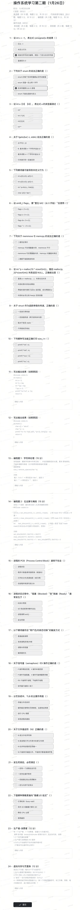

# 考题



## 答案

我帮你把这份试卷的所有题目逐一解答，分成 C 语言和操作系统两个模块来梳理：

---

## 🧩 C 语言部分

### 选择题（1-10题）

1. **`int x = -1; (unsigned)x` 的结果**
   - 正确选项：**将按无符号表示解释，得到一个很大的无符号数**
   - 原理：-1 的补码是全1二进制，无符号解释时为 `2^位数-1`（32位系统为 4294967295）。

2. **关于 `enum` 的正确说法**
   - 正确选项：**枚举常量默认从0递增**
   - 说明：枚举可以手动赋值，变量大小通常与 `int` 一致，可在函数外定义。

3. **`int a[3][4];` 表达式 `a` 的类型**
   - 正确选项：**`int (*)[4]`**
   - 说明：二维数组名是指向一维数组的指针。

4. **`fgets(buf, n, stdin)` 的正确描述**
   - 正确选项：**最多读取 n-1 个字符并追加 `\0`**
   - 说明：`fgets` 会在读取 `n-1` 个字符或遇到换行时停止，并自动添加结束符。

5. **最可能导致未定义行为的选项**
   - 正确选项：**`int a[5]={0}; a[5]=1;`**
   - 说明：数组下标越界访问（`a[5]` 超出了 `a[0]-a[4]` 的范围）。

6. **`uint8_t flags;` 置位 `bit2` 的操作**
   - 正确选项：**`flags |= (1 << 2);`**
   - 说明：按位或操作可以将指定位设为1，且不改变其他位。

7. **`memmove` 与 `memcpy` 的区别**
   - 正确选项：**`memmove` 可处理重叠内存，`memcpy` 对重叠未保证**
   - 说明：`memmove` 通过选择复制方向保证安全，`memcpy` 不处理重叠。

8. **`realloc` 失败后的正确做法**
   - 正确选项：**用临时指针接收 `realloc` 返回值，成功再赋值给 `p`**
   - 说明：`realloc` 失败时原内存不会释放，直接赋值会导致指针丢失和内存泄漏。

9. **`struct` 作为函数参数的传递方式**
   - 正确选项：**一定按值传递（拷贝结构体内容）**
   - 说明：C 语言默认值传递，若需引用传递需使用指针。

10. **打印 `size_t n` 的正确格式符**
    - 正确选项：**`printf("%zu", n);`**
    - 说明：`size_t` 是无符号整数类型，对应格式符为 `%zu`。

---

### 代码阅读与输出（11-12题）

11. **代码1输出**

```c
int a = 5;
int *p = &a;
int **pp = &p;
**pp += 3;
printf("%d %d", a, *p);
```

- 输出：`8 8`
- 解析：`**pp` 直接修改 `a` 的值为 8，`*p` 指向 `a` 所以也为 8。

12. **代码2输出**

```c
char s[] = "abcd";
char *p = s;
printf("%c %c %d", p[1], *(p+2), (long)p - (long)s);
```

- 输出：`b c 0`
- 解析：`p[1]` 是 `'b'`，`*(p+2)` 是 `'c'`，指针偏移量为 0。

---

### 编程题（13-14题）

13. **删除字符串所有空格（返回长度）**

```c
#include <string.h>
size_t remove_spaces(char *s) {
    if (s == NULL) return 0;
    size_t i = 0, j = 0;
    while (s[i] != '\0') {
        if (s[i] != ' ') s[j++] = s[i];
        i++;
    }
    s[j] = '\0';
    return j;
}
```

14. **位运算与掩码操作**

```c
#include <stdint.h>
void set_bit(uint32_t *x, uint32_t mask) { *x |= mask; }
void clear_bit(uint32_t *x, uint32_t mask) { *x &= ~mask; }
void toggle_bit(uint32_t *x, uint32_t mask) { *x ^= mask; }
int test_bit(uint32_t x, uint32_t mask) { return (x & mask) != 0; }
```

---

## 🖥️ 操作系统部分

### 选择题（15-22题）

15. **进程 PCB 通常不包含**
    - 正确选项：**该进程所有源代码文本**
    - 说明：PCB 包含进程状态、寄存器、文件描述符等元数据，不包含源代码。

16. **“阻塞”→“就绪”的触发条件**
    - 正确选项：**I/O 完成或等待事件发生**
    - 说明：阻塞态是等待 I/O 或事件，完成后回到就绪态。

17. **会触发内核态切换的方式**
    - 正确选项：**系统调用 / 异常 / 中断**
    - 说明：普通函数调用、变量赋值不会触发内核态切换。

18. **关于信号量的正确描述**
    - 正确选项：**信号量可用于同步与互斥**
    - 说明：信号量可以是整型，互斥锁是特殊的二值信号量。

19. **分页系统中 TLB 的作用**
    - 正确选项：**缓存常用的页表项，加速地址转换**
    - 说明：TLB 是页表的高速缓存，减少内存访问次数。

20. **关于文件描述符 `fd` 的正确说法**
    - 正确选项：**fd 是进程打开文件表中的索引**
    - 说明：fd 是进程本地的，指向内核文件表项，可指向管道、设备等。

21. **发生死锁的必要条件**
    - 正确选项：**四个必要条件同时满足（互斥、请求与保持、不可剥夺、循环等待）**

22. **更可能隐藏 I/O 延迟的策略**
    - 正确选项：**异步（或重叠）I/O**
    - 说明：异步 I/O 允许 CPU 在等待 I/O 时处理其他任务。

---

### 简答题（23-24题）

23. **生产者-消费者问题（PV操作）**

- **信号量定义**：
  - `empty`（空闲缓冲区数，初始 `n`）
  - `full`（已填充缓冲区数，初始 `0`）
  - `mutex`（互斥访问缓冲区，初始 `1`）
- **生产者流程**：`P(empty) → P(mutex) → 生产 → V(mutex) → V(full)`
- **消费者流程**：`P(full) → P(mutex) → 消费 → V(mutex) → V(empty)`
- **为什么需要 `mutex`**：保证缓冲区操作的原子性，避免数据竞争。
- **为什么不会界外访问**：`empty` 和 `full` 分别限制生产者和消费者的操作，避免越界。

24. **虚拟内存与页面置换**

- **虚拟内存作用**：扩大地址空间、内存隔离、按需加载、共享内存。
- **页面置换的原因**：物理内存不足时，需换出页面以加载新页面。
- **常见置换算法**：
  - **FIFO**：换出最早进入的页面，可能出现 Belady 异常。
  - **LRU**：换出最近最少使用的页面，性能较好但实现复杂。
- **减少缺页次数的方法**：增大物理内存、优化置换算法、程序局部性优化、增大页面大小。

---

要不要我帮你整理这份试卷的**标准答案速查表**，方便你快速对照和复习？
