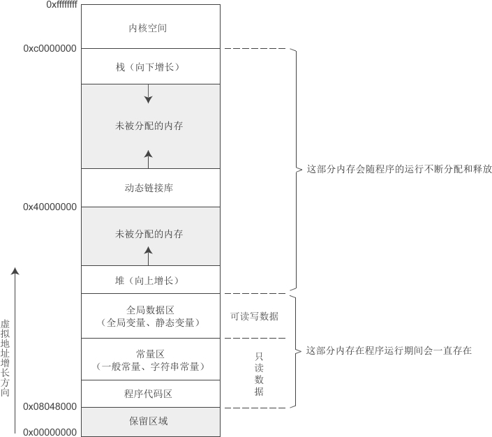

# 内存空间分布

参考：[博客园](https://www.cnblogs.com/liantang-blog/p/13715537.html)

c 中内存空间分为几大块：内核空间、内存栈区、内存堆区、全局静态区、常量区、代码区



## 简述

这是Linux下32位环境的用户空间内存分布情况

* 内核空间　　：一部分核心软件独立于普通应用程序，运行在较高的特权级别上，驻留在被保护的内存空间上，拥有访问硬件设备的所有权限

* 内存栈区　　：存放函数的参数值，局部变量的值等。在程序运行时由`编译器`自动分配和释放。

* 内存堆区　　：存放new或者malloc出来的对象。由程序员分配和释放，如果程序员不释放，程序结束时由操作系统回收。如main函数里面定义的。

* 全局静态区    :  存放全局变量，局部静态（static）变量和全局静态变量，初始化的全局变量和静态变量data段，为初始化的全局变量和静态变量放在bss段。

* 常量区　　　：存放一般常量和字符串常量

* 代码区　　　：存放二进制代码，只读，可共享

## 代码

```c
#include <iostream>
using namespace std;

int arr[10];         　　 //数组未初始化，空间开辟在bss段上
int arr2[10] = {1,2,3,4,5,6,7,8,9,10}; 　//数组已初始化，空间开辟在data段

int main()
{
  int arr3[10];   　　　　 //空间开辟在栈上面
  int a = 10;     　　　　 //空间开辟在栈上面

  int *p = new int[10];   //空间开辟在堆上面

  static int data;  　　  //未初始化静态变量，空间开辟在bss段上
  static int data2 = 100;//初始化静态变量，空间开辟在data段上

  return 0;    
}
```

## 补充

* C/C++不提供垃圾回收机制，因此需要对堆中的数据进行及时销毁，防止内存泄露，使用free和delete销毁new和malloc申请的堆内存，而栈内存是动态释放。
* 堆栈区，程序运行时动态分配内存，其他区是在生成.exe文件之后就有了（也就是编译时就确定了内存）。
* 代码区是共享且只读的。 共享是内存只有一份代码，只读可以防止程序被意外修改指令。
* 全局静态区和常量区，当程序结束时，由系统释放。
* 栈区-不要返回局部变量地址，局部变量随函数结束会被回收。
* 只有new或malloc的是在堆，即使是对象类型（java不同，java 的关键字new与c中意义不一样，非基础类型是在堆区）
