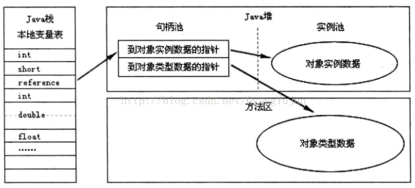

# java 内存区域划分

[参考csdn博客](https://blog.csdn.net/OyangYujun/article/details/41173747)

[c语言-内存空间分布](../../c/1.c的基础语法/18.内存空间/内存空间分布.md)

## 区域划分

划分为运行时内存区、非运行时内存区。

### 运行时内存分区


运行时内存区是指Java虚拟机（JVM）在执行Java程序时所管理的内存区域。这些内存区由JVM规范定义，并在JVM启动时创建。主要的运行时内存区包括：

线程不共享：

- **程序计数器**：存储当前线程执行的字节码指令的地址。
程序计数器是一块较小的区域，它的作用可以看做是**当前线程所执行的字节码的行号指示器**。在虚拟机的模型里，字节码指示器就是通过改变程序计数器的值来指定下一条需要执行的指令。分支，循环等基础功能就是依赖程序计数器来完成的。由于java虚拟机的多线程是通过轮流切换并分配处理器执行时间来完成，一个处理器同一时间只会执行一条线程中的指令。为了线程恢复后能够恢复正确的执行位置，每条线程都需要一个独立的程序计数器，以确保线程之间互不影响。**所以程序计数器是“线程私有”的内存**。如果虚拟机正在执行的是一个Java方法，则计数器指定的是字节码指令对应的地址，如果正在执行的是一个本地方法，则计数器指定问空undefined。**程序计数器区域是Java虚拟机中唯一没有定义OutOfMemory异常的区域。**

- **Java虚拟机栈**：存储局部变量和方法调用的栈帧。
和程序计数器一样也是线程私有的，生命周期与线程相同。**虚拟机栈描述的是Java方法执行的内存模型：每个方法被执行的时候都会创建一个栈帧用于存储局部变量表，操作栈，动态链接，方法出口等信息**。每一个方法被调用的过程就对应一个栈帧在虚拟机栈中从入栈到出栈的过程。通常所说的虚拟机运行时分为栈和堆，这里的栈指的就是虚拟机栈或者说虚拟机栈中的局部变量表部分。局部变量表存放了编译器可知的各种基本数据类型、对象引用和returnAddress类型（指向一条字节码指令的地址）。局部变量表所需的内存空间在编译器完成分配，当进入一个方法时这个方法需要在帧中分配多大的内存空间是完全确定的，运行期间不会改变局部变量表的大小。（64为长度的long和double会占用两个局部变量空间，其他的数据类型占用一个）Java虚拟机栈可能出现两种类型的异常：1. 线程请求的栈深度大于虚拟机允许的栈深度，将抛出StackOverflowError。2.虚拟机栈空间可以动态扩展，当动态扩展是无法申请到足够的空间时，抛出OutOfMemory异常。

- **本地方法栈**：存储本地方法（如JNI方法）的调用信息。
本地方法栈和虚拟机栈基本类似，只不过Java虚拟机栈执行的是Java代码（字节码），本地方法栈中存储本地方法（如JNI方法）的调用信息。本地方法栈中也会抛出StackOverflowError和OutOfMemory异常。
  
线程共享：

- **Java堆**：存储对象实例和数组。
堆是所有线程共享的一块区域，**在虚拟机启动时创建**。堆的唯一目的是存放对象实例，几乎所有的对象实例都在这里分配。**Java堆是垃圾收集器管理的主要区域**，所以也称为“GC堆”。Java堆可以是物理上不连续的空间，只要逻辑上连续即可，主流的虚拟机都是按照可扩展的方式来实现的。如果当前对中没有内存完成对象实例的创建，并且不能在进行内存扩展，则会抛出OutOfMemory异常。
  >由于现在的垃圾收集器基本上都是采用分代收集算法，所以Java堆还可细分为:新生代和老生代。在细致一点可分为Eden空间，From Survivor空间，To Survivor空间。如果从内存分配的角度看，线程共享的Java堆可划分出多个线程私有的分配缓冲区。不过无论如何划分，都与存放内容无关，无论哪个区域，都是用来存放对象实例。细分的目的是为了更好的回收内存或者更快的分配内存。

- **方法区**：存储类信息、常量、静态变量等数据。
方法区也是线程共享的区域，用于存储已经被虚拟机加载的类信息，常量，静态变量和即时编译器（JIT）编译后的代码等数据。Java虚拟机把方法区描述为堆的一个逻辑分区，不过方法区有一个别名Non-Heap(非堆)，用于区别于Java堆区。Java虚拟机规范对这个区域的限制也非常宽松，除了可以是物理不连续的空间外，也允许固定大小和扩展性，还可以不实现垃圾收集。相对而言，垃圾收集行为在这个区域是比较少出现的（所以常量和静态变量的定义要多注意）。方法区的内存收集还是会出现，不过这个区域的内存收集主要是针对常量池的回收和对类型的卸载。一般来说方法区的内存回收比较难以令人满意。当方法区无法满足内存分配需求时将抛出OutOfMemoryError异常。

  - **运行时常量池**：方法区的一部分，存储编译期生成的字面量和符号引用。
  运行时常量池是方法区的一部分，Class文件中除了有类的版本，字段，方法，接口等信息以外，还有一项信息是常量池用于存储编译器生成的各种字面量和符号引用，这部分信息将在类加载后存放到方法区的运行时常量池中。Java虚拟机对类的每一部分（包括常量池）都有严格的规定，每个字节用于存储哪种数据都必须有规范上的要求，这样才能够被虚拟机认可，装载和执行。一般来说，除了保存Class文件中描述的符号引用外，还会把翻译出来的直接引用也存储在运行时常量池中。**运行时常量池相对于Class文件常量池的另外一个重要特征是具备动态性**，Java虚拟机并不要求常量只能在编译期产生，也就是并非预置入Class文件常量池的内容才能进入方法区的运行时常量池中，运行期间也可将新的常量放入常量池中。常量池是方法区的一部分，所以受到内存的限制，当无法申请到足够内存时会抛出OutOfMemoryError异常。

### 非运行时内存区

非运行时内存区是指不由JVM直接管理的内存区域。这些内存区域通常由操作系统或硬件直接管理。非运行时内存区的例子包括：

- 直接内存（Direct Memory）：
  - 通过Java NIO（New Input/Output）操作的内存。
  - 不受JVM堆大小限制。
- 系统内存：
  - 操作系统管理的内存，用于存储文件、网络数据等。
- 缓存：
  - 硬件或操作系统级别的缓存，如CPU缓存。

---

## 对象访问

对象访问在Java语言中无处不在，即使是最简单的访问，也会涉及到Java栈，java堆，方法区这三个最重要的内存区域之间的关联关系。如下面的代码：

```java
Object obj = new Object();
```

假设这段代码出现在方法体中，那么“Object obj”部分的语义将会反映到Java栈的本地变量表中，作为一个**reference类型**的数据存在。而“new Object();”部分的语义将会反应到Java堆中，形成一块存储Object类型所有实例数据值（Instance Data）的结构化内存，根据具体类型以及虚拟机实现的对象分布的不同，这块内存的长度是不固定的。另外，在JAVA堆中还必须包含能查找到此对象内存数据的地址信息，这些类型数据则存储在方法区中。

由于reference类型在Java虚拟机中之规定了指向对象的引用，并没有规定这个引用要通过哪种方式去定位，以及访问到Java堆中的对象的具体位置，因此虚拟机实现的对象访问方式会有所不同。主流的访问方式有两种：句柄访问方式和直接指针。

1. 如果使用句柄访问方式，Java堆中将会划分出一块内存来作为句柄池，reference中存储的就是对象的地址，而句柄中包含了对象实例数据和类型数据各自的具体地址信息。


2. 如果通过直接指针方式访问，Java堆对象的布局中就必须考虑如何放置访问类型数据的相关信息，reference中直接存储的就是对象的地址。


两种方式各有优势，局并访问方式最大的好处是reference中存放的是稳定的句柄地址，在对象被移动时，只会改变句柄中的实例数据指针，而reference本身不需要被修改。而指针访问的最大优势是速度快，它节省了一次指针定位的开销，由于对象访问在Java中非常频繁，一次这类开销积少成多后也是一项非常可观的成本。

具体的访问方式都是有虚拟机指定的，虚拟机Sun HotSpot使用的是直接指针方式，不过从整个软件开发的范围来看，各种语言和框架使用句柄访问方式的情况十分常见。
