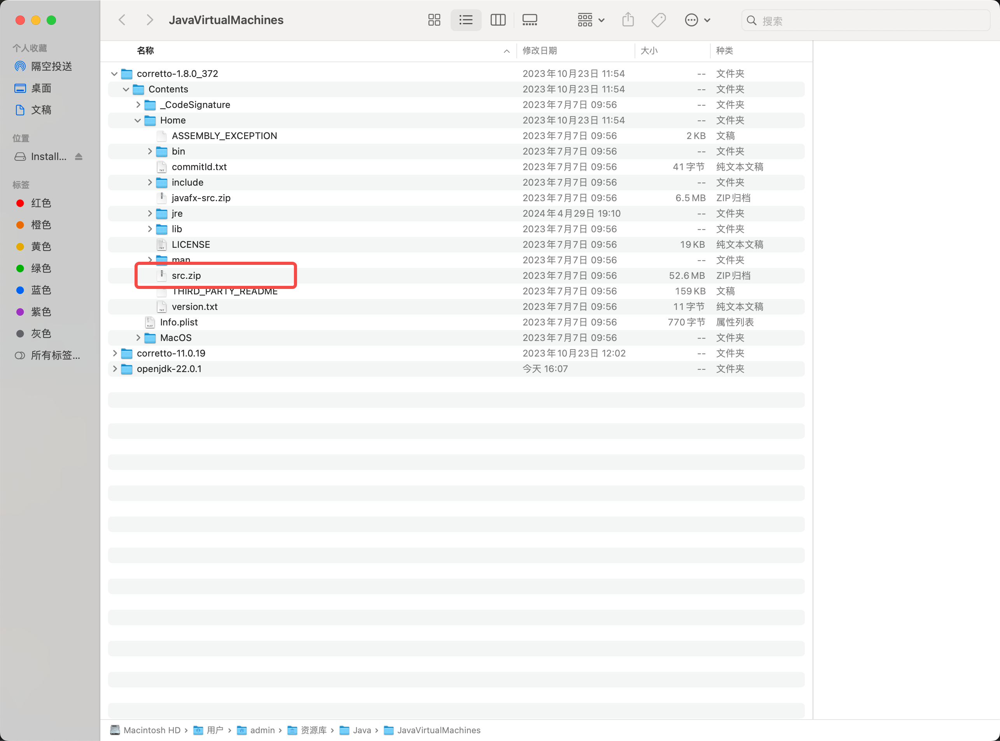
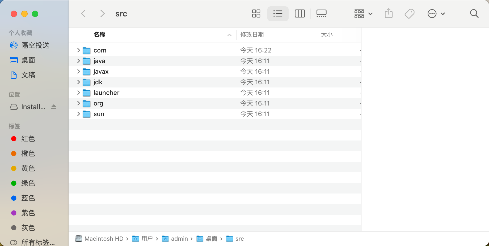

# 查看源码

很多在线文档，没有真正的源代码，所以这里简单说下如何看源代码。

[我的源码仓库](https://gitee.com/wuxu54/wuxu_jdk.git)

## 本地源代码查看

1. 下载jdk
2. 进入jdk目录：`corretto-1.8.0_372/Contents/Home/src.zip`

3. 拷贝**src.zip**压缩包并解压，此压缩包里就是源码

## 在线jdk文档

[开源中国-在线jdk文档](https://tool.oschina.net/apidocs/apidoc?api=jdk-zh)
>这里是对源代码的标注，但没有显示源代码。学习源代码时可以搭配此文档。
