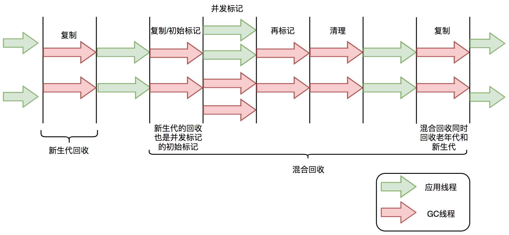
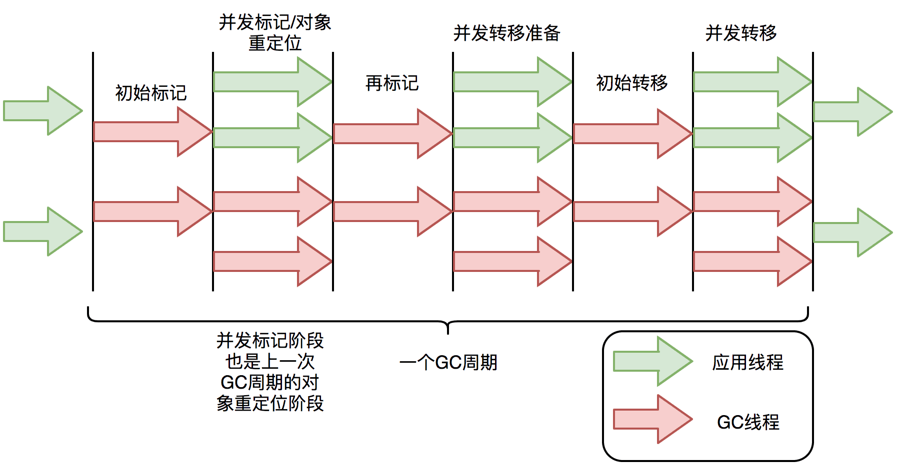
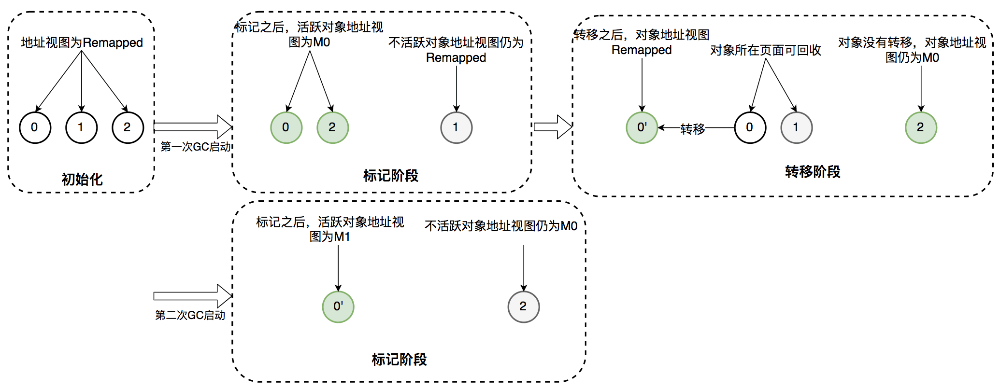
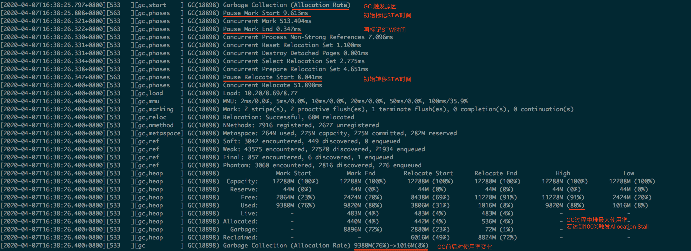

# GC - Java 垃圾回收器之ZGC详解

>ZGC（The Z Garbage Collector）是JDK 11中推出的一款低延迟垃圾回收器, 是JDK 11+ 最为重要的更新之一，适用于大内存低延迟服务的内存管理和回收。在梳理相关知识点时，发现美团技术团队分享的文章[新一代垃圾回收器ZGC的探索与实践](https://tech.meituan.com/2020/08/06/new-zgc-practice-in-meituan.html)比较完善（包含G1收集器停顿时间瓶颈，原理，优化等）, 这里分享给你，帮你构建ZGC相关的知识体系。@pdai

[TOC]

## ZGC概述

ZGC（The Z Garbage Collector）是JDK 11中推出的一款低延迟垃圾回收器，它的设计目标包括：

1. 停顿时间不超过10ms；
2. 停顿时间不会随着堆的大小，或者活跃对象的大小而增加（对程序吞吐量影响小于15%）；
3. 支持8MB~4TB级别的堆（未来支持16TB）。

从设计目标来看，我们知道ZGC适用于**大内存低延迟**服务的内存管理和回收。本文主要介绍ZGC在低延时场景中的应用和卓越表现，文章内容主要分为四部分：

1. **GC之痛**：介绍实际业务中遇到的GC痛点，并分析CMS收集器和G1收集器停顿时间瓶颈；
2. **ZGC原理**：分析ZGC停顿时间比G1或CMS更短的本质原因，以及背后的技术原理；
3. **ZGC调优实践**：重点分享对ZGC调优的理解，并分析若干个实际调优案例；
4. **升级ZGC效果**：展示在生产环境应用ZGC取得的效果。

### GC之痛

>很多低延迟高可用Java服务的系统可用性经常受GC停顿的困扰。GC停顿指垃圾回收期间STW（Stop The World），当STW时，所有应用线程停止活动，等待GC停顿结束。

以美团风控服务为例，部分上游业务要求风控服务65ms内返回结果，并且可用性要达到99.99%。但因为GC停顿，我们未能达到上述可用性目标。当时使用的是CMS垃圾回收器，单次Young GC 40ms，一分钟10次，接口平均响应时间30ms。通过计算可知，有`（40ms + 30ms) * 10次 / 60000ms = 1.12%`的请求的响应时间会增加0 ~ 40ms不等，其中`30ms * 10次 / 60000ms = 0.5%`的请求响应时间会增加40ms。可见，GC停顿对响应时间的影响较大。为了降低GC停顿对系统可用性的影响，我们从降低单次GC时间和降低GC频率两个角度出发进行了调优，还测试过G1垃圾回收器，但这三项措施均未能降低GC对服务可用性的影响。

### CMS与G1停顿时间瓶颈

>在介绍ZGC之前，首先回顾一下CMS和G1的GC过程以及停顿时间的瓶颈。CMS新生代的Young GC、G1和ZGC都基于**标记-复制**算法，但算法具体实现的不同就导致了巨大的性能差异。

标记-复制算法应用在CMS新生代（ParNew是CMS默认的新生代垃圾回收器）和G1垃圾回收器中。标记-复制算法可以分为三个阶段：

- 标记阶段，即从GC Roots集合开始，标记活跃对象；
- 转移阶段，即把活跃对象复制到新的内存地址上；
- 重定位阶段，因为转移导致对象的地址发生了变化，在重定位阶段，所有指向对象旧地址的指针都要调整到对象新的地址上。

下面以G1为例，通过G1中标记-复制算法过程（G1的Young GC和Mixed GC均采用该算法），分析G1停顿耗时的主要瓶颈。G1垃圾回收周期如下图所示：



G1的混合回收过程可以分为标记阶段、清理阶段和复制阶段。

#### 标记阶段停顿分析

- **初始标记阶段**：初始标记阶段是指从GC Roots出发标记全部直接子节点的过程，该阶段是STW的。由于GC Roots数量不多，通常该阶段耗时非常短。
- **并发标记阶段**：并发标记阶段是指从GC Roots开始对堆中对象进行可达性分析，找出存活对象。该阶段是并发的，即应用线程和GC线程可以同时活动。并发标记耗时相对长很多，但因为不是STW，所以我们不太关心该阶段耗时的长短。
- **再标记阶段**：重新标记那些在并发标记阶段发生变化的对象。该阶段是STW的。

#### 清理阶段停顿分析

**清理阶段**清点出有存活对象的分区和没有存活对象的分区，该阶段不会清理垃圾对象，也不会执行存活对象的复制。该阶段是STW的。

#### 复制阶段停顿分析

- **复制算法**中的转移阶段需要分配新内存和复制对象的成员变量。转移阶段是STW的，其中内存分配通常耗时非常短，但对象成员变量的复制耗时有可能较长，这是因为复制耗时与存活对象数量与对象复杂度成正比。对象越复杂，复制耗时越长。

四个STW过程中，初始标记因为只标记GC Roots，耗时较短。再标记因为对象数少，耗时也较短。清理阶段因为内存分区数量少，耗时也较短。转移阶段要处理所有存活的对象，耗时会较长。因此，**G1停顿时间的瓶颈主要是标记-复制中的转移阶段STW**。为什么转移阶段不能和标记阶段一样并发执行呢？主要是G1未能解决转移过程中准确定位对象地址的问题。

G1的Young GC和CMS的Young GC，其标记-复制全过程STW，这里不再详细阐述。

## ZGC原理

### 全并发的ZGC

>与CMS中的ParNew和G1类似，ZGC也采用标记-复制算法，不过ZGC对该算法做了重大改进：**ZGC在标记、转移和重定位阶段几乎都是并发的**，这是ZGC实现停顿时间小于10ms目标的最关键原因。

ZGC垃圾回收周期如下图所示：



ZGC只有三个STW阶段：初始标记，再标记，初始转移。其中，初始标记和初始转移分别都只需要扫描所有GC Roots，其处理时间和GC Roots的数量成正比，一般情况耗时非常短；再标记阶段STW时间很短，最多1ms，超过1ms则再次进入并发标记阶段。即，ZGC几乎所有暂停都只依赖于GC Roots集合大小，停顿时间不会随着堆的大小或者活跃对象的大小而增加。与ZGC对比，G1的转移阶段完全STW的，且停顿时间随存活对象的大小增加而增加。

### ZGC关键技术

ZGC通过**着色指针**和**读屏障技术**，解决了转移过程中准确访问对象的问题，实现了并发转移。大致原理描述如下：并发转移中“并发”意味着GC线程在转移对象的过程中，应用线程也在不停地访问对象。假设对象发生转移，但对象地址未及时更新，那么应用线程可能访问到旧地址，从而造成错误。而在ZGC中，应用线程访问对象将触发“读屏障”，如果发现对象被移动了，那么“读屏障”会把读出来的指针更新到对象的新地址上，这样应用线程始终访问的都是对象的新地址。那么，JVM是如何判断对象被移动过呢？就是利用对象引用的地址，即着色指针。下面介绍着色指针和读屏障技术细节。

#### 着色指针

>着色指针是一种将信息存储在指针中的技术。

ZGC仅支持64位系统，它把64位虚拟地址空间划分为多个子空间，如下图所示：


其中，`[0~4TB)` 对应Java堆，`[4TB ~ 8TB)` 称为M0地址空间，`[8TB ~ 12TB)` 称为M1地址空间，`[12TB ~ 16TB)` 预留未使用，`[16TB ~ 20TB)` 称为Remapped空间。

当应用程序创建对象时，首先在堆空间申请一个虚拟地址，但该虚拟地址并不会映射到真正的物理地址。ZGC同时会为该对象在M0、M1和Remapped地址空间分别申请一个虚拟地址，且这三个虚拟地址对应同一个物理地址，但这三个空间在同一时间有且只有一个空间有效。ZGC之所以设置三个虚拟地址空间，是因为它使用“空间换时间”思想，去降低GC停顿时间。“空间换时间”中的空间是虚拟空间，而不是真正的物理空间。后续章节将详细介绍这三个空间的切换过程。

与上述地址空间划分相对应，ZGC实际仅使用64位地址空间的第041位，而第4245位存储元数据，第47~63位固定为0。


ZGC将对象存活信息存储在42~45位中，这与传统的垃圾回收并将对象存活信息放在对象头中完全不同。

#### 读屏障

>读屏障是JVM向应用代码插入一小段代码的技术。当应用线程从堆中读取对象引用时，就会执行这段代码。需要注意的是，**仅“从堆中读取对象引用”才会触发这段代码**。

读屏障示例：

```java {.line-numbers}
Object o = obj.FieldA   // 从堆中读取引用，需要加入屏障
<Load barrier>
Object p = o  // 无需加入屏障，因为不是从堆中读取引用
o.dosomething() // 无需加入屏障，因为不是从堆中读取引用
int i =  obj.FieldB  //无需加入屏障，因为不是对象引用
```

ZGC中读屏障的代码作用：在对象标记和转移过程中，用于确定对象的引用地址是否满足条件，并作出相应动作。

### ZGC并发处理演示

接下来详细介绍ZGC一次垃圾回收周期中地址视图的切换过程：

- **初始化**：ZGC初始化之后，整个内存空间的地址视图被设置为Remapped。程序正常运行，在内存中分配对象，满足一定条件后垃圾回收启动，此时进入标记阶段。
- **并发标记阶段**：第一次进入标记阶段时视图为M0，如果对象被GC标记线程或者应用线程访问过，那么就将对象的地址视图从Remapped调整为M0。所以，在标记阶段结束之后，对象的地址要么是M0视图，要么是Remapped。如果对象的地址是M0视图，那么说明对象是活跃的；如果对象的地址是Remapped视图，说明对象是不活跃的。
- **并发转移阶段**：标记结束后就进入转移阶段，此时地址视图再次被设置为Remapped。如果对象被GC转移线程或者应用线程访问过，那么就将对象的地址视图从M0调整为Remapped。

其实，在标记阶段存在两个地址视图M0和M1，上面的过程显示只用了一个地址视图。之所以设计成两个，是为了区别前一次标记和当前标记。也即，第二次进入并发标记阶段后，地址视图调整为M1，而非M0。

着色指针和读屏障技术不仅应用在并发转移阶段，还应用在并发标记阶段：将对象设置为已标记，传统的垃圾回收器需要进行一次内存访问，并将对象存活信息放在对象头中；而在ZGC中，只需要设置指针地址的第42~45位即可，并且因为是寄存器访问，所以速度比访问内存更快。



## ZGC调优实践

ZGC不是“银弹”，需要根据服务的具体特点进行调优。网络上能搜索到实战经验较少，调优理论需自行摸索，我们在此阶段也耗费了不少时间，最终才达到理想的性能。本文的一个目的是列举一些使用ZGC时常见的问题，帮助大家使用ZGC提高服务可用性。

### 调优基础知识

#### 理解ZGC重要配置参数

以我们服务在生产环境中ZGC参数配置为例，说明各个参数的作用：

重要参数配置样例：

```sh
-Xms10G -Xmx10G 
-XX:ReservedCodeCacheSize=256m -XX:InitialCodeCacheSize=256m 
-XX:+UnlockExperimentalVMOptions -XX:+UseZGC 
-XX:ConcGCThreads=2 -XX:ParallelGCThreads=6 
-XX:ZCollectionInterval=120 -XX:ZAllocationSpikeTolerance=5 
-XX:+UnlockDiagnosticVMOptions -XX:-ZProactive 
-Xlog:safepoint,classhisto*=trace,age*,gc*=info:file=/opt/logs/logs/gc-%t.log:time,tid,tags:filecount=5,filesize=50m 
```

- `-Xms -Xmx`：堆的最大内存和最小内存，这里都设置为10G，程序的堆内存将保持10G不变。
- `-XX:ReservedCodeCacheSize -XX:InitialCodeCacheSize`：设置CodeCache的大小， JIT编译的代码都放在CodeCache中，一般服务64m或128m就已经足够。我们的服务因为有一定特殊性，所以设置的较大，后面会详细介绍。
- `-XX:+UnlockExperimentalVMOptions -XX:+UseZGC`：启用ZGC的配置。
- `-XX:ConcGCThreads`：并发回收垃圾的线程。默认是总核数的12.5%，8核CPU默认是1。调大后GC变快，但会占用程序运行时的CPU资源，吞吐会受到影响。
- `-XX:ParallelGCThreads`：STW阶段使用线程数，默认是总核数的60%。
- `-XX:ZCollectionInterval`：ZGC发生的最小时间间隔，单位秒。
- `-XX:ZAllocationSpikeTolerance`：ZGC触发自适应算法的修正系数，默认2，数值越大，越早的触发ZGC。
- `-XX:+UnlockDiagnosticVMOptions -XX:-ZProactive`：是否启用主动回收，默认开启，这里的配置表示关闭。
- `-Xlog`：设置GC日志中的内容、格式、位置以及每个日志的大小。

#### 理解ZGC触发时机

相比于CMS和G1的GC触发机制，ZGC的GC触发机制有很大不同。ZGC的核心特点是并发，GC过程中一直有新的对象产生。如何保证在GC完成之前，新产生的对象不会将堆占满，是ZGC参数调优的第一大目标。因为在ZGC中，当垃圾来不及回收将堆占满时，会导致正在运行的线程停顿，持续时间可能长达秒级之久。

ZGC有多种GC触发机制，总结如下：

- **阻塞内存分配请求触发**：当垃圾来不及回收，垃圾将堆占满时，会导致部分线程阻塞。我们应当避免出现这种触发方式。日志中关键字是`Allocation Stall`。
- **基于分配速率的自适应算法**：最主要的GC触发方式，其算法原理可简单描述为”ZGC根据近期的对象分配速率以及GC时间，计算出当内存占用达到什么阈值时触发下一次GC”。自适应算法的详细理论可参考彭成寒《新一代垃圾回收器ZGC设计与实现》一书中的内容。通过`ZAllocationSpikeTolerance`参数控制阈值大小，该参数默认**2**，**数值越大，越早的触发GC**。我们通过调整此参数解决了一些问题。日志中关键字是`Allocation Rate”`。
- **基于固定时间间隔**：通过`ZCollectionInterval`控制，适合应对突增流量场景。流量平稳变化时，自适应算法可能在堆使用率达到95%以上才触发GC。流量突增时，自适应算法触发的时机可能会过晚，导致部分线程阻塞。我们通过调整此参数解决流量突增场景的问题，比如定时活动、秒杀等场景。日志中关键字是`Timer`。
- **主动触发规则**：类似于固定间隔规则，但时间间隔不固定，是ZGC自行算出来的时机，我们的服务因为已经加了基于固定时间间隔的触发机制，所以通过`-ZProactive`参数将该功能关闭，以免GC频繁，影响服务可用性。 日志中关键字是`Proactive`。
- **预热规则**：服务刚启动时出现，一般不需要关注。日志中关键字是`Warmup`。
- **外部触发**：代码中显式调用`System.gc()`触发。 日志中关键字是`System.gc()`。
- **元数据分配触发**：元数据区不足时导致，一般不需要关注。 日志中关键字是`Metadata GC Threshold`。

#### 理解ZGC日志

一次完整的GC过程，需要注意的点已在图中标出。



注意：该日志过滤了进入安全点的信息。正常情况，在一次GC过程中还穿插着进入安全点的操作。

GC日志中每一行都注明了GC过程中的信息，关键信息如下：

- **Start**：开始GC，并标明的GC触发的原因。上图中触发原因是自适应算法。
- **Phase-Pause Mark Start**：初始标记，会STW。
- **Phase-Pause Mark End**：再次标记，会STW。
- **Phase-Pause Relocate Start**：初始转移，会STW。
- **Heap信息**：记录了GC过程中Mark、Relocate前后的堆大小变化状况。High和Low记录了其中的最大值和最小值，我们一般关注High中Used的值，如果达到100%，在GC过程中一定存在内存分配不足的情况，需要调整GC的触发时机，更早或者更快地进行GC。
- **GC信息统计**：可以定时的打印垃圾收集信息，观察10秒内、10分钟内、10个小时内，从启动到现在的所有统计信息。利用这些统计信息，可以排查定位一些异常点。

日志中内容较多，关键点已用红线标出，含义较好理解，更详细的解释大家可以自行在网上查阅资料。


#### 理解ZGC停顿原因

我们在实战过程中共发现了6种使程序停顿的场景，分别如下：

- GC时，初始标记：日志中Pause Mark Start。
- GC时，再标记：日志中Pause Mark End。
- GC时，初始转移：日志中Pause Relocate Start。
- 内存分配阻塞：当内存不足时线程会阻塞等待GC完成，关键字是”Allocation Stall”。


- 安全点：所有线程进入到安全点后才能进行GC，ZGC定期进入安全点判断是否需要GC。先进入安全点的线程需要等待后进入安全点的线程直到所有线程挂起。
- dump线程、内存：比如jstack、jmap命令。


## 调优案例

我们维护的服务名叫Zeus，它是美团的规则平台，常用于风控场景中的规则管理。规则运行是基于开源的表达式执行引擎Aviator。Aviator内部将每一条表达式转化成Java的一个类，通过调用该类的接口实现表达式逻辑。Zeus服务内的规则数量超过万条，且每台机器每天的请求量几百万。这些客观条件导致Aviator生成的类和方法会产生很多的ClassLoader和CodeCache，这些在使用ZGC时都成为过GC的性能瓶颈。接下来介绍两类调优案例。

第一类：内存分配阻塞，系统停顿可达到秒级：案例一、案例二
第二类：GC Roots 数量大，单次GC停顿时间长：案例三、案例四

### 案例一：秒杀活动中流量突增，出现性能毛刺

日志信息：对比出现性能毛刺时间点的GC日志和业务日志，发现JVM停顿了较长时间，且停顿时GC日志中有大量的“Allocation Stall”日志。

分析：这种案例多出现在“自适应算法”为主要GC触发机制的场景中。ZGC是一款并发的垃圾回收器，GC线程和应用线程同时活动，在GC过程中，还会产生新的对象。GC完成之前，新产生的对象将堆占满，那么应用线程可能因为申请内存失败而导致线程阻塞。当秒杀活动开始，大量请求打入系统，但自适应算法计算的GC触发间隔较长，导致GC触发不及时，引起了内存分配阻塞，导致停顿。

解决方法：

1. 开启”基于固定时间间隔“的GC触发机制：`-XX:ZCollectionInterval`。比如调整为5秒，甚至更短。
2. 增大修正系数`-XX:ZAllocationSpikeTolerance`，更早触发GC。ZGC采用正态分布模型预测内存分配速率，模型修正系数ZAllocationSpikeTolerance默认值为2，值越大，越早的触发GC，Zeus中所有集群设置的是5。

### 案例二：压测时，流量逐渐增大到一定程度后，出现性能毛刺

日志信息：平均1秒GC一次，两次GC之间几乎没有间隔。分析：GC触发及时，但内存标记和回收速度过慢，引起内存分配阻塞，导致停顿。

解决方法：

1. 增大`-XX:ConcGCThreads`， 加快并发标记和回收速度。ConcGCThreads默认值是核数的1/8，8核机器，默认值是1。该参数影响系统吞吐，如果GC间隔时间大于GC周期，不建议调整该参数。

### 案例三： 单次GC停顿时间30ms，与预期停顿10ms左右有较大差距

日志信息：观察ZGC日志信息统计，“Pause Roots ClassLoaderDataGraph”一项耗时较长。

分析：dump内存文件，发现系统中有上万个ClassLoader实例。我们知道ClassLoader属于GC Roots一部分，且ZGC停顿时间与GC Roots成正比，GC Roots数量越大，停顿时间越久。再进一步分析，ClassLoader的类名表明，这些ClassLoader均由Aviator组件生成。分析Aviator源码，发现Aviator对每一个表达式新生成类时，会创建一个ClassLoader，这导致了ClassLoader数量巨大的问题。在更高Aviator版本中，该问题已经被修复，即仅创建一个ClassLoader为所有表达式生成类。

解决方法：升级Aviator组件版本，避免生成多余的ClassLoader。

### 案例四：服务启动后，运行时间越长，单次GC时间越长，重启后恢复

日志信息：观察ZGC日志信息统计，“Pause Roots CodeCache”的耗时会随着服务运行时间逐渐增长。

分析：CodeCache空间用于存放Java热点代码的JIT编译结果，而CodeCache也属于GC Roots一部分。通过添加`-XX:+PrintCodeCacheOnCompilation`参数，打印CodeCache中的被优化的方法，发现大量的Aviator表达式代码。定位到根本原因，每个表达式都是一个类中一个方法。随着运行时间越长，执行次数增加，这些方法会被JIT优化编译进入到Code Cache中，导致CodeCache越来越大。

解决方法：JIT有一些参数配置可以调整JIT编译的条件，但对于我们的问题都不太适用。我们最终通过业务优化解决，删除不需要执行的Aviator表达式，从而避免了大量Aviator方法进入CodeCache中。

值得一提的是，我们并不是在所有这些问题都解决后才全量部署所有集群。即使开始有各种各样的毛刺，但计算后发现，有各种问题的ZGC也比之前的CMS对服务可用性影响小。所以从开始准备使用ZGC到全量部署，大概用了2周的时间。在之后的3个月时间里，我们边做业务需求，边跟进这些问题，最终逐个解决了上述问题，从而使ZGC在各个集群上达到了一个更好表现。

## 升级ZGC效果

### 延迟降低

TP(Top Percentile)是一项衡量系统延迟的指标：

1. TP999表示99.9%请求都能被响应的最小耗时；
2. TP99表示99%请求都能被响应的最小耗时。

在Zeus服务不同集群中，ZGC在低延迟（TP999 < 200ms）场景中收益较大：

- TP999：下降12142ms，下降幅度18%74%。
- TP99：下降528ms，下降幅度10%47%。

超低延迟（TP999 < 20ms）和高延迟（TP999 > 200ms）服务收益不大，原因是这些服务的响应时间瓶颈不是GC，而是外部依赖的性能。

### 吞吐下降

对吞吐量优先的场景，ZGC可能并不适合。例如，Zeus某离线集群原先使用CMS，升级ZGC后，系统吞吐量明显降低。究其原因有二：

- 第一，ZGC是单代垃圾回收器，而CMS是分代垃圾回收器。单代垃圾回收器每次处理的对象更多，更耗费CPU资源；
- 第二，ZGC使用读屏障，读屏障操作需耗费额外的计算资源。

## 总结

ZGC作为下一代垃圾回收器，性能非常优秀。ZGC垃圾回收过程几乎全部是并发，实际STW停顿时间极短，不到10ms。这得益于其采用的着色指针和读屏障技术。

Zeus在升级JDK 11+ZGC中，通过将风险和问题分类，然后各个击破，最终顺利实现了升级目标，GC停顿也几乎不再影响系统可用性。

最后推荐大家升级ZGC，Zeus系统因为业务特点，遇到了较多问题，而风控其他团队在升级时都非常顺利。

## 参考文献

- [ZGC官网](https://wiki.openjdk.java.net/display/zgc/Main)
- 彭成寒.《新一代垃圾回收器ZGC设计与实现》. 机械工业出版社, 2019.
- [从实际案例聊聊Java应用的GC优化](https://tech.meituan.com/2017/12/29/jvm-optimize.html)
- [Java Hotspot G1 GC的一些关键技术](https://tech.meituan.com/2016/09/23/g1.html)

作者简介

- 王东，美团信息安全资深工程师。
- 王伟，美团信息安全技术专家。

更多优秀文章推荐

- [更多优秀文章推荐](https://www.jianshu.com/p/664e4da05b2c)

---

```txt {.line-numbers}
著作权归@pdai所有
原文链接：https://pdai.tech/md/java/jvm/java-jvm-gc-zgc.html
```
