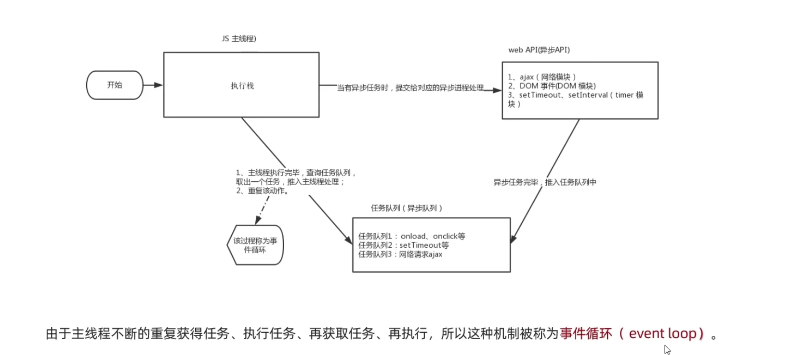

# js的同步和异步

同步：顺序执行
异步：按cpu核心数，分配执行，可以多个线程同时执行。

js是单线程，无法实现异步。基于此Html5 提出work标准，浏览器可以支持多线程，将异步任务交给浏览器处理。

## 执行机制

## 参考资料

[黑马视频](https://www.bilibili.com/video/BV1Y84y1L7Nn?p=128&vd_source=3509947f569e04aa5c144447e22d0ceb)
