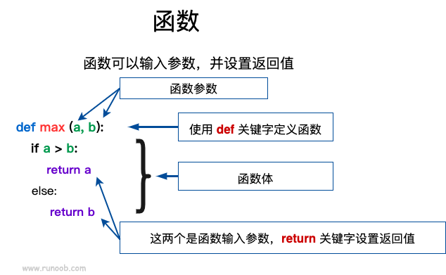

# 函数

函数是组织好的，可重复使用的，用来实现单一，或相关联功能的代码段。

## 定义一个函数

以下是简单的规则：

- 函数代码块以 `def` 关键词开头，后接函数标识符名称和圆括号 ()。
- 任何传入参数和自变量必须放在圆括号中间，圆括号之间可以用于定义参数。
- 函数的第一行语句可以选择性地使用文档字符串—用于存放函数说明。
- 函数内容以冒号 `:` 起始，并且缩进。
- return [表达式] 结束函数，选择性地返回一个值给调用方，不带表达式的 - return 相当于返回 `None`。



Python 定义函数使用 def 关键字，一般格式如下：

```python
def 函数名（参数列表）:
    函数体
```

## 函数中的参数类型

即：值传递、引用传递两种类型。

- **不可变类型（值传递）**：类似 C++ 的值传递，如整数、字符串、元组。如 fun(a)，传递的只是 a 的值，没有影响 a 对象本身。如果在 fun(a) 内部修改 a 的值，则是新生成一个 a 的对象。
- **可变类型（引用传递）**：类似 C++ 的引用传递，如 列表，字典。如 fun(la)，则是将 la 真正的传过去，修改后 fun 外部的 la 也会受影响

示例：不可变对象实例，`id()` 函数可以获取内存地址

```python
def change(a):
    print(id(a))   # 指向的是同一个对象
    a=10
    print(id(a))   # 一个新对象，这里相当于给a设置了新的int类型数据
 
a=1
print(id(a))
change(a)

#上面代码输出结果：
#4379369136
#4379369136
#4379369424
```

示例：可变对象实例，可变对象在函数里修改了参数，那么在调用这个函数的函数里，原始的参数也被改变了

```python
#!/usr/bin/python3
 
# 可写函数说明
def changeme( mylist ):
   "修改传入的列表"
   mylist.append([1,2,3,4])
   print ("函数内取值: ", mylist)
   return
 
# 调用changeme函数
mylist = [10,20,30]
changeme( mylist )
print ("函数外取值: ", mylist)

#上面代码打印：
#函数内取值:  [10, 20, 30, [1, 2, 3, 4]]
#函数外取值:  [10, 20, 30, [1, 2, 3, 4]]
```

## 参数

参数细分为以下几种情况：

- 必需参数：必需参数须以正确的顺序传入函数。调用时的数量必须和声明时的一样。
- 关键字参数（命名参数）：用参数名匹配参数值，可以顺序不一致
- 默认参数：调用函数时，如果没有传递参数，则会使用默认参数。例如：`def printinfo( name, age = 35 )` age是默认参数默认值是35。
- 不定长参数：一个函数能处理比当初声明时更多的参数，这些参数叫做不定长参数。

### 不定长参数细讲

1. 加了星号 `*` 的参数会以`元组(tuple)`的形式导入，存放所有未命名的变量参数。

    ```python
    #!/usr/bin/python3
    
    # 可写函数说明
    def printinfo( arg1, *vartuple ):
    "打印任何传入的参数"
    print ("输出: ")
    print (arg1)
    print (vartuple)
    
    # 调用printinfo 函数
    printinfo( 70, 60, 50 )
    # 如果在函数调用时没有指定参数，它就是一个空元组。我们也可以不向函数传递未命名的变量。
    printinfo(70)
    ```

2. 加了两个星号 `**` 的参数会以`字典`的形式导入。

    ```python
    #!/usr/bin/python3
    
    # 可写函数说明
    def printinfo( arg1, **vardict ):
    "打印任何传入的参数"
    print ("输出: ")
    print (arg1)
    print (vardict)
    
    # 调用printinfo 函数
    printinfo(1, a=2,b=3)
    ```

3. 声明函数时，参数中星号 `*` 可以单独出现,如果单独出现星号 `*`，则星号`*` 后的参数必须用关键字传入

    ```python
    >>> def f(a,b,*,c):
    ...     return a+b+c
    ... 
    >>> f(1,2,3)   # 报错
    Traceback (most recent call last):
    File "<stdin>", line 1, in <module>
    TypeError: f() takes 2 positional arguments but 3 were given
    >>> f(1,2,c=3) # 正常
    6
    >>>
    ```

## 匿名函数

使用 lambda 来创建匿名函数。所谓匿名，意即不再使用 `def` 语句这样标准的形式定义一个函数。

- lambda 只是一个表达式，函数体比 def 简单很多。
- lambda 的主体是一个表达式，而不是一个代码块。仅仅能在 lambda 表达式中封装有限的逻辑进去。
- lambda 函数拥有自己的命名空间，且不能访问自己参数列表之外或全局命名空间里的参数。
- 虽然 lambda 函数看起来只能写一行，却不等同于 C 或 C++ 的内联函数，内联函数的目的是调用小函数时不占用栈内存从而减少函数调用的开销，提高代码的执行速度。

**lambda 函数特点**：

- lambda 函数是匿名的，它们没有函数名称，只能通过赋值给变量或作为参数传递给其他函数来使用。
- lambda 函数通常只包含一行代码，这使得它们适用于编写简单的函数。

语法：lambda 函数的语法只包含一个语句：`lambda [arg1 [,arg2,.....argn]]:expression`

示例：

```python
# 设置参数 a 加上 10
x = lambda a : a + 10
print(x(5))
```

## return语句

return [表达式] 语句用于退出函数，选择性地向调用方返回一个表达式。不带参数值的 return 语句返回 None。

## 强制位置参数

Python3.8 新增了一个函数形参语法 `/` 用来指明后面的参数可以是位置形参或关键字形参（也叫命名参数），如果使用时不用命名参数那必须保证位置正确

示例：

```python
# 在以下的例子中，形参 a 和 b 必须使用指定位置参数，c 或 d 可以是位置形参或关键字形参，而 e 和 f 要求为关键字形参
def f(a, b, /, c, d, *, e, f):
    print(a, b, c, d, e, f)

#正确使用
f(10, 20, 30, d=40, e=50, f=60)

#错误使用
f(10, b=20, c=30, d=40, e=50, f=60)   # b 不能使用关键字参数的形式
f(10, 20, 30, 40, 50, f=60)           # e 必须使用关键字参数的形式

#------补充示例：
f(1,2,d=1,c=2,e=3,f=4) # 正确，c、d 使用命名参数，可忽略位置
# f(1,2,d=1,2,e=3,f=4)# 错误，c没有使用命名参数，必须保证位置正确
```
