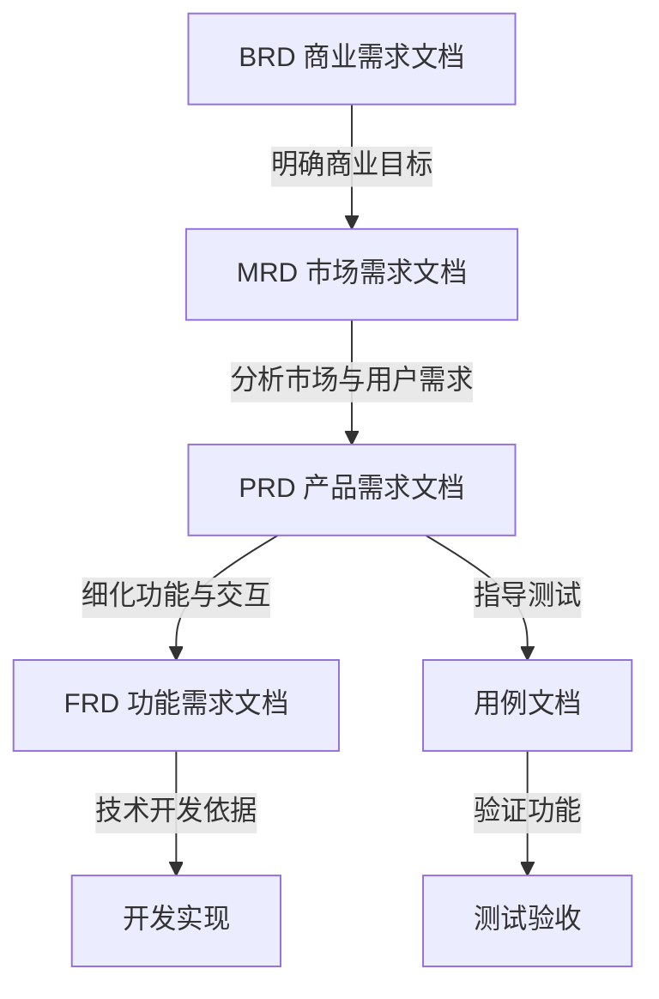

# PRD、MRD 及相关文档详解  

在产品开发流程中，PRD、MRD 等文档是关键的沟通与规划工具，它们明确了产品目标、需求、功能及实现路径，确保团队协作高效有序。

- 评估产品机会（需求收集、可行性研究） 产出 【MRD】
- 定义要开发的产品（需求分析、原型设计） 产出 【PRD】

以下详细解析这些核心文档的定义、作用、核心内容及关联关系：

## 一、MRD（Market Requirements Document，市场需求文档）  

### 定义  

MRD 是基于市场调研和用户需求分析，聚焦**“为什么做这个产品/功能”**的文档，用于阐述市场机会、目标用户、竞争格局及产品定位，为产品方向提供市场层面的决策依据。  

### 核心作用  

- 明确市场需求背景，论证产品存在的合理性与商业价值。  
- 为产品团队提供市场层面的指导，避免产品脱离市场实际需求。  
- 向管理层、销售、市场等非技术团队传递产品的市场定位和目标。  

### 核心内容  

1. **市场分析**  
   - 市场规模、增长趋势、政策环境等宏观数据。  
   - 目标用户画像（年龄、需求痛点、行为习惯等）。  
   - 竞争分析：竞品优势、劣势、市场份额及差异化机会。  
2. **产品定位与目标**  
   - 产品核心价值：解决用户什么问题，提供什么独特价值。  
   - 短期/长期目标：如用户量、市场占有率、营收预期等。  
3. **核心需求概述**  
   - 提炼用户最核心的需求点（非具体功能），例如“用户需要更高效的文件同步工具”。  

## 二、PRD（Product Requirements Document，产品需求文档）  

### 定义  

PRD 是在 MRD 基础上，聚焦**“做什么产品/功能”**的文档，详细描述产品的功能、交互逻辑、页面设计、非功能需求等，是技术团队开发、测试团队验收的核心依据。  

### 核心作用  

- 将市场需求转化为具体可执行的产品功能，明确产品“是什么”和“怎么做”。  
- 作为产品、技术、设计、测试等跨团队协作的“契约”，确保各方对需求的理解一致。  
- 为后续的开发排期、测试用例设计、验收标准制定提供依据。  

### 核心内容  

1. **产品概述**  
   - 产品目标：承接 MRD 的目标，明确当前版本要实现的具体成果。  
   - 范围界定：包含哪些功能（In Scope），不包含哪些功能（Out of Scope）。  
2. **功能需求详情**  
   - 功能模块划分：按用户场景或业务逻辑拆分模块（如登录模块、支付模块）。  
   - 功能点描述：每个功能的触发条件、操作流程、预期结果（可用“用户故事”格式：“作为[用户角色]，我希望[操作]，以便[价值]”）。  
   - 交互逻辑：页面跳转、按钮点击反馈、异常提示等（可附流程图、线框图）。  
3. **非功能需求**  
   - 性能要求：如页面加载时间≤2秒、并发用户数支持10万+。  
   - 兼容性：支持的设备（如手机型号、系统版本）、浏览器类型等。  
   - 安全性：数据加密、权限控制、防攻击策略等。  
   - 可用性：操作步骤简洁性、错误提示易懂性等。  
4. **验收标准（Acceptance Criteria）**  
   - 明确功能通过的条件，例如“输入正确手机号和验证码后，点击登录按钮，应在3秒内跳转到首页”。  

## 三、其他相关文档  

### 1. BRD（Business Requirements Document，商业需求文档）  

- **定义**：聚焦“为什么做这个业务”，从商业价值角度阐述项目的必要性，是立项阶段的核心文档。  
- **核心内容**：商业目标（如盈利模式、投资回报）、成本预算、风险评估、资源需求等。  
- **与 MRD/PRD 的关系**：BRD 是顶层规划，MRD 基于 BRD 细化市场需求，PRD 基于 MRD 细化产品功能。  

### 2. FRD（Functional Requirements Document，功能需求文档）  

- **定义**：更偏向技术视角的功能拆解，详细描述每个功能的技术实现逻辑、数据字段、接口交互等。  
- **核心区别**：PRD 侧重用户视角的“功能是什么”，FRD 侧重技术视角的“功能如何实现”（如数据结构、接口参数）。  

### 3. 用例文档（Test Case Document）  

- **定义**：测试团队根据 PRD 编写的测试用例集合，用于验证功能是否符合需求。  
- **核心内容**：测试场景、输入数据、操作步骤、预期结果、实际结果等。  

## 四、文档间的关系与流程  

### 流程图（mermaid）  

### 关键逻辑  

1. **流程顺序**：通常按 BRD → MRD → PRD → FRD → 用例文档的顺序产出，依次从商业目标→市场需求→产品功能→技术实现→测试验证递进。  
2. **核心关联**：MRD 是 PRD 的前提（解决“为什么做”），PRD 是 MRD 的落地（解决“做什么”），FRD 和用例文档则是 PRD 的技术与测试延伸。  

## 五、实践建议  

- **文档精简**：避免过度冗余，根据团队规模和项目复杂度调整细节（小项目可合并 MRD 和 PRD）。  
- **动态更新**：需求变更时及时同步文档，确保所有成员使用最新版本。  
- **可视化辅助**：在 PRD 中加入流程图、原型图、交互说明，减少歧义。  
- **跨团队评审**：文档完成后组织产品、技术、设计、测试评审，提前发现问题。  

通过清晰定义和规范这些文档，可大幅降低沟通成本，确保产品开发方向与市场需求一致，最终提升产品成功率。
