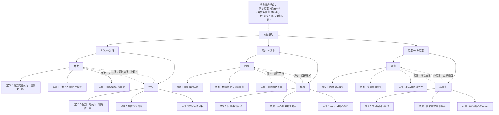

# 并发、并行、同步、异步、阻塞、非阻塞详解

## **1. 并发（Concurrency）与并行（Parallelism）**

- **并发**  
  - **定义**：多个任务在**重叠的时间段内交替执行**，但不一定是同时的。  
  - **场景**：单核 CPU 通过时间片轮转实现多任务“同时运行”的假象。  
  - **核心思想**：通过任务切换提升资源利用率。  
  - **示例**：浏览器边下载文件边渲染页面。

- **并行**  
  - **定义**：多个任务**真正同时执行**，依赖多核/分布式硬件支持。  
  - **场景**：多核 CPU 同时处理多个计算任务。  
  - **核心思想**：通过硬件扩展提升吞吐量。  
  - **示例**：视频编码软件利用多核加速渲染。

**总结**：  

- 并发是**逻辑上的多任务**（如线程调度），并行是**物理上的多任务**（如多核运算）。  
- 并发解决任务的组织问题，并行解决任务的执行效率问题。

---

## **2. 同步（Synchronous）与异步（Asynchronous）**

- **同步**  
  - **定义**：任务**顺序执行**，调用者必须等待当前操作完成才能继续。  
  - **特点**：代码流程直观，但可能因等待导致资源浪费。  
  - **示例**：普通函数调用 `result = readFile()`。

- **异步**  
  - **定义**：任务**发起后不阻塞**，通过回调、事件或通知机制处理结果。  
  - **特点**：提升系统吞吐量，但代码复杂度增加。  
  - **示例**：Node.js 的 `fs.readFile(callback)`。

**总结**：  

- 同步是“**等结果**”，异步是“**等通知**”。  
- 异步常用于 I/O 密集型场景（如网络请求），同步适用于简单逻辑。

---

## **3. 阻塞（Blocking）与非阻塞（Non-blocking）**

- **阻塞**  
  - **定义**：调用者线程被**挂起**，直到操作完成。  
  - **特点**：简单但浪费线程资源。  
  - **示例**：Java 的 `InputStream.read()` 会阻塞线程。

- **非阻塞**  
  - **定义**：调用后**立即返回**，无需等待结果。  
  - **特点**：需配合轮询或事件驱动获取结果。  
  - **示例**：NIO 中的 `SocketChannel.configureBlocking(false)`。

**总结**：  

- 阻塞是“**不许动，等我干完**”，非阻塞是“**你先忙，我待会儿再来问**”。  
- 非阻塞常用于高并发场景（如服务器处理海量连接）。

---

## **4. 概念组合与常见模式**

- **同步阻塞**：最常见模式，如默认的文件读取操作。  
- **同步非阻塞**：需主动轮询结果（如忙等待 `while(!ready) {}`）。  
- **异步非阻塞**：高效模式，如 Node.js 的异步 I/O。  
- **异步阻塞**：极少见，可能因设计错误导致（如错误使用异步 API 后主动等待）。

---

## **5. 对比表格**

| 概念          | 核心区别                          | 典型场景               |
|---------------|----------------------------------|-----------------------|
| **并发 vs 并行** | 交替执行 vs 同时执行             | 单核调度 vs 多核计算   |
| **同步 vs 异步** | 等待结果 vs 回调通知             | 顺序逻辑 vs 高吞吐 I/O |
| **阻塞 vs 非阻塞** | 线程挂起 vs 立即返回             | 简单调用 vs 高并发处理 |

---

## **6. 技术应用示例**

- **并发 + 异步非阻塞**：Nginx 通过事件驱动处理万级并发连接。  
- **并行 + 同步阻塞**：多线程计算密集型任务（如矩阵运算）。  
- **异步非阻塞 + 回调**：JavaScript 的 Promise 和 async/await。

通过理解这些概念的差异与组合，可以更灵活地设计高并发、高性能的系统架构。

---

## 图示

以下是根据上述内容生成的 Mermaid 思维导图，帮助直观理解这些概念的关系与差异：

### 图表说明

1. **层级结构**：  
   - 根节点为三大对比组（并发/并行、同步/异步、阻塞/非阻塞）  
   - 每个组细化定义、场景、示例等子节点  

2. **对比关系**：  
   - 用虚线箭头标注核心差异（如并发与并行的逻辑/物理执行区别）  

3. **组合模式**：  
   - 右侧注释框总结常见技术组合模式  
