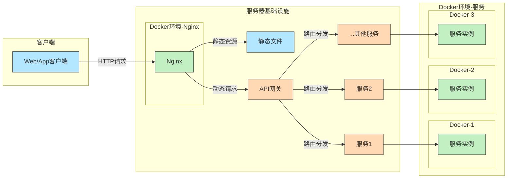
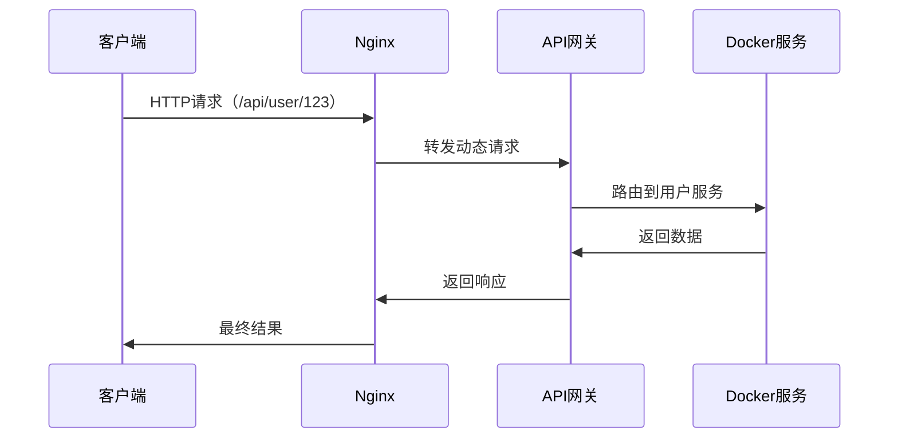

# 前后端开发核心组成

以下是整合了移动端（Android、iOS、小程序）的前后端开发完整模块表格，新增内容以 **粗体** 标出：

---

| **模块层级**       | **组成部分**           | **关键点/技术示例**                                                                 |
|--------------------|------------------------|------------------------------------------------------------------------------------|
| **前端模块**       | **页面展示**           | - UI组件（按钮、表单） - 路由管理（React Router/Vue Router） - 响应式布局（Flexbox/Grid） |
|                    | **数据交互**           | - API请求（Axios/Fetch） - 状态管理（Redux/Pinia） - 数据缓存（LocalStorage）          |
|                    | **用户交互**           | - 表单验证（Zod/VeeValidate） - 错误反馈（Toast/Modal） - 动画效果（CSS/GSAP）        |
| **移动端模块**     | **Android开发**        | - 原生开发（Kotlin/Java） - Jetpack组件（ViewModel、Room） - 性能优化（内存泄漏检测）|
|                    | **iOS开发**            | - 原生开发（Swift/Objective-C） - SwiftUI/UIKit - CoreData/Swift Realm          |
|                    | **跨平台框架**         | - Flutter（Dart语言） - React Native（JSX） - 多端适配（响应式设计）              |
|                    | **小程序开发**         | - 微信小程序（WXML/WXSS/JS） - 支付宝小程序（AXML/ACSS） - 跨端框架（Taro/Uni-app）|
|                    | **移动端特性**         | - 推送通知（Firebase/APNs） - 本地存储（SQLite/MMKV） - 设备API（摄像头、GPS）    |
| **后端模块**       | **接口层**             | - 路由定义（Express.js/Spring） - 参数解析（Query/Body） - 身份鉴权（JWT/OAuth）     |
|                    | **业务逻辑**           | - 服务层（用户注册、订单处理） - 数据校验（Hibernate Validator）                     |
|                    | **数据持久化**         | - ORM操作（Sequelize/TypeORM） - 原生SQL - 缓存（Redis）                          |
| **接口交互**       | **API设计**            | - RESTful/GraphQL规范 - Swagger文档 - Mock工具（Postman/Mock.js）                |
|                    | **数据传输**           | - JSON/Protobuf格式 - 状态码定义（200/404/500） - **移动端适配（分页加载、数据压缩）**|
| **数据库模块**     | **表结构设计**         | - 用户表、订单表等 - 字段类型（VARCHAR/INT） - 关系（一对多/多对多）                |
|                    | **性能优化**           | - 索引设计（B-Tree） - 分库分表 - 事务管理（ACID特性）                           |
| **辅助模块**       | **测试**               | - 单元测试（Jest/JUnit） - E2E测试（Cypress/Selenium） - **移动端自动化测试（Appium）**|
|                    | **日志与监控**         | - 日志记录（Winston/Log4j） - 性能监控（Prometheus/New Relic） - **移动端埋点（Firebase/友盟）**|
|                    | **安全与部署**         | - XSS/SQL注入防护 - HTTPS加密 - **移动端加固（代码混淆、签名校验）** - 容器化部署（Docker/Kubernetes）|
|                    | **跨端协作**           | - 多端代码复用（Monorepo） - 接口统一管理（OpenAPI） - **热更新（CodePush/JSPatch）**|

---

## **扩展说明**

1. **移动端与后端的协作**  
   - **接口适配**：后端需针对移动端特性设计接口（如分页加载、图片压缩上传）。  
   - **推送服务**：集成 Firebase Cloud Messaging（Android）和 APNs（iOS）实现消息推送。  
   - **设备能力调用**：通过接口传递设备参数（如 GPS 坐标、摄像头数据）。  

2. **小程序特殊性**  
   - **生态依赖**：微信/支付宝的登录、支付、分享 API 需单独对接。  
   - **跨端框架**：使用 Taro 或 Uni-app 可一次开发多端发布（微信/支付宝/百度小程序）。  

3. **移动端性能优化**  
   - **网络层**：减少请求次数（合并 API）、数据缓存（Redis + 本地 SQLite）。  
   - **渲染优化**：列表懒加载、图片懒加载、内存泄漏监控（Android Profiler/Instruments）。  

4. **完整流程示例（移动端用户登录）**  
   - **移动端**：输入账号密码 → 调用 `/api/login` → 获取 Token → 存储至本地（Keychain/SharedPreferences）。  
   - **后端**：验证用户 → 返回用户信息及 Token → 记录登录日志。  
   - **安全加固**：Token 加密存储、接口防重放攻击。  

---

通过整合移动端，系统可覆盖 **Web + Android + iOS + 小程序** 全平台，实现真正意义上的“多端一体”开发。

---

## 客户端、服务器、Nginx、网关和 Docker 之间的关系图

以下是使用 Mermaid 语法绘制的客户端、服务器、Nginx、网关和 Docker 之间的关系图：

### 关系说明

1. **客户端**  
   - 发起 HTTP 请求到 Nginx（反向代理/负载均衡器）。

2. **Nginx**  
   - 处理静态资源请求（直接返回 HTML/CSS/JS）。  
   - 将动态请求（如 API 调用）转发给 API 网关。
   - 实际开发中，Nginx也是放在docker容器里。

3. **API网关**  
   - 负责路由分发（如 `/user/*` → 用户服务，`/order/*` → 订单服务）。  
   - 可能集成认证、限流、日志等功能。

4. **Docker容器**  
   - 每个服务（如用户服务、订单服务）运行在独立容器中。  
   - 通过容器化实现环境隔离和快速部署。  
   - 服务实例可以是多副本（通过 Kubernetes/Docker Swarm 管理）。

---

### 扩展流程示例

### 核心组件职责

| 组件       | 职责                               | 典型工具                         |
|------------|-----------------------------------|---------------------------------|
| **Nginx**  | 反向代理、负载均衡、静态资源托管   | Nginx, OpenResty                |
| **网关**   | 动态路由、认证、流量控制           | Spring Cloud Gateway, Kong     |
| **Docker** | 服务容器化、环境隔离、快速部署     | Docker, Kubernetes, Docker Compose |
