# 构建模块

UML 的构建块的定义如下：

* 事务
* 关系
* 图

## 事务

事务是实体抽象化的最终结果，是 UML 构建块最重要的组成部分，事务的分类如下:

* 结构事务
* 行为事务
* 分组事务
* 注释事务

### 结构事务

结构事务是模型中的**静态**部分，用以呈现概念或实体的表现元素，是软件建模中最常见的元素，接下来是对结构化物件的简要描述：

* 类（class）
类是指具有相同属性、方法、关系和语义的对象的集合；
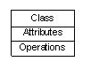

* 接口(interface)
接口是指类或组件所提供的服务（操作），描述了类或组件对外可见的动作；
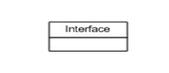

* 协作(collaboration)
协作定义元素之间的相互作用；
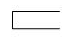

* 用例(use case)
用例定义了执行者（在系统外部和系统交互的人）和被考虑的系统之间的交互来实现的一个业务目标；
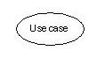

* 组件(component)
组件描述物理系统的一部分；
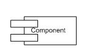

* 节点(node)
一个节点可以被定义为在运行时存在的物理元素；
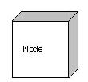

### 行为事务

行为事务指的是 UML 模型中的**动态**部分，代表语句里的 "动词"，表示模型里随着时空不断变化的部分，包含两类：

* 交互:
交互被定义为一种行为，包括一组元素之间的消息交换来完成特定的任务。
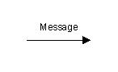

* 状态机:
状态机由一系列对象的状态组成，它是有用的，一个对象在其生命周期的状态是很重要的。
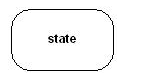

### 分组事务

可以把分组事务看成是一个"盒子"，模型可以在其中被分解。目前只有一种分组事务，即包（package）。结构事务、动作事务甚至分组事务都有可能放在一个包中。包纯粹是概念上的，只存在于开发阶段，而组件在运行时存在。

* 包:
封装是唯一一个分组事务可收集结构和行为的东西。
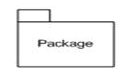

### 注释事务

注释事务可以被定义为一种机制来捕捉UML模型元素的言论，说明和注释。注释是唯一一个注释事务。

* 注释:
注释用于渲染意见，约束等的UML元素。
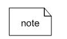

## 关系

关系是另一个最重要的构建块UML，它显示元素是如何彼此相关联，此关联描述的一个应用程序的功能，UML中定义了四种关系：

* 依赖关系:
依赖是两件事务之间的语义联系，其中一个事务的变化也影响到另一个事务。
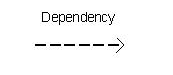

* 协作:
一种描述一组对象之间连接的结构关系，如聚合关系（描述了整体和部分间的结构关系）；
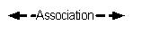

* 泛化:
泛化可以被定义为一个专门的元件连接关系与一个广义的元素，它基本上描述了在对象世界中的继承关系，是一种一般化-特殊化的关系；
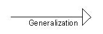

* 实现:
类之间的语义关系，其中的一个类指定了由另一个类保证执行的契约。

* 关联：实现箭头
可以是单向，也可以是双向
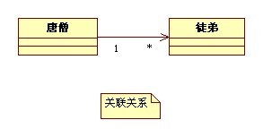

* 聚合：带空心菱形头表示
是关联关系的一种，是强的关联关系
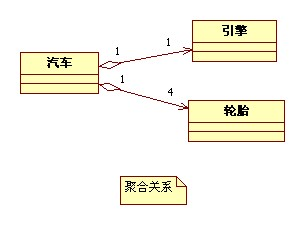

* 组合（Composition）：带实心菱形头的实线表示
合成关系是关联关系的一种，是比聚合关系还要强的关系。如果是组合关系，如果整体被破坏则个体一定会被破坏，而聚合的个体则可能是被多个整体所共享的，不一定会随着某个整体的破坏而被破坏。
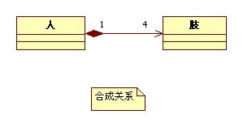

## UML图

UML 图的整个讨论的最终输出所有要素，关系用于使一个完整的UML图，图中表示的系统。

UML 图的视觉效果是整个过程中最重要的部分。

图是事务集合的分类，UML 中包含多种图：

* 类图：类图描述系统所包含的类、类的内部结构及类之间的关系；
* 对象图：对象图是类图的一个具体实例；
* 用例图：用例图从用户的角度出发描述系统的功能、需求，展示系统外部的各类角色与系统内部的各种用例之间的关系；
* 顺序图：顺序图表示对象之间动态合作的关系；
* 协作图：协作图描述对象之间的协作关系；
* 活动图：活动图描述系统中各种活动的执行顺序；
* 状态图：状态图描述一类对象的所有可能的状态以及事件发生时状态的转移条件；
* 部署关系图：部署关系图定义系统中软硬件的物理体系结构；
* 组件图：组件图描述代码部件的物理结构以及各部件之间的依赖关系；
