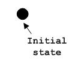

# 事务

* 结构事务
* 行为事务
* 分组事务
* 注释事务

## 结构事务

图形表示法中使用的结构事务是 UML 中最广泛使用的，这些被认为是为 UML 模型的名词。以下是结构事务的列表。

* 类
* 接口
* 协作
* 用例
* 活动类
* 组件
* 节点

### 类注释表示法

下面的图表示的 UML 类，该图被分为四个部分。

* 顶端部分被用来命名类。
* 第二个是用来显示类的属性。
* 第三部分是用来描述由类执行的操作。
* 第四部分是可选的显示附加组件。

类是用来表示对象，对象可以是任何性质和职责。

### 对象表示法

该对象表示以同样的方式作为类。唯一的区别是有下划线的名称，如下图所示。

由于对象是实际执行的一类被称为类的实例。因此，它具有相同的使用作为类。

### 接口表示法

接口是用圆来表示，如下所示。它有一个名称，一般写成下面的圆圈。

接口是用来描述的功能，而不执行。界面就像一个模板，定义不同的功能但不执行。当一个类实现了接口，也按要求实现功能。

### 协作表示法

协作表示由 eclipse 虚线如下所示。它有一个名字，里面写 eclipse。

协作表示职责，一般职责在一组。

### 用例表示法

用例表示它里面的一个名字作为 eclipse。它可能包含更多的责任。

用例是用来捕捉系统的高层次功能。

### 角色表示法

某些内部或外部的与系统进行交互的实体，可以被定义为一个角色。

角色是在描述用例图内部或外部实体。

### 初始状态表示法

初始状态被定义，以显示开始的一个过程。这个符号存在于大多数图。

初始状态的表示法的用法是显示一个过程的起点。

### 最终状态表示法

最终状态是用来显示的一个过程的结束。这种表示法也可以用来在大部分的图中描述的目的。

最终状态表示法的用法是显示一个过程的终止点。

### 活动类表示法

活动类类似于一类具有扎实的边界，活动类一般是用来描述一个系统的并发行为。

活动类是用来表示一个系统的并发性。

### 元件表示法

UML 中的一个组件，如下图所示名称里面。在必要时，可以添加额外的元素。

元器件是用来表示系统的任何部分的 UML 图。

### 节点表示法

UML 中的一个节点表示的一个方盒子，如下图所示，同一个名字。一个节点表示一个物理的系统组件。

节点用来表示物理系统的一部分，如服务器，网络等。

## 行为事务

动态部分是 UML 中最重要的元素之一。

UML 有一个强大的功能集，代表软件和非软件系统的动态部分。这些功能包括交互和状态机。

相互作用可分为两种类型：

* 顺序（序列图）
* 协作（协作图）

### 交互表示法

交互基本上是两个 UML 组件之间的信息交换。下图表示交互中使用不同的符号。

交互是用来表示一个系统的组件之间的通信。

### 状态机表示法

状态机描述的组件在其生命周期的不同状态。在下面的图中描述的符号。

状态机是用来描述一个系统组件的不同状态。状态可以是活动，空闲或任何其他根据情况。

### 分组事务

组织的 UML 模型设计的最重要的方面之一。 UML 中只有一个元件即可用于分组，也就是包。

### 包表示法

包装信息书写方式如下表所示，这是用来包装系统组成部分的。

## 注释事务

任一图表中说明的不同的元素和它们的功能是非常重要的。因此，UML 符号注释，以支持这一要求。

### 注释表示法

这种表示法如下所示，它们被用来提供一个系统的必要的信息。

