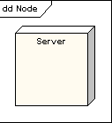
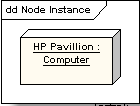
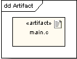
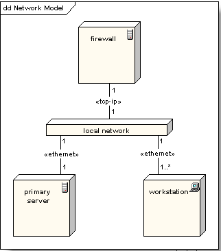
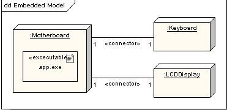
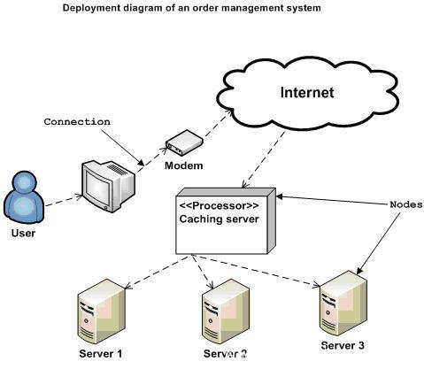
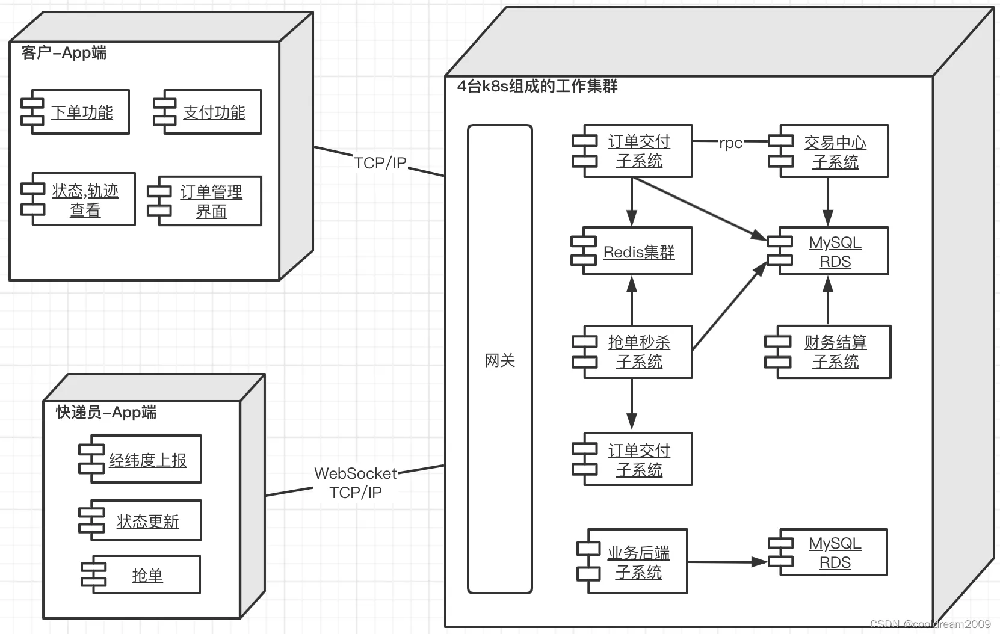

# UML部署图

部署图由节点以及节点之间的关系组成。

部署图描述的是系统运行时的结构，展示了硬件的配置及其软件如何部署到网络结构中。

部署图通常用来帮助理解分布式系统，一个系统模型只有一个部署图。

部署图用于可视化的软件组件部署的系统中的物理组件的拓扑结构。

部署图是用来描述一个系统的静态部署视图。

## UML 部署图元素

### 1、结点（Node）

结点是存在与运行时的代表计算机资源的物理元素，可以是硬件也可以是运行其上的软件系统，比如64主机、Windows server 2008操作系统、防火墙等。

结点用三维盒装表示，如下图所示：

### 2、结点实例（Node Instance）

结点实例的命名格式：Node Instance : node。它与结点的区别在于名称有下划线和结点类型前面有冒号，冒号前面可以有示例名称也可以没有示例名称，如下图：

### 3、结点类型（Node Stereotypes）

结点类型有：cdrom、cd-rom、computer、disk array、pc、pc client、pc server、secure、server、storage、unix server、user pc，并在结点的右上角用不同的图标表示，如下图：

### 4、物件（Artifact）

物件是软件开发过程中的产物，包括过程模型（比如用例图、设计图等等）、源代码、可执行程序、设计文档、测试报告、需求原型、用户手册等等。物件表示如下，带有关键字 artifact 和文档图标

### 5、连接（Association）

结点之间的连线表示系统之间进行交互的通信路径，这个通信路径称为连接（Association），如下图所示，连接中有网络协议：

### 6、结点容器（Node as Container）

一个结点可以包括其他的结点，比如组件或者物件，则称此结点为结点容器（Node as Container）。如下图所示，结点（Node）包容了物件（Artifact）：

## UML 部署图目的

部署图与组件图密切相关，部署图是用来描述软件组件部署的硬件组件；而组件图是用来描述组件和显示了它们是如何在硬件中部署。

UML的设计主要是把重点放在系统的软件构件。但是，这两个图是使用特殊图表专注于软件组件和硬件组件。

所以大多数的 UML 图是用来处理逻辑组件，但把重点放在系统的硬件拓扑部署图。

以下是部署图的目的描述：

* 可视化系统的硬件拓扑。

* 描述用于部署软件组件的硬件组件。

* 描述运行时处理节点。

## 如何绘制 UML 部署图？

部署图对系统工程师是非常有用。一个高效的部署图是非常重要的，因为它控制以下参数：

* 性能

* 可扩展性

* 可维护性

* 可移植性

在绘制部署图前应确定以下构件：

* 节点

* 节点之间的关系

下列部署图是一个样品给订单管理系统的部署视图的想法，已经表明的节点：

* 监控

* 调制解调器

* 缓存服务器

* 服务器

假定应用程序是一个基于 Web 的应用程序部署在集群环境中使用服务器1，服务器2和服务器3。用户连接到使用互联网的应用程序。控制流从缓存服务器的集群环境中。

所以下面的部署图已经制定考虑到所有上述提到的几点：

## 网上找的部署图示例

## 在哪里使用部署图？

部署图主要用于系统工程师。这些图用来描述的物理组件（硬件）以及它们的分布和关联。

为了阐述清楚细节，我们可以想像的硬件组件/节点上的软件组件位于部署图。

软件应用程序的开发需要复杂的业务流程模型。为了满足业务的需求，一个软件应用只做到高效是不够的，还应考虑到业务是否能够支持用户的不断增长以及响应的时间是否够快等。

软件应用程序可以是独立的，基于 Web，分布式，基于大型机和更多。

使用部署图可以描述如下：

* 为了模拟一个系统的硬件拓扑。

* 嵌入式系统建模。

* 为了模拟一个客户机/服务器系统的硬件的详细信息。

* 为了模拟硬件的分布式应用程序的细节。

* 正向和逆向工程。
