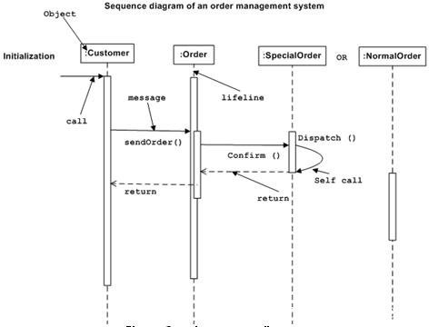
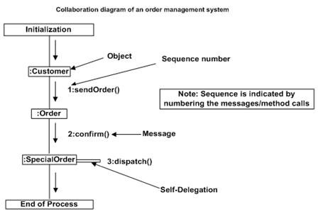

# UML交互图

* UML 交互图描述的是对象之间的动态合作关系以及合作过程中的行为次序。
* UML 交互图常常用来描述一个用例的行为，显示该用例中所涉及的对象以及这些对象之间的消息传递情况，即一个用例的实现过程。
* UML 交互图包括两种：序列图和协作图。
  * 序列图 ：显示对象之间的关系，强调对象之间消息的时间顺序，显示对象之间的交互。
  * 协作图 ：描述对象之间的交互关系。

## UML 交互图作用

UML 交互图主要包括对象和消息两类元素，创建交互图的过程实际上就是向对象分配任务的过程，是可视化系统的交互行为。

由于可视化的交互是一个困难的任务，所以要使用不同类型的模型来捕获不同方面的相互作用，这也是序列图和时序图的作用。

总而言之，对交互图的描述如下：

* 交互图捕捉一个系统的动态行为；

* 交互图用来描述该系统中的消息流；

* 交互图用来描述对象的结构组织；

* 交互图是为了描述对象之间的互动。

## UML 交互图如何绘制？

我们已经了解了交互图的作用就是捕捉系统的动态环节。因此，关于动态捕捉，我们需要知道一个动态的环节是如何实现可视化的。

动态环节可以定义为在一个特定的时刻运行的系统快照。

在绘制交互图之前，确定以下条件：

* 参与互动的对象；

* 对象之间的消息流；

* 消息的顺序流程；

* 对象的组织。

下面描述了两个交互图建模的订单管理系统：第一个图是序列图，第二个图是协作图。

### 序列图

序列图中包含了四个对象：客户、订单、特殊订单和正常订单。

下面的关系图所示的消息序列为 SpecialOrder 对象和 NormalOrder 对象在相同的情况下使用。现在重要的是要了解时间顺序的消息流，与消息流无关，使用一个对象的方法调用。

首先调用的是 sendOrder（），这是一个订单对象的方法；在下一次调用 confirm ()，这是一个 SpecialOrder 对象的方法；最后调用 Dispatch ()，它是一种方法的 SpecialOrder 对象。所以这里的图主要描述方法从一个对象到另一个对象的调用，在系统运行时这也是实际情况：

### 协作图

协作图显示对象的组织，如下图所示。

这里协作图的方法调用序列是表示，由一些数字技术，如下所示。

该数字表示方法如何被称为此起彼伏。我们已经采取了相同的订单管理系统，协作图来描述。

这些调用方法类似的序列图。但不同的是，序列图中未介绍的对象组织，而协作图中示出的对象的组织。

现在选择这两个图表之间主要强调的是需求类型。如果时间序列是很重要的，那么序列图中被使用，并且，如果需要的组织，那么使用协作图。

## 使用交互图的场合

我们现在来讨论交互图在实际情况中的应用。要了解实际应用中，我们需要了解的基本性质序列图和协作图。

这两个图的主要目的，是相似的，因为它们是用来捕捉系统的动态行为：序列图是用来捕获从一个对象到另一个消息流的顺序；协作图用来描述参与相互作用中的对象的结构组织。

一个单一的图是不足以说明整个系统的动态环节，这样的一套图是用来捕获一个整体。

使用交互图，当我们想要了解的消息流和组织结构。消息流装置控制流从一个对象到另一个序列和结构组织的装置，在一个系统中的元素的视觉组织。

以下是交互图的用法：

* 按时间顺序的控制流建模。

* 为了模拟流结构组织控制。

* 正向工程。

* 逆向工程。
