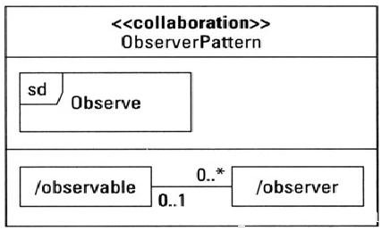
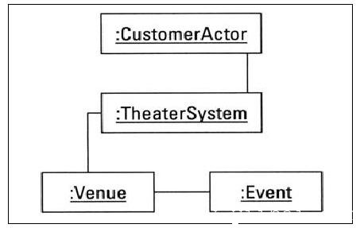
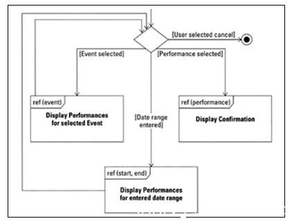
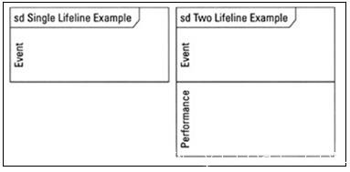
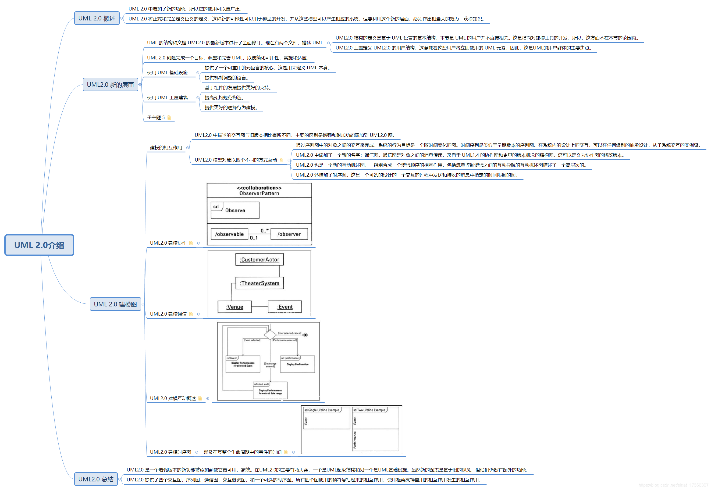

# UML 2.0

UML 2.0 中增加了新的功能，所以它的使用可以更广泛。

UML 2.0 将正式和完全定义语义的定义。这种新的可能性可以用于模型的开发，并从这些模型可以产生相应的系统。但要利用这个新的层面，必须作出相当大的努力，获得知识。

## UML2.0 新的层面

UML 的结构和文档 UML2.0 的最新版本进行了全面修订。现在有两个文件，描述 UML：

* UML2.0 结构的定义是基于 UML 语言的基本结构。本节是 UML 的用户并不直接相关。这是指向对建模工具的开发。所以，这方面不在本节的范围内。

* UML2.0 上盖定义 UML2.0 的用户结构。这意味着这些用户将立即使用的 UML 元素。因此，这是UML的用户群体的主要焦点。

UML 2.0 创建完成一个目标，调整和完善 UML，以便简化可用性，实施和适应。

使用 UML 基础设施：

* 提供了一个可重用的元语言的核心。这是用来定义 UML 本身。

* 提供机制调整的语言。

使用 UML 上层建筑：

* 基于组件的发展提供更好的支持。

* 提高架构规范构造。

* 提供更好的选择行为建模。

所以很重要的一点要注意的是上述的主要分部。这些区划是用来增加UML的可用性和定义清楚地了解它的用法。

另外一个方面，已经提出了这个新版本。它是一个完全新的对象约束语言（OCL）和图交汇处的建议。这些功能都一起形成完整的UML2.0包。

## UML 2.0 建模图

### 建模的相互作用

UML2.0 中描述的交互图与旧版本相比有所不同，主要的区别是增强和附加功能添加到 UML2.0 图。

UML2.0 模型对象以四个不同的方式互动：

* 通过序列图中的对象之间的交互来完成，系统的行为目标是一个随时间变化的图。时间序列是类似于早期版本的序列图。在系统内的设计上的交互，可以在任何级别的抽象设计，从子系统交互的实例级。

* UML2.0 中添加了一个新的名字：通信图。通信图是对象之间的消息传递，来自于 UML1.4 的协作图和更早的版本概念的结构图。这可以定义为协作图的修改版本。

* UML2.0 也是一个新的互动概述图。一组组合成一个逻辑顺序的相互作用，包括流量控制逻辑之间的互动导航的互动概述图描述了一个高层次的。

* UML2.0 还增加了时序图。这是一个可选的设计的一个交互的过程中发送和接收的消息中指定的时间限制的图。

因此，从上面的描述中，重要的是要注意，所有的图的目的是发送/接收消息。载入这些消息的装卸内部的对象。所以对象也有接收和发送邮件的选项，这里谈到的另一个重要方面称为接口。现在，这些接口是负责接受和发送消息到另一个。

因此，从上面的讨论可以得出结论，UML2.0中相互作用以不同的方式描述的，这就是为什么进入图片所遇到的新的图名。但是，如果我们分析了新的图，那么很显然，根据在早期版本中所描述的交互图创建的所有图。唯一的区别是UML2.0添加附加功能。使图更高效和目的导向。

### UML2.0 建模协作

正如我们已经讨论过的，协作是用来模拟常见的物体之间的相互作用。要阐明的话，我们可以说，协作是互动对象由一组消息预先定义的角色。

最重要的一点要注意的是协作图的早期版本，并在UML2.0版本之间的差异。因此，区分协作图名称已更改于UML2.0。它被命名为UML2.0通信图。

因此，协作被定义为一类的属性（属性）和行为（操作）。的协作类上的隔间可以用户定义的也可用于相互作用（时序图）的构成要素（组合结构图）。

下图模型的观察者设计模式之间的协作对象观察到的项目中的作用，以及任何数量的观察员的对象。

### UML2.0 建模通信

通信图协作图的早期版本略有不同。我们可以说，它是一个缩减版的早期版本的UML。通信图的区别因素是在对象之间的链接。

这是一个可视化的链接，它缺少的序列图。在序列图只显示对象之间传递的消息，即使有它们之间没有联系。

通信图是建模人员是用来防止这样的错误，通过使用一个对象图的格式作为消息传递的基础。通信图上每个对象被称为对象生命线。

通信图的消息类型是相同的序列图。通信图可以模拟同步，异步，返回，丢失，发现，和对象的创建消息。

下图显示了三个对象的对象图和两个环节，形成了基础通信图是。通信图是上每个对象被称为对象生命线。

### UML2.0 建模互动概述

在实际使用中，一个单一的场景的序列图是用来模型。所以使用序列图来完成整个应用程序。当一个单一的场景建模，它有可能忘记的全过程并且这可能带来误差。

因此，要解决这个问题，新的互动概述结合的控制流图，活动图，序列图和消息规范。

活动图使用活动对象流来形容一个过程。互动概述图使用相互作用和交互出现。序列图中的生命线和消息只出现内相互作用或相互作用的发生。然而，参与的互动概述图的生命线（对象）可能被列为图名。

下图显示了一个决定帧和终止点的交互概览图

### UML2.0 建模时序图

此图中本身的名称，描述图中的目的。它基本上是涉及在其整个生命周期中的事件的时间。

因此，可以被定义为一个时序图，把重点放在其使用寿命中的一个对象的事件的特殊目的的交互图。它基本上是一个混合的状态机和交互图。时序图使用下面的时间线：

* 状态的时间线

* 一般值的时间线

在时序图中的生命线一帧的内容区域内形成一个长方形的空间。它通常是水平对齐读取由左到右。在同一帧内，也可以层叠多个生命线，它们之间的相互作用模型。

## 以下是UML 2.0介绍的汇总图

## UML2.0 总结

UML2.0 是一个增强版本的新功能被添加到使它更可用，高效。在UML2.0的主要有两大类，一个是UML超级结构和另一个是UML基础设施。虽然新的图表是基于旧的观念，但他们仍然有额外的功能。

UML2.0 提供了四个交互图，序列图，通信图，交互概览图，和一个可选的时序图。所有四个图使用的帧符号括起来的相互作用。使用框架支持重用的相互作用发生的相互作用。
