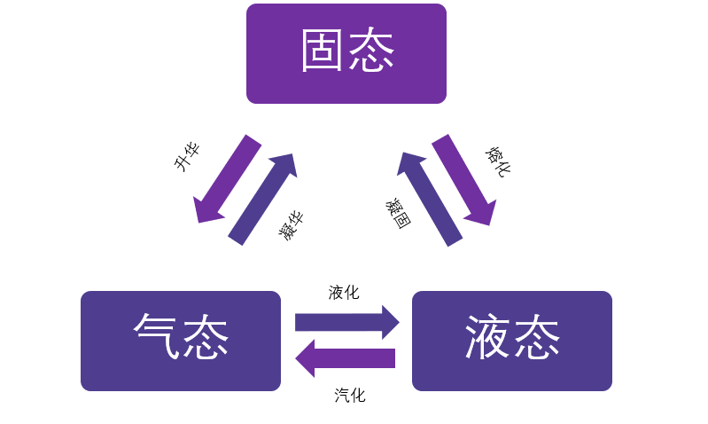

# 箭头含义

在系统结构图中，箭头用于表示组件之间的交互和数据流的方向。以下是一些常见的箭头类型及其含义：

* 实线箭头：
表示直接的控制流或数据流。从箭头的尾部到箭头的头部，表示数据或控制信号的传递方向。
* 虚线箭头：
通常表示一种关系或依赖，可能不是直接的数据流。这可以表示组件之间的继承、关联或通信。
* 带箭头的曲线：
类似于实线箭头，但用于表示更复杂的路径或跨越多个层次的交互。
* 双向箭头：
表示两个组件之间存在双向交互，数据可以在两个方向上流动。
* 箭头上带有“+”号：
表示触发动作或方法调用，通常用于表示事件处理或函数调用。
* 箭头上带有“-”号：
表示删除或移除操作。
* 箭头上带有“<->”：
表示同步交互，两个组件同时或顺序进行操作。
* 箭头上带有“->”：
表示异步交互，操作是顺序进行的，但可能存在时间上的延迟。
* 箭头上带有“…”：
表示多对多的关系，或者数据流是可变的。
* 箭头上带有文字：
文字可以描述交互的类型或数据流的内容。
* 箭头上带有数字：
表示交互的顺序或步骤。
* 箭头上带有颜色：
颜色可以用来区分不同类型的交互或数据流，或者表示不同的状态。

## 图例

在设计系统结构图时，应该遵循一些基本规则：

* 一致性：在整个图中保持箭头的风格和含义一致。
* 简洁性：避免过多的箭头使图表变得混乱。
* 清晰性：确保箭头的方向和含义清晰易懂。
* 标注：必要时，使用标签或说明文字来解释箭头的含义。

系统结构图的目的是清晰地展示系统的组件及其交互，箭头是实现这一目的的重要工具。通过合理使用箭头，可以使图表更加直观和易于理解。
