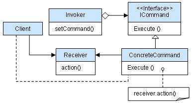

# 命令模式

将请求/操作封装为一个对象，允许用户使用不同的请求对客户端进行参数化，使请求者与接收者解耦，支持【对请求排队】、【记录请求日志】，以及【支持可撤销】的操作。

类型：行为型

目的：解决在软件系统中请求者和执行者之间的紧耦合问题，特别是在需要对行为进行记录、撤销/重做或事务处理等场景。

示意图：



## 结构

命令模式通常定义以下角色：

- **命令（Command）**:定义了执行操作的接口，通常包含一个 execute 方法，用于调用具体的操作。
- **具体命令（ConcreteCommand）**:实现了命令接口，负责执行具体的操作。它通常包含了对接收者的引用，通过调用接收者的方法来完成请求的处理。
- **接收者（Receiver）**:知道如何执行与请求相关的操作，实际执行命令的对象。
- **调用者/请求者（Invoker）**:发送命令的对象，它包含了一个命令对象并能触发命令的执行。调用者并不直接处理请求，而是通过将请求传递给命令对象来实现。
- **客户端（Client）**:创建具体命令对象并设置其接收者，将命令对象交给调用者执行。

## 适用场景

- 当需要将操作封装为对象时。
- 当需要对操作进行排队、记录或撤销时。
- 当需要将调用操作的对象和知道如何执行操作的对象解耦时。

## 优缺点

- 优点：
  - **解耦**：命令模式将调用操作的对象与知道如何执行操作的对象解耦。
  - **扩展性**：容易扩展新命令，符合开闭原则。
  - **撤销操作**：支持撤销操作。
  - **日志记录**：可以很容易地添加日志记录功能。
- 缺点：
  - **资源消耗**：如果系统中有很多命令，可能会消耗大量资源。

## 示例

```java
// 命令接口
interface Command {
    void execute();
    void undo();
}

// 接收者
class Receiver {
    public void action() {
        System.out.println("Receiver performs the action");
    }
    
    public void revertAction() {
        System.out.println("Receiver reverts the action");
    }
}

// 具体命令
class ConcreteCommand implements Command {
    private Receiver receiver;

    public ConcreteCommand(Receiver receiver) {
        this.receiver = receiver;
    }

    @Override
    public void execute() {
        receiver.action();
    }

    @Override
    public void undo() {
        receiver.revertAction();
    }
}

// 调用者
class Invoker {
    private Command command;

    public void setCommand(Command command) {
        this.command = command;
    }

    public void trigger() {
        command.execute();
    }

    public void untrigger() {
        command.undo();
    }
}

// 客户端代码
public class CommandPatternDemo {
    public static void main(String[] args) {
        Receiver receiver = new Receiver();
        Command command = new ConcreteCommand(receiver);
        Invoker invoker = new Invoker();

        invoker.setCommand(command);
        invoker.trigger();  // Receiver performs the action
        invoker.untrigger(); // Receiver reverts the action
    }
}
```
