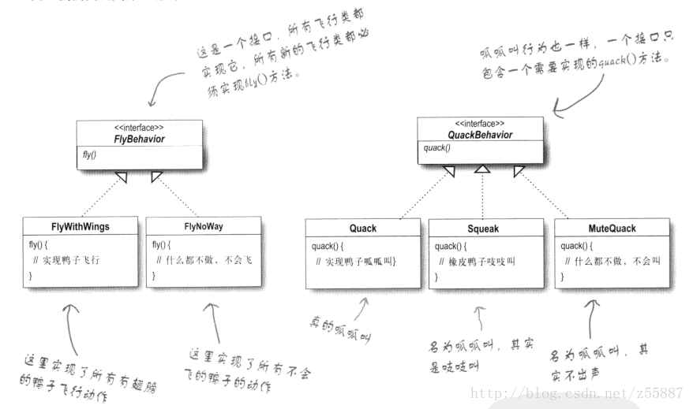

# 状态模式VS策略模式

摘录资料：[菜鸟教程-状态模式VS策略模式](https://www.runoob.com/w3cnote/state-vs-strategy.html)
>文章真的很精彩。通过对案例的逐步分析，层层递进的进行结构设计，并详细阐述了两种模式的区别，我受益匪浅，感谢~。

## 个人理解区别

- 状态模式：行为是明确的，但状态会影响行为具体的执行。这种情况下，将不变行为封装为固定方法即行为接口，将变化的状态设定为具体状态类并实现行为接口，通过上下文对象持有的不同状态执行对应的行为。
- 策略模式：行为是变化的，状态是固定的。这种情况下，将不变的状态固定，将行为设定为不同的策略类，每次通过状态类中的不同策略类执行对应策略的行为。

---

## 资料详细内容抄录

在行为类设计模式中，状态模式和策略模式是亲兄弟，两者非常相似，我们先看看两者的通用类图，把两者放在一起比较一下，如图所示：


二者是不是很像，光看这个 UML 我们看不出什么端倪来，接下来我们结合例子，来对比一下二者之间的区别。下面的例子是《Head First 设计模式》中的例子。

---

### 策略模式

策略模式定义了算法族，分别封装起来，让他们之间可以互相替换，此模式让算法的变化独立于使用算法的客户。

某公司开发了一个鸭子游戏，里面会出现各种特点的鸭子：绿头鸭，红头鸭，橡皮鸭……用程序如何实现这些鸭子？ 看到这个场景问题，很容易想到，先定义一个所有鸭子的超类Duck，把公共方法和属性封装进去。例如，鸭子都会游泳，鸭子都有各自的外貌：

```java
public abstract class Duck {
    public void swim(){
        System.out.println("All duck can swim!");
    }
    public abstract void display();
    public void fly(){
        System.out.println("飞~~~");
    }
    public void quack(){
        System.out.println("呱呱呱~");
    }
}
```

但是很快，我们发现这个超类的定义有问题。不是所有鸭子都会飞，不是所有鸭子都是呱呱叫（假设橡皮鸭是吱吱叫）。只要继承了这个超类，那所有的鸭子都会飞了，所有的鸭子都是呱呱叫了。

怎么办呢？

- **Solution 1**

    第一个想到的解决方法是：子类进行方法覆盖。很简单，不会飞的子类覆盖fly方法，重写不就行了？

    但是，弊端很明显，所有不会飞的子类岂不都是要覆盖，假设50种鸭子都不会飞，那重写的工作量和维护量得有多大？

- **Solution 2**

    好的，所以我们想到第二个方法：继续设计子抽象类，例如会飞不会叫的抽象子类FlyNoQuackDuck,会叫不会非的抽象子类QuackNoFlyDuck，不会叫不会飞的抽象子类NoQuackNoFlyDuck，又会飞又会叫的抽象子类FlyAndQuackDuck……

    写着写着我们发现这种方法也不行，太不灵活，而且改变的部分越多，这种抽象子类得定义的越多。

- **Solution 3**

    那什么方法才好呢？我们思考，之所以出现上面的问题，是因为我们习惯性的总想用继承来实现改变的部分，实际我们可以将改变的部分抽离出来，用组合来实现。

这里用到了三个设计原则：

- 找出应用中可能需要变化之处，把他们独立出来。
- 针对接口编程，而不是针对实现
- 多用组合，少用继承

运用第一个设计原则，我们将改变的方法fly()和quack()独立出来，封装成两个行为类接口。然后根据不同的需求，设计出实现接口的不同行为类。



运用第二个和第三个设计原则，我们在Duck类中组合两个成员变量的接口，在子类中动态的赋值。


整体的"类图"如下：


#### 总结

这种解决方法很完美的解决了我们的问题，运用"策略模式"的思想，将变化的部分抽离出来，组合进类中，根据不同的子类，可以"set"不同的行为子类进行，实现动态改变行为。

#### 代码实现

两个行为接口类

```java
public interface FlyBehavior {
    public void fly();
}

public interface QuackBehavior {
    public void quack();
}
```

实现飞行接口的不同行为类

```java
public class FlyNoWay implements FlyBehavior{
    public void fly(){
        System.out.println("我不能飞……");
    }
}

public class FlyWithWings implements FlyBehavior{
    public void fly(){
        System.out.println("飞~~~");
    }
}

public class FlyWithRocket implements FlyBehavior{

    public void fly(){
        System.out.println("带上火箭筒，飞~~~");
    }
}
```

实现鸭叫的不同行为类

```java
public class Quack implements QuackBehavior{
    public void quack(){
        System.out.println("呱呱呱~");
    }
}


public class Squeak implements QuackBehavior{
    public void quack(){
        System.out.println("吱吱吱~");
    }
}


public class MuteQuack implements QuackBehavior{
    public void quack(){
        System.out.println("我不会叫……");
    }
}
```

组合了实现接口的超类

```java
public abstract class Duck {
    protected FlyBehavior flyBehavior;
    protected QuackBehavior quackBehavior;

    public void swim(){
        System.out.println("All duck can swim!");
    }

    public abstract void display();

    /**
     * 动态改变飞行行为
     */
    public void setFlyBehavior(FlyBehavior flyBehavior) {
        this.flyBehavior = flyBehavior;
    }

    /**
     * 动态改变鸭叫行为
     */
    public void setQuackBehavior(QuackBehavior quackBehavior) {
        this.quackBehavior = quackBehavior;
    }

    public void performFly(){
        flyBehavior.fly();
    }

    public void performQuack(){
        quackBehavior.quack();
    }
}
```

不同的鸭子类

```java
/**
 * 绿头鸭
 */
public class MallarDuck extends Duck{

    public MallarDuck() {
        //可飞
        flyBehavior = new FlyWithWings();
        //呱呱叫
        quackBehavior = new Quack();
    }

    @Override
    public void display() {
        System.out.println("看着像绿头鸭");
    }

}

/**
 * 绿头鸭
 */
public class RedHeadDuck extends Duck{

    public RedHeadDuck() {
        //可飞
        flyBehavior = new FlyWithWings();
        //呱呱叫
        quackBehavior = new Quack();
    }

    @Override
    public void display() {
        System.out.println("看着像红头鸭");
    }

}

/**
 * 橡皮鸭
 */
public class RubberDuck extends Duck{

    public RubberDuck() {
        //不会飞
        flyBehavior = new FlyNoWay();
        //吱吱叫
        quackBehavior = new Squeak();
    }

    @Override
    public void display() {
        System.out.println("看着像橡皮鸭");
    }

}
```

---

### 状态模式

状态模式允许对象在内部状态改变时改变它的行为，对象看起来好像修改了它的类

状态模式策略模式很相似，也是将类的"状态"封装了起来，在执行动作时进行自动的转换，从而实现，类在不同状态下的同一动作显示出不同结果。它与策略模式的区别在于，这种转换是"自动"，"无意识"的。

状态模式的类图如下


状态模式的类图与策略模式一模一样，区别在于它们的意图。策略模式会控制对象使用什么策略，而状态模式会自动改变状态。看完下面的案例应该就清楚了。

现在有一个糖果机的需求摆在你面前，需要用Java实现。

我们分析一下，糖果机的功能可以分为下图所示的四个动作和四个状态：


在不同状态下，同样的动作结果不一样。例如，在"投了25分钱"的状态下"转动曲柄"，会售出糖果；而在"没有25分钱"的状态下"转动曲柄"会提示请先投币。

简单思考后，我们写出如下的糖果机实现代码

```java
public class NoPatternGumballMachine{
    /*
     * 四个状态
     */
    /**没有硬币状态*/
    private final static int NO_QUARTER = 0;
    /**投币状态*/
    private final static int HAS_QUARTER = 1;
    /**出售糖果状态*/
    private final static int SOLD = 2;
    /**糖果售尽状态*/
    private final static int SOLD_OUT = 3;

    private int state = SOLD_OUT;
    private int candyCount = 0;

    public NoPatternGumballMachine(int count) {
        this.candyCount = count;
        if(candyCount > 0)
            state = NO_QUARTER;
    }

    /*
     * 四个动作
     */

    /**
     * 投币
     */
    public void insertQuarter() {
        if(NO_QUARTER == state){
            System.out.println("投币");
            state = HAS_QUARTER;
        }
        else if(HAS_QUARTER == state){
            System.out.println("请不要重复投币！");
            returnQuarter();
        }
        else if(SOLD == state){
            System.out.println("已投币，请等待糖果");
            returnQuarter();
        }else if(SOLD_OUT == state){
            System.out.println("糖果已经售尽");
            returnQuarter();
        }
    }

    /**
     * 退币
     */
    public void ejectQuarter() {
        if(NO_QUARTER == state){
            System.out.println("没有硬币，无法弹出");
        }
        else if(HAS_QUARTER == state){
            returnQuarter();
            state = NO_QUARTER;
        }
        else if(SOLD == state){
            System.out.println("无法退币，正在发放糖果，请等待");
        }else if(SOLD_OUT == state){
            System.out.println("没有投币，无法退币");
        }
    }

    /**
     * 转动出糖曲轴
     */
    public void turnCrank() {
        if(NO_QUARTER == state){
            System.out.println("请先投币");
        }
        else if(HAS_QUARTER == state){
            System.out.println("转动曲轴，准备发糖");
            state = SOLD;
        }
        else if(SOLD == state){
            System.out.println("已按过曲轴，请等待");
        }else if(SOLD_OUT == state){
            System.out.println("糖果已经售尽");
        }
    }

    /**
     * 发糖
     */
    public void dispense() {
        if(NO_QUARTER == state){
            System.out.println("没有投币，无法发放糖果");
        }
        else if(HAS_QUARTER == state){
            System.out.println("this method don't support");
        }
        else if(SOLD == state){
            if(candyCount > 0){
                System.out.println("分发一颗糖果");
                candyCount --;
                state = NO_QUARTER;
            }
            else{
                System.out.println("抱歉，糖果已售尽");
                state = SOLD_OUT;
            }
        }else if(SOLD_OUT == state){
            System.out.println("抱歉，糖果已售尽");
        }
    }

    /**
     * 退还硬币
     */
    protected void returnQuarter() {
        System.out.println("退币……");
    }

}
```

从代码里面可以看出，糖果机根据此刻不同的状态，而使对应的动作呈现不同的结果。这份代码已经可以满足我们的基本需求，但稍微思考一下，你会觉得这种实现代码似乎，功能太复杂了，扩展性很差，没有面向对象的风格。

假设由于新需求，要增加一种状态，那每个动作方法我们都需要修改，都要重新增加一条else语句。而如果需求变更，某个状态下的动作需要修改，我们也要同时改动四个方法。这样的工作将是繁琐而头大的。

怎么办? 六大设计原则之一

找出应用中可能需要变化之处，把他们独立出来。

在糖果机中，状态就是一直在变化的部分，不同的状态动作不一样。我们完全可以将其抽离出来


#### 新的设计想法如下

首先，我们定义一个State接口，在这个接口内，糖果机的每个动作都有一个对应的方法

然后为机器的每个状态实现状态类，这些类将负责在对应的状态下进行机器的行为

最后，我们要摆脱旧的条件代码，取而代之的方式是，将动作委托到状态类

定义一个State接口

```java
public abstract class State {
    /**
     * 投币
     */
    public abstract void insertQuarter();

    /**
     * 退币
     */
    public abstract void ejectQuarter();

    /**
     * 转动出糖曲轴
     */
    public abstract void turnCrank();

    /**
     * 发糖
     */
    public abstract void dispense();

    /**
     * 退还硬币
     */
    protected void returnQuarter() {
        System.out.println("退币……");
    }
}
```

为机器的每个状态实现状态类

```java
/**
 * 没有硬币的状态
 */
public class NoQuarterState extends State{
    GumballMachine gumballMachine;

    public NoQuarterState(GumballMachine gumballMachine) {
        this.gumballMachine = gumballMachine;
    }
    @Override
    public void insertQuarter() {
        System.out.println("你投入了一个硬币");
        //转换为有硬币状态
        gumballMachine.setState(gumballMachine.hasQuarterState);
    }

    @Override
    public void ejectQuarter() {
        System.out.println("没有硬币，无法弹出");
    }

    @Override
    public void turnCrank() {
        System.out.println("请先投币");
    }

    @Override
    public void dispense() {
        System.out.println("没有投币，无法发放糖果");
    }

}

/**
 * 投硬币的状态
 */
public class HasQuarterState extends State{
    GumballMachine gumballMachine;

    public HasQuarterState(GumballMachine gumballMachine) {
        this.gumballMachine = gumballMachine;
    }
    @Override
    public void insertQuarter() {
        System.out.println("请不要重复投币！");
        returnQuarter();
    }

    @Override
    public void ejectQuarter() {
        returnQuarter();
        gumballMachine.setState(gumballMachine.noQuarterState);
    }

    @Override
    public void turnCrank() {
        System.out.println("转动曲轴，准备发糖");
        gumballMachine.setState(gumballMachine.soldState);
    }

    @Override
    public void dispense() {
        System.out.println("this method don't support");
    }

}

/**
 * 出售的状态
 */
public class SoldState extends State{
    GumballMachine gumballMachine;

    public SoldState(GumballMachine gumballMachine) {
        this.gumballMachine = gumballMachine;
    }

    @Override
    public void insertQuarter() {
        System.out.println("已投币，请等待糖果");
        returnQuarter();
    }

    @Override
    public void ejectQuarter() {
        System.out.println("无法退币，正在发放糖果，请等待");
    }

    @Override
    public void turnCrank() {
        System.out.println("已按过曲轴，请等待");
    }

    @Override
    public void dispense() {
        int candyCount = gumballMachine.getCandyCount();
        if(candyCount > 0){
            System.out.println("分发一颗糖果");
            candyCount--;
            gumballMachine.setCandyCount(candyCount);
            if(candyCount > 0){
                gumballMachine.setState(gumballMachine.noQuarterState);
                return;
            }
        }

        System.out.println("抱歉，糖果已售尽");
        gumballMachine.setState(gumballMachine.soldOutState);
    }

}

/**
 * 售尽的状态
 */
public class SoldOutState extends State{
    GumballMachine gumballMachine;

    public SoldOutState(GumballMachine gumballMachine) {
        this.gumballMachine = gumballMachine;
    }
    @Override
    public void insertQuarter() {
        System.out.println("糖果已经售尽");
        returnQuarter();
    }

    @Override
    public void ejectQuarter() {
        System.out.println("没有投币，无法退币");
    }

    @Override
    public void turnCrank() {
        System.out.println("糖果已经售尽");
    }

    @Override
    public void dispense() {
        System.out.println("糖果已经售尽");
    }

}
```

将糖果机的动作委托到状态类

```java
public class GumballMachine extends State{
    public State noQuarterState = new NoQuarterState(this);
    public State hasQuarterState = new HasQuarterState(this);
    public State soldState = new SoldState(this);
    public State soldOutState = new SoldOutState(this);

    private State state = soldOutState;
    private int candyCount = 0;

    public GumballMachine(int count) {
        this.candyCount = count;
        if(count > 0)
            setState(noQuarterState);
    }

    @Override
    public void insertQuarter() {
        state.insertQuarter();
    }
    @Override
    public void ejectQuarter() {
        state.ejectQuarter();
    }
    @Override
    public void turnCrank() {
        state.turnCrank();
    }
    @Override
    public void dispense() {
        state.dispense();
    }

    public void setState(State state) {
        this.state = state;
    }

    public State getState() {
        return state;
    }

    public void setCandyCount(int candyCount) {
        this.candyCount = candyCount;
    }

    public int getCandyCount() {
        return candyCount;
    }

}
```

可以发现，这种设计下，糖果机根本不需要清楚状态的改变，它只用调用状态的方法就行。状态的改变是在状态内部发生的。这就是"状态模式"。

如果此时再增加一种状态，糖果机不需要做任何改变，我们只需要再增加一个状态类，然后在相关的状态类方法里面增加转换的过程即可。
