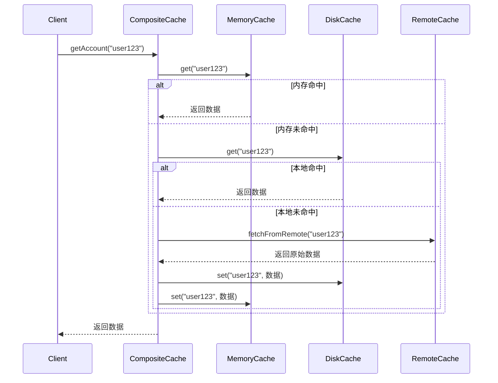

# 组合模式+策略模式

实现三级缓存的账号数据获取功能，推荐采用 **组合设计模式** 和 **策略模式** 结合的方案，同时融入 **工厂模式** 管理缓存实例。以下是具体设计思路及模式选择依据：

## **一、核心设计模式选择**

### **1. 组合模式（Composite Pattern）**

**作用**：将多级缓存（如内存缓存、本地存储、远程服务）抽象为统一接口，使客户端可以一致地操作单级缓存或缓存组合。  
**实现逻辑**：  

- 定义顶层接口 `Cache`，包含 `get()`、`set()`、`delete()` 等核心方法。  
- 具体缓存类（如 `MemoryCache`、`DiskCache`、`RemoteCache`）实现该接口，处理各自的读写逻辑。  
- 定义 `CompositeCache` 组合类，维护子缓存列表（如三级缓存的顺序），按优先级依次调用子缓存的方法。  

**示例代码结构**：  

```java
// 顶层接口
public interface Cache {
    Object get(String key);
    void set(String key, Object value);
    void delete(String key);
}

// 内存缓存（一级缓存）
public class MemoryCache implements Cache {
    // 基于HashMap实现内存缓存
}

// 组合缓存（三级缓存）
public class CompositeCache implements Cache {
    private final List<Cache> caches; // 按优先级排序（内存→本地→远程）

    public CompositeCache(Cache... caches) {
        this.caches = Arrays.asList(caches);
    }

    @Override
    public Object get(String key) {
        for (Cache cache : caches) {
            Object value = cache.get(key);
            if (value != null) { // 按顺序获取，优先返回一级缓存结果
                return value;
            }
        }
        return null;
    }

    // set/delete方法可根据需求决定是否更新所有层级缓存
}
```

### **2. 策略模式（Strategy Pattern）**

>这步与下面的详细示例不符合，但不代表这步是错的，如果你有需要把每个功能点都拆分使用不同的处理方式，可以采用这一说明。

**作用**：解耦缓存策略（如缓存过期时间、更新策略），允许动态切换不同的缓存行为。  
**应用场景**：  

- **缓存过期策略**：内存缓存设置短有效期（如5分钟），本地存储设置长有效期（如1天）。  
- **更新策略**：  
  - **Cache-Aside（旁路缓存）**：先更新数据库，再删除缓存（适用于写多读少场景）。  
  - **Write-Through（写入穿透）**：同时更新缓存和数据库（适用于实时性要求高的场景）。  

**实现逻辑**：  

- 定义策略接口 `CacheStrategy`，包含 `getStrategy()`、`setStrategy()` 方法。  
- 具体策略类（如 `ExpireStrategy`、`UpdateStrategy`）实现该接口，封装不同的缓存逻辑。  
- 在 `Cache` 接口中引入策略注入，例如：  

  ```java
  public interface Cache {
      void setStrategy(CacheStrategy strategy); // 注入策略
      // ...其他方法
  }
  ```

### **3. 工厂模式（Factory Pattern）**

**作用**：统一创建缓存实例，隐藏具体实现细节，便于扩展和维护。  
**实现逻辑**：  

- 定义工厂类 `CacheFactory`，根据配置（如 `CACHE_TYPE.MEMORY`、`CACHE_TYPE.DISK`）返回对应的缓存实例。  
- 支持通过配置文件（如 `config.properties`）动态指定缓存层级和策略：  

  ```java
  public class CacheFactory {
      public static Cache createCache(CACHE_TYPE type) {
          switch (type) {
              case MEMORY:
                  return new MemoryCache();
              case DISK:
                  return new DiskCache();
              case REMOTE:
                  return new RemoteCache();
              default:
                  throw new IllegalArgumentException("Unknown cache type");
          }
      }
  }
  ```

## **二、三级缓存的典型流程设计**

### **流程说明**（以获取账号数据为例）

1. **一级缓存（内存缓存，如 HashMap/Guava Cache）**  
   - 优先从内存获取数据，速度最快。  
   - 数据有效期短（如5分钟），适用于高频读场景。  

2. **二级缓存（本地存储，如文件/数据库 SQLite）**  
   - 内存缓存失效后，从本地存储读取。  
   - 数据有效期较长（如1天），用于持久化存储中间结果。  

3. **三级缓存（远程服务，如 Redis/HTTP 接口）**  
   - 前两级缓存均失效时，调用远程服务获取原始数据（如数据库或第三方接口）。  
   - 更新策略：获取远程数据后，按顺序写入二级和一级缓存。  

### **时序图**  



## **三、关键扩展点与最佳实践**

### **1. 缓存穿透与击穿处理**  

- **缓存穿透**（查询不存在的数据）：  
  - 采用 **布隆过滤器**（Bloom Filter）过滤无效请求，避免频繁穿透到远程服务。  
- **缓存击穿**（热点数据同时失效）：  
  - 使用 **互斥锁**（如 `ReentrantLock`）或 **逻辑过期**（异步提前更新缓存）。  

### **2. 缓存更新策略**  

- **读时更新**：获取数据时检查过期时间，过期则异步刷新。  
- **写时更新**：通过策略模式实现 `Cache-Aside` 或 `Write-Through`。  

### **3. 监控与日志**  

- 在组合缓存中添加监控钩子，统计各层级缓存的命中率、响应时间等指标。  
- 使用日志框架记录缓存穿透、击穿等异常情况。  

## **四、模式组合的优势**

| 模式         | 优势                                                                 |
|--------------|----------------------------------------------------------------------|
| 组合模式     | 统一多级缓存接口，支持动态增减缓存层级（如未来扩展四级缓存）。       |
| 策略模式     | 解耦缓存逻辑，便于切换过期策略、更新策略，提升代码可维护性。         |
| 工厂模式     | 集中管理缓存实例创建，支持通过配置动态调整缓存类型和层级顺序。       |

## **五、代码示例（简化版）**

```java
// 客户端调用
public class AccountService {
    private final Cache cache;

    public AccountService() {
        // 创建三级缓存组合（内存→本地→远程）
        Cache memoryCache = CacheFactory.createCache(CACHE_TYPE.MEMORY);
        Cache diskCache = CacheFactory.createCache(CACHE_TYPE.DISK);
        Cache remoteCache = CacheFactory.createCache(CACHE_TYPE.REMOTE);
        this.cache = new CompositeCache(memoryCache, diskCache, remoteCache);
    }

    public Account getAccount(String userId) {
        return (Account) cache.get(userId);
    }
}
```

通过组合设计模式、策略模式和工厂模式，可构建灵活、可扩展的三级缓存体系，兼顾性能、可维护性和可扩展性。实际开发中可根据具体技术栈（如 Java 中的 Caffeine/Guava，Python 中的 `lru_cache`/Redis）调整实现细节。

---

## 缓存策略具体实现

>本示例与上面的说明是不一样的，而是一个简化版本，将组合模式与策略模式进行了融合，把不同策略作为不同层级缓存的真正实现。

下面我将详细说明如何使用策略模式实现缓存策略，并提供具体的步骤和代码示例。

## **1. 定义缓存策略接口**

首先需要定义一个统一的缓存策略接口，包含缓存操作的核心方法：

```kotlin
interface CacheStrategy {
    fun get(key: String): Any?
    fun put(key: String, value: Any)
    fun delete(key: String)
    fun isExpired(key: String): Boolean  // 检查缓存是否过期
}
```

## **2. 实现具体的缓存策略类**

针对不同的缓存层级（内存、本地、远程），实现具体的策略类：

### **内存缓存策略**

```kotlin
class MemoryCacheStrategy : CacheStrategy {
    private val cache = mutableMapOf<String, CacheEntry>()
    
    override fun get(key: String): Any? {
        val entry = cache[key] ?: return null
        return if (isExpired(key)) {
            cache.remove(key)
            null
        } else {
            entry.value
        }
    }
    
    override fun put(key: String, value: Any) {
        cache[key] = CacheEntry(value, System.currentTimeMillis() + 5 * 60 * 1000) // 5分钟过期
    }
    
    override fun delete(key: String) {
        cache.remove(key)
    }
    
    override fun isExpired(key: String): Boolean {
        val entry = cache[key] ?: return true
        return System.currentTimeMillis() > entry.expireTime
    }
    
    data class CacheEntry(val value: Any, val expireTime: Long)
}
```

### **本地存储缓存策略**

```kotlin
class DiskCacheStrategy : CacheStrategy {
    private val fileDir = File("cache_dir")
    
    init {
        if (!fileDir.exists()) {
            fileDir.mkdirs()
        }
    }
    
    override fun get(key: String): Any? {
        val file = File(fileDir, key)
        if (!file.exists() || isExpired(key)) {
            return null
        }
        return file.readText()
    }
    
    override fun put(key: String, value: Any) {
        val file = File(fileDir, key)
        file.writeText(value.toString())
        // 记录过期时间（可通过单独的文件或数据库实现）
    }
    
    override fun delete(key: String) {
        File(fileDir, key).delete()
    }
    
    override fun isExpired(key: String): Boolean {
        // 检查文件的修改时间或读取单独存储的过期时间
        return false // 简化示例
    }
}
```

### **远程缓存策略**

```kotlin
class RemoteCacheStrategy : CacheStrategy {
    private val httpClient = HttpClient()
    
    override fun get(key: String): Any? {
        return httpClient.get("https://api.example.com/cache/$key")
    }
    
    override fun put(key: String, value: Any) {
        httpClient.post("https://api.example.com/cache/$key", value)
    }
    
    override fun delete(key: String) {
        httpClient.delete("https://api.example.com/cache/$key")
    }
    
    override fun isExpired(key: String): Boolean {
        // 远程缓存通常由服务端控制过期
        return false
    }
}
```

## **3. 创建缓存上下文类**

使用一个上下文类来持有当前的缓存策略，并委托调用策略方法：

```kotlin
class CacheContext(private var strategy: CacheStrategy) {
    fun get(key: String): Any? {
        return strategy.get(key)
    }
    
    fun put(key: String, value: Any) {
        strategy.put(key, value)
    }
    
    fun delete(key: String) {
        strategy.delete(key)
    }
    
    fun isExpired(key: String): Boolean {
        return strategy.isExpired(key)
    }
    
    fun setStrategy(strategy: CacheStrategy) {
        this.strategy = strategy
    }
}
```

## **4. 实现组合缓存策略（处理多级缓存）**

使用组合模式与策略模式结合，实现多级缓存的协同工作：

```kotlin
class CompositeCacheStrategy(private val strategies: List<CacheStrategy>) : CacheStrategy {
    override fun get(key: String): Any? {
        for (strategy in strategies) {
            val value = strategy.get(key)
            if (value != null) {
                // 从下级缓存获取到数据后，更新上级缓存
                updateUpperCaches(key, value, strategy)
                return value
            }
        }
        return null
    }
    
    override fun put(key: String, value: Any) {
        // 更新所有层级的缓存
        strategies.forEach { it.put(key, value) }
    }
    
    override fun delete(key: String) {
        // 删除所有层级的缓存
        strategies.forEach { it.delete(key) }
    }
    
    override fun isExpired(key: String): Boolean {
        // 检查所有层级的缓存是否过期
        return strategies.all { it.isExpired(key) }
    }
    
    private fun updateUpperCaches(key: String, value: Any, sourceStrategy: CacheStrategy) {
        val sourceIndex = strategies.indexOf(sourceStrategy)
        for (i in 0 until sourceIndex) {
            strategies[i].put(key, value)
        }
    }
}
```

## **5. 集成回调机制（处理数据变化通知）**

为远程缓存策略添加回调机制，当数据变化时通知上层：

```kotlin
class RemoteCacheStrategy : CacheStrategy {
    private val httpClient = HttpClient()
    private var listeners = mutableListOf<CacheUpdateListener>()
    
    override fun get(key: String): Any? {
        return httpClient.get("https://api.example.com/cache/$key")
    }
    
    override fun put(key: String, value: Any) {
        httpClient.post("https://api.example.com/cache/$key", value)
        notifyListeners(key, value)
    }
    
    override fun delete(key: String) {
        httpClient.delete("https://api.example.com/cache/$key")
        notifyListeners(key, null)
    }
    
    override fun isExpired(key: String): Boolean {
        return false
    }
    
    fun addListener(listener: CacheUpdateListener) {
        listeners.add(listener)
    }
    
    private fun notifyListeners(key: String, value: Any?) {
        listeners.forEach { it.onCacheUpdated(key, value) }
    }
}

interface CacheUpdateListener {
    fun onCacheUpdated(key: String, value: Any?)
}
```

## **6. 使用示例**

演示如何配置和使用三级缓存策略：

```kotlin
// 创建三级缓存策略
val memoryStrategy = MemoryCacheStrategy()
val diskStrategy = DiskCacheStrategy()
val remoteStrategy = RemoteCacheStrategy()

// 设置远程缓存的监听器
remoteStrategy.addListener(object : CacheUpdateListener {
    override fun onCacheUpdated(key: String, value: Any?) {
        println("远程缓存更新: key=$key, value=$value")
        // 可以在这里触发其他缓存的更新
    }
})

// 创建组合缓存策略（按优先级排序）
val compositeStrategy = CompositeCacheStrategy(listOf(
    memoryStrategy,  // 一级缓存：内存
    diskStrategy,    // 二级缓存：本地存储
    remoteStrategy   // 三级缓存：远程服务
))

// 创建缓存上下文
val cacheContext = CacheContext(compositeStrategy)

// 使用缓存
cacheContext.put("user:123", mapOf("name" to "John", "age" to 30))
val userData = cacheContext.get("user:123")
println("获取缓存数据: $userData")
```

## **策略模式的优势总结**

1. **可扩展性**：新增缓存策略（如 Redis 缓存）时，只需实现 `CacheStrategy` 接口，无需修改现有代码。
2. **灵活性**：可以在运行时动态切换缓存策略，例如根据网络状态选择不同的远程缓存实现。
3. **可维护性**：将不同缓存的逻辑分离到独立的策略类中，降低了代码复杂度。
4. **解耦回调机制**：通过接口和监听器模式，将数据变化的通知逻辑与缓存操作解耦。

这种设计使缓存系统能够适应不同的应用场景和需求变化，同时保持代码的清晰和可维护性。
