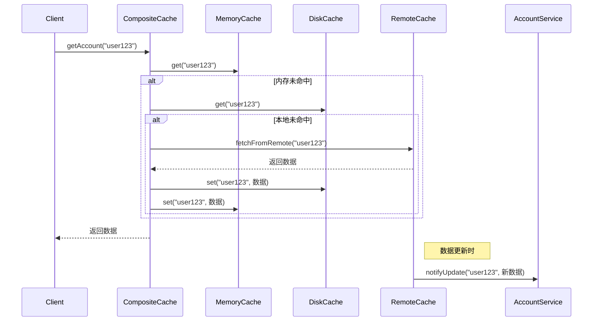

# 三级缓存账号处理-底层带有更新通知

如果remoteCache 带有信息变化的回调方法，怎么重新设计，保证上层可以响应变化？

## 我说

下面的回答及示例：可以逆向调用链通知更新，最底层的remoteCache做事件源。

## 答案

要让上层代码响应 `remoteCache` 的信息变化，需要引入 **观察者模式（Observer Pattern）** 或 **发布-订阅模式（Publish-Subscribe Pattern）**，使缓存系统能够主动通知订阅者数据更新。以下是重新设计的方案：

### **一、核心设计模式扩展**

#### **1. 观察者模式（Observer Pattern）**

**作用**：让 `remoteCache` 作为被观察对象（Subject），当数据变化时通知所有订阅者（Observers）。  
**实现逻辑**：  

- 定义 `Observer` 接口和 `Subject` 接口：  

  ```java
  // 观察者接口
  public interface Observer {
      void update(String key, Object value); // 数据更新回调
  }

  // 被观察对象接口
  public interface Subject {
      void registerObserver(Observer observer); // 注册观察者
      void removeObserver(Observer observer);   // 移除观察者
      void notifyObservers(String key, Object value); // 通知观察者
  }
  ```

- `RemoteCache` 实现 `Subject` 接口，维护观察者列表并在数据更新时触发通知：  

  ```java
  public class RemoteCache implements Cache, Subject {
      private final List<Observer> observers = new ArrayList<>();

      @Override
      public void registerObserver(Observer observer) {
          observers.add(observer);
      }

      @Override
      public void removeObserver(Observer observer) {
          observers.remove(observer);
      }

      @Override
      public void notifyObservers(String key, Object value) {
          observers.forEach(o -> o.update(key, value));
      }

      // 当远程数据更新时（如调用set方法），触发通知
      @Override
      public void set(String key, Object value) {
          // 更新远程数据...
          notifyObservers(key, value); // 通知所有订阅者
      }
  }
  ```

#### **2. 事件总线（Event Bus）机制**

**作用**：解耦发布者（`RemoteCache`）和订阅者（上层服务），使用中心化事件总线传递消息。  
**实现逻辑**：  

- 定义事件类（如 `CacheUpdateEvent`）：  

  ```java
  public class CacheUpdateEvent {
      private final String key;
      private final Object value;

      public CacheUpdateEvent(String key, Object value) {
          this.key = key;
          this.value = value;
      }

      // getter方法
  }
  ```

- 创建事件总线单例（如使用 Guava EventBus 或自定义实现）：  

  ```java
  public class EventBusSingleton {
      private static final EventBus EVENT_BUS = new EventBus();

      public static EventBus getInstance() {
          return EVENT_BUS;
      }
  }
  ```

- `RemoteCache` 在数据更新时发布事件：  

  ```java
  public class RemoteCache implements Cache {
      @Override
      public void set(String key, Object value) {
          // 更新远程数据...
          EventBusSingleton.getInstance().post(new CacheUpdateEvent(key, value));
      }
  }
  ```

- 上层服务订阅事件：  

  ```java
  public class AccountService {
      public AccountService() {
          // 注册订阅者
          EventBusSingleton.getInstance().register(this);
      }

      @Subscribe // 注解标记事件处理方法
      public void handleCacheUpdate(CacheUpdateEvent event) {
          // 处理缓存更新，如刷新本地缓存
          System.out.println("账号数据更新: " + event.getKey());
      }
  }
  ```

### **二、三级缓存架构调整**

#### **1. 让组合缓存（CompositeCache）实现 Observer 接口**

使组合缓存能够响应 `remoteCache` 的变化，并同步更新下级缓存：  

```java
public class CompositeCache implements Cache, Observer {
    private final List<Cache> caches;

    public CompositeCache(Cache... caches) {
        this.caches = Arrays.asList(caches);
        // 注册为remoteCache的观察者（假设最后一个是remoteCache）
        if (!caches.isEmpty() && caches.get(caches.size() - 1) instanceof Subject) {
            ((Subject) caches.get(caches.size() - 1)).registerObserver(this);
        }
    }

    @Override
    public void update(String key, Object value) {
        // 当remoteCache数据更新时，同步更新所有下级缓存
        for (int i = caches.size() - 2; i >= 0; i--) { // 从倒数第二个缓存开始更新
            caches.get(i).set(key, value);
        }
    }
}
```

#### **2. 异步通知机制**

使用线程池异步处理通知，避免阻塞 `remoteCache` 的主流程：  

```java
public class RemoteCache implements Cache, Subject {
    private final ExecutorService executor = Executors.newSingleThreadExecutor();
    private final List<Observer> observers = new ArrayList<>();

    @Override
    public void notifyObservers(String key, Object value) {
        executor.submit(() -> {
            observers.forEach(o -> o.update(key, value));
        });
    }
}
```

### **三、上层服务响应设计**

#### **1. 主动注册监听**

上层服务直接实现 `Observer` 接口并注册到 `remoteCache`：  

```java
public class AccountService implements Observer {
    private final Cache cache;

    public AccountService(Cache cache) {
        this.cache = cache;
        // 如果cache是CompositeCache，获取其内部的remoteCache
        if (cache instanceof CompositeCache) {
            CompositeCache compositeCache = (CompositeCache) cache;
            // 假设最后一个子缓存是remoteCache
            Cache remoteCache = compositeCache.getLastCache();
            if (remoteCache instanceof Subject) {
                ((Subject) remoteCache).registerObserver(this);
            }
        }
    }

    @Override
    public void update(String key, Object value) {
        // 处理账号数据更新，如刷新UI、通知用户等
        System.out.println("账号 " + key + " 数据已更新");
    }
}
```

#### **2. 回调接口注入**

通过接口注入让上层服务自定义回调逻辑：  

```java
public interface CacheUpdateListener {
    void onCacheUpdated(String key, Object value);
}

public class RemoteCache implements Cache {
    private CacheUpdateListener listener;

    public void setUpdateListener(CacheUpdateListener listener) {
        this.listener = listener;
    }

    @Override
    public void set(String key, Object value) {
        // 更新远程数据...
        if (listener != null) {
            listener.onCacheUpdated(key, value);
        }
    }
}
```

### **四、改进后的时序图**



### **五、关键考虑因素**

1. **线程安全**：  
   - 观察者列表需线程安全（如使用 `CopyOnWriteArrayList`）。  
   - 异步通知需处理线程池的生命周期管理。  

2. **异常处理**：  
   - 观察者的 `update()` 方法应捕获异常，避免影响其他订阅者。  

3. **过滤机制**：  
   - 支持按 key 或数据类型过滤通知，避免不必要的回调。  

4. **弱引用**：  
   - 使用弱引用（`WeakReference`）存储观察者，防止内存泄漏。  

### **六、总结**

通过引入 **观察者模式** 或 **事件总线**，可实现：  

1. `remoteCache` 作为数据源主动推送变化。  
2. 组合缓存自动同步多级缓存状态。  
3. 上层服务（如 `AccountService`）灵活响应数据更新。  

这一设计保持了原有三级缓存的结构，同时增强了系统的可扩展性和实时性。
