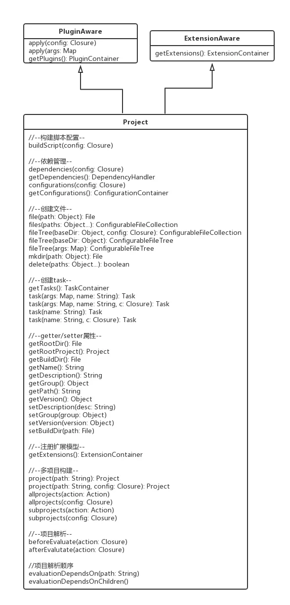

# project api

Gradle 的 `Project` 对象是构建脚本中与 Gradle 交互的主要接口，提供了丰富的 API 来配置和管理项目。
>本节就是搜罗project对象常用的api，只有你知道含义，照着用就行

## api图（只有常见api）



## 常见api及描述

## 1. 基本属性和方法

- **allprojects**: 包含当前项目及其所有子项目。

  ```groovy
  allprojects {
      group = 'com.example'
      version = '1.0'
  }
  ```

- **ant**: 提供 `AntBuilder`，用于在构建文件中执行 Ant 任务。

  ```groovy
  task printChecksum {
      doLast {
          ant.checksum(file: 'someFile.txt') {
              property(name: 'checksumValue', refId: 'checksumOut')
          }
          println "The checksum is: ${ant.properties.'checksumOut'}"
      }
  }
  ```

  参考：[Gradle User Manual]

- **artifacts**: 用于分配项目产生的构件到配置中。

  ```groovy
  artifacts {
      archiveFile MyArtifact
  }
  ```

- **buildDir**: 项目构建目录，已弃用，推荐使用 `layout.buildDirectory`.

  ```groovy
  buildDir = 'path/to/build'
  ```

- **buildFile**: 当前项目的构建脚本。

  ```groovy
  println "Build file location: ${buildFile}"
  ```

- **buildscript**: 用于配置项目的构建脚本类路径。

  ```groovy
  buildscript {
      repositories {
          mavenCentral()
      }
      dependencies {
          classpath 'com.example:plugin:1.0'
      }
  }
  ```

- **childProjects**: 直接子项目的集合。

  ```groovy
  childProjects.values().each { childProject ->
      println childProject.name
  }
  ```

- **configurations**: 项目的配置集合。

  ```groovy
  configurations {
      compile
  }
  ```

- **dependencies**: 依赖处理器，用于添加新依赖。

  ```groovy
  dependencies {
      compile 'com.example:library:1.0'
  }
  ```

- **description**: 项目的描述。

  ```groovy
  description = 'This is a sample project'
  ```

- **extensions**: 添加 DSL 扩展到项目。

  ```groovy
  extensions.create('myExtension', MyExtensionClass)
  ```

- **gradle**: 返回当前项目所属的 `Gradle` 调用。

  ```groovy
  println "Gradle version: ${gradle.gradleVersion}"
  ```

- **group**: 项目的组。

  ```groovy
  group = 'com.example'
  ```

- **layout**: 提供对项目中各种重要目录的访问。

  ```groovy
  def buildDir = layout.buildDirectory.get().asFile
  ```

- **logger**: 项目的日志器。

  ```groovy
  logger.lifecycle "This is a lifecycle message"
  ```

- **logging**: 控制项目构建脚本的日志和标准输出/错误捕获。

  ```groovy
  logging.captureStandardOutput LogLevel.INFO
  ```

- **name**: 项目的名称。

  ```groovy
  println "Project name: $name"
  ```

- **parent**: 返回父项目，如果没有则为 `null`。

  ```groovy
  def parentProject = parent
  ```

- **path**: 项目在项目层次结构中的路径。

  ```groovy
  println "Project path: $path"
  ```

- **subprojects**: 配置子项目。

  ```groovy
  subprojects {
      apply plugin: 'java'
  }
  ```

- **tasks**: 项目的 `Task` 集合。

  ```groovy
  tasks.named('compileJava') {
      doLast {
          println 'Compiling Java code'
      }
  }
  ```

- **version**: 项目的版本。

  ```groovy
  version = '1.0.0'
  ```

## 2. 脚本块

- **allprojects**: 配置当前项目及其所有子项目。

  ```groovy
  allprojects {
      repositories {
          mavenCentral()
      }
  }
  ```

- **buildscript**: 配置项目的构建脚本类路径。

  ```groovy
  buildscript {
      repositories {
          mavenCentral()
      }
      dependencies {
          classpath 'com.example:plugin:1.0'
      }
  }
  ```

- **configurations**: 配置项目的依赖配置。

  ```groovy
  configurations {
      compile {
          exclude group: 'com.example', module: 'old-module'
      }
  }
  ```

- **dependencies**: 配置项目的依赖。

  ```groovy
  dependencies {
      testImplementation 'junit:junit:4.13.2'
  }
  ```

- **repositories**: 配置项目的仓库。

  ```groovy
  repositories {
      maven { url 'https://repo.example.com' }
  }
  ```

- **subprojects**: 配置子项目。

  ```groovy
  subprojects {
      apply plugin: 'java'
  }
  ```

这些 API 提供了对 Gradle 项目对象的全面控制，允许你自定义构建过程的各个方面。通过这些 API，你可以灵活地管理任务、依赖、插件和其他构建特性。

---

在 Gradle 中，`Project` 对象提供了许多高级用法，可以帮助你更好地管理和配置项目。以下是一些主要的高级用法及示例：

### 1. 动态属性和方法

Gradle 允许你在 `Project` 对象上动态定义属性和方法，这可以通过 `ext` 关键字实现。这样，你可以在整个项目中共享这些属性和方法。

```groovy
ext {
    myProperty = 'Hello, Gradle!'
}

task printProperty {
    doLast {
        println myProperty
    }
}
```

### 2. 使用 `beforeEvaluate` 和 `afterEvaluate`

你可以在项目的配置阶段添加回调，以便在项目评估之前或之后执行特定的逻辑。这对于调整项目配置非常有用。

```groovy
project.beforeEvaluate {
    println "Before evaluating project: ${project.name}"
}

project.afterEvaluate {
    println "After evaluating project: ${project.name}"
}
```

### 3. 继承和配置注入

在多项目构建中，子项目可以继承父项目的属性和方法。这使得共享配置变得简单。

```groovy
// 在根项目的 build.gradle
ext {
    commonProperty = 'Common Value'
}

// 在子项目的 build.gradle
println "Inherited property: ${commonProperty}"
```

### 4. 自定义插件

你可以创建自定义插件并将其应用于项目。插件可以封装构建逻辑，使其更易于重用。

```groovy
class MyCustomPlugin implements Plugin<Project> {
    void apply(Project project) {
        project.task('myTask') {
            doLast {
                println 'Executing my custom task!'
            }
        }
    }
}

// 在 build.gradle 中应用插件
apply plugin: MyCustomPlugin
```

### 5. 使用 `buildSrc` 目录

将构建逻辑放入 `buildSrc` 目录中，Gradle 会自动编译这些类并将其包含在构建脚本的类路径中。这对于组织复杂的构建逻辑非常有用。

```groovy
// 在 buildSrc/src/main/groovy/MyUtils.groovy
class MyUtils {
    static String greet(String name) {
        return "Hello, $name!"
    }
}

// 在 build.gradle 中使用
task greet {
    doLast {
        println MyUtils.greet('Gradle User')
    }
}
```

### 6. 文件操作

`Project` 对象提供了强大的文件操作 API，例如 `copy` 和 `fileTree` 方法，可以方便地处理文件和目录。

```groovy
// 拷贝文件
copy {
    from 'sourceDir'
    into 'destinationDir'
}

// 遍历文件树
fileTree('someDir').visit { FileTreeElement file ->
    println file.name
}
```

### 7. 任务依赖和配置

你可以在 `Project` 对象中定义任务依赖关系，并在任务执行之前或之后执行特定的操作。

```groovy
task taskA {
    doLast {
        println 'Task A executed'
    }
}

task taskB {
    dependsOn taskA
    doLast {
        println 'Task B executed'
    }
}
```

### 8. 共享构建逻辑

可以将公共构建逻辑放在外部脚本中，并在多个项目中应用该脚本。这对于跨多个项目共享配置非常有用。

```groovy
apply from: 'common.gradle'
```

通过这些高级用法，你可以更灵活地管理和配置 Gradle 项目，提升构建效率和可维护性。这些方法使得 Gradle 成为一个强大的构建工具，适用于各种规模的项目。

---

Gradle Project的API和属性非常丰富，涵盖了项目配置、任务管理、依赖管理、文件操作等多个方面。以下是对Gradle Project中一些常用API和属性的介绍，并附上示例代码。

### 一、常用API

1. **获取项目实例**

   - `this.project` 或 `project`：获取当前Project实例。
   - `this.getRootProject()`：获取根Project实例。
   - `this.getParent()`：获取当前Project的父Project实例。
   - `this.findProject(String path)`：根据路径查找Project实例。
   - `project(String path)`：定位一个外部或者内部Project。

   示例：

   ```groovy
   println this.project.name // 输出当前项目名称
   println this.getRootProject().name // 输出根项目名称
   println this.getParent().name // 输出父项目名称（如果存在）
   def subproject = this.findProject(':subproject-name') // 查找子项目
   println subproject.name // 输出找到的子项目名称
   ```

2. **获取项目集合**

   - `this.getAllprojects()`：获取工程中的所有Project实例。
   - `this.getSubprojects()`：获取当前Project的所有子Project实例。

   示例：

   ```groovy
   this.getAllprojects().each { project ->
       println project.name
   }

   this.getSubprojects().each { subproject ->
       println subproject.name
   }
   ```

3. **配置项目属性**

   - `group`：设置项目的组名。
   - `version`：设置项目的版本号。
   - `description`：设置项目的描述信息。

   示例：

   ```groovy
   group = 'com.example'
   version = '1.0.0'
   description = 'This is a sample project.'
   ```

4. **依赖管理**

   - `dependencies`：定义项目的依赖关系。

   示例：

   ```groovy
   dependencies {
       implementation 'org.springframework.boot:spring-boot-starter-web:2.5.4'
       testImplementation 'junit:junit:4.13.2'
   }
   ```

5. **任务管理**

   - `task`：定义自定义任务。
   - `tasks.create()`：动态创建任务。
   - `tasks.findByName()`：查找任务。
   - `tasks.getByName()`：获取任务（如果任务不存在则抛出异常）。

   示例：

   ```groovy
   task hello {
       doLast {
           println 'Hello, Gradle!'
       }
   }

   tasks.create(name: 'goodbye', type: DefaultTask) {
       group = 'Custom'
       description = 'Says goodbye.'
       doLast {
           println 'Goodbye, Gradle!'
       }
   }

   def helloTask = tasks.findByName('hello')
   if (helloTask != null) {
       helloTask.configure {
           doFirst {
               println 'Starting hello task...'
           }
       }
   }

   try {
       def goodbyeTask = tasks.getByName('goodbye')
       goodbyeTask.configure {
           doFirst {
               println 'Starting goodbye task...'
           }
       }
   } catch (UnknownTaskException e) {
       println 'Goodbye task not found.'
   }
   ```

### 二、常用属性

1. **项目名称**

   - `name`：获取或设置项目的名称。

   示例：

   ```groovy
   println project.name // 输出项目名称
   project.name = 'new-project-name' // 设置项目名称（通常不推荐在项目配置中修改名称）
   ```

2. **项目路径**

   - `projectDir`：获取项目的根目录。

   示例：

   ```groovy
   println project.projectDir // 输出项目根目录的路径
   ```

3. **构建脚本文件**

   - `buildFile`：获取构建脚本文件的File对象。

   示例：

   ```groovy
   println project.buildFile // 输出构建脚本文件的路径
   ```

4. **扩展属性**

   - 可以通过`ext`块定义自定义属性，并在项目的其他地方引用这些属性。

   示例：

   ```groovy
   ext {
       compileSdkVersion = 30
       applicationId = 'com.example.myapp'
   }

   println project.ext.compileSdkVersion // 输出compileSdkVersion的值
   println project.ext.applicationId // 输出applicationId的值
   ```

### 三、综合示例

以下是一个综合示例，展示了如何使用Gradle Project的API和属性来配置一个简单的项目：

```groovy
// 设置项目的组名、版本号和描述信息
group = 'com.example'
version = '1.0.0'
description = 'This is a comprehensive Gradle project example.'

// 定义自定义属性
ext {
    compileSdkVersion = 30
    minSdkVersion = 16
    targetSdkVersion = 30
}

// 配置项目的依赖关系
dependencies {
    implementation "androidx.appcompat:appcompat:${compileSdkVersion}"
    testImplementation 'junit:junit:4.13.2'
}

// 定义自定义任务
task printProperties {
    doLast {
        println "Group: ${group}"
        println "Version: ${version}"
        println "Compile SDK Version: ${ext.compileSdkVersion}"
        println "Min SDK Version: ${ext.minSdkVersion}"
        println "Target SDK Version: ${ext.targetSdkVersion}"
    }
}

// 配置所有子项目的公共属性
allprojects {
    repositories {
        google()
        mavenCentral()
    }
}

// 配置子项目的特定属性（如果有的话）
subprojects {
    // 这里可以添加子项目特有的配置
}
```

在这个示例中，我们设置了项目的组名、版本号和描述信息，定义了自定义属性，配置了项目的依赖关系，并定义了一个自定义任务来打印这些属性。此外，我们还配置了所有子项目的公共属性（如仓库地址），并预留了配置子项目特定属性的位置。

---

除了之前提到的Gradle Project的API和属性外，Gradle确实还提供了许多其他有用的属性和功能。以下是对Gradle中一些其他常用属性的介绍：

### 1. 项目属性（Project Properties）

项目属性可以在项目对象上使用，并可以通过多种方式设置，如命令行、系统属性或环境变量。这些属性在构建脚本中可以通过`project.hasProperty()`、`project.property()`或`project.findProperty()`等方法访问。

- **通过命令行设置**：使用`-P`选项可以在命令行上设置项目属性。例如，`gradle -PmyProperty=myValue`。
- **通过系统属性设置**：系统属性可以通过设置`org.gradle.project.<propertyName>`的形式来设置项目属性。例如，`org.gradle.project.myProperty=myValue`。
- **通过环境变量设置**：环境变量可以通过设置`ORG_GRADLE_PROJECT_<PROPERTY_NAME>`（注意属性名中的大写和下划线转换）的形式来设置项目属性。例如，`ORG_GRADLE_PROJECT_MY_PROPERTY=myValue`。

### 2. 动态属性（Dynamic Properties）

Gradle允许在Project对象上动态添加属性。这些属性可以通过`ext`块或直接在Project对象上设置。例如：

```groovy
ext.myDynamicProperty = 'someValue'
// 或者
project.myDynamicProperty = 'someValue'
```

然后，这些属性可以在构建脚本的其他部分或通过命令行访问。

### 3. 预设属性（Predefined Properties）

Gradle提供了一些预设属性，这些属性在构建过程中具有特定的含义和用途。例如：

- **projectDir**：项目的根目录。
- **buildDir**：构建输出的目录。
- **buildFile**：构建脚本文件的File对象。
- **name**：项目的名称。
- **path**：项目的路径（相对于根项目）。

### 4. 常规属性（Common Properties）

除了上述特定于Gradle的属性外，还有一些常规属性可能用于配置项目的各个方面。这些属性可能因项目类型和插件的不同而有所不同。例如，在Android项目中，可能会使用以下属性：

- **compileSdkVersion**：编译SDK的版本。
- **minSdkVersion**：应用支持的最小Android SDK版本。
- **targetSdkVersion**：目标Android SDK版本。

这些属性通常在`build.gradle`文件的`android`块中配置。

### 5. 多项目构建中的属性

在多项目构建中，Gradle允许在根项目和子项目之间共享属性。这可以通过在根项目的`gradle.properties`文件中设置属性，并在子项目中引用它们来实现。此外，还可以使用`allprojects`和`subprojects`块来配置所有项目或特定子项目的公共属性。

### 示例

以下是一个综合示例，展示了如何在Gradle构建脚本中使用不同的属性：

```groovy
// 在根项目的gradle.properties文件中设置属性
VERSION_NAME=1.0.0
VERSION_CODE=1
COMPILE_SDK_VERSION=30

// 在build.gradle文件中使用这些属性
android {
    compileSdkVersion COMPILE_SDK_VERSION.toInteger()

    defaultConfig {
        applicationId "com.example.myapp"
        minSdkVersion 16
        targetSdkVersion COMPILE_SDK_VERSION.toInteger()
        versionCode VERSION_CODE.toInteger()
        versionName VERSION_NAME
    }
}

// 在构建脚本中动态添加属性
ext.myCustomProperty = 'customValue'

// 在任务中使用这些属性
task printProperties {
    doLast {
        println "Version Name: ${VERSION_NAME}"
        println "Version Code: ${VERSION_CODE}"
        println "Compile SDK Version: ${COMPILE_SDK_VERSION}"
        println "Custom Property: ${myCustomProperty}"
    }
}
```

在这个示例中，我们在`gradle.properties`文件中设置了版本号和编译SDK版本等属性，并在`build.gradle`文件中使用了这些属性来配置Android项目。此外，我们还动态添加了一个自定义属性，并在一个任务中打印了所有这些属性。
