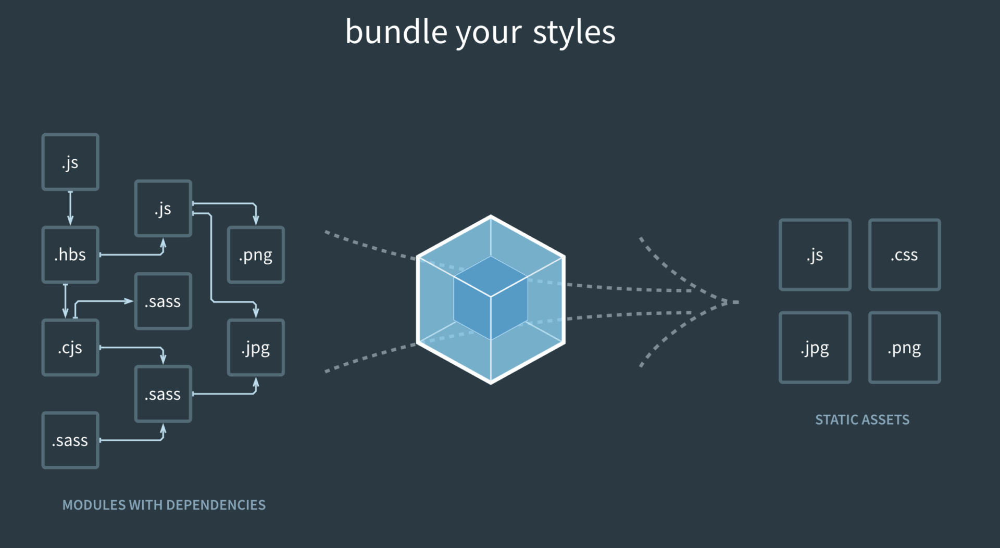

# webpack

Webpack是一个开源的前端资源打包工具，它允许开发者将应用程序的多个模块（JavaScript文件、CSS样式、图片等）打包成一个或多个优化后的文件，以便在浏览器中加载和运行。Webpack通过处理模块间的依赖关系，创建了一个内部依赖图，使得资源可以按需加载，从而提高应用程序的加载速度和运行效率。

Webpack的核心功能包括：

* **模块打包** ：Webpack能够分析项目中的模块依赖关系，并将它们打包到一个或多个bundle文件中。
* **加载器（Loaders）** ：Webpack使用加载器来处理不同类型的资源。例如，可以使用css-loader将CSS文件转换为JavaScript模块，或者使用file-loader处理图片文件。
* **插件（Plugins）** ：Webpack插件可以用于执行各种任务，如压缩打包后的文件、清理构建目录、热模块替换（HMR）等。
* **开发服务器** ：Webpack提供了一个内置的开发服务器，支持实时重新加载（Live Reload）和热模块替换（HMR），使得开发过程更加高效。
* **模式** ：Webpack支持两种模式：开发（development）和生产（production）。在生产模式下，Webpack会进行代码压缩和优化，以减少最终打包文件的大小。

Webpack的配置文件（通常是**webpack.config.js**）定义了项目的入口点、输出目录、加载器和插件等配置，使得开发者可以根据项目需求进行定制化设置。通过Webpack，开发者可以构建出更加高效、可维护的前端应用程序。
