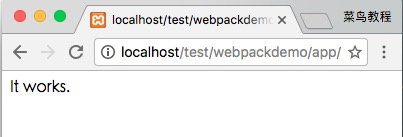

# 项目创建

## 1.创建app目录

接下来我们创建一个目录 app：

```shell
mkdir app
```

在 app 目录下添加 **runoob1.js** 文件，代码如下：

```js
// app/runoob1.js 文件
document.write("It works.");
```

在 app 目录下添加 index.html 文件，代码如下：

```html
<!-- app/index.html 文件 -->
<html>
    <head>
        <meta charset="utf-8">
    </head>
    <body>
        <script type="text/javascript" src="bundle.js" charset="utf-8"></script>
    </body>
</html>
```

接下来我们使用 webpack 命令来打包：

```shell
webpack runoob1.js bundle.js
```

执行以上命令会编译 runoob1.js 文件并生成bundle.js 文件，成功后输出信息如下所示：

```shell
Hash: a41c6217554e666594cb
Version: webpack 1.12.13
Time: 50ms
    Asset     Size  Chunks             Chunk Names
bundle.js  1.42 kB       0  [emitted]  main
   [0] ./runoob1.js 29 bytes {0} [built]
```

在浏览器中打开 index.html，输出结果如下：


