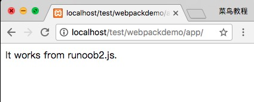

# 模块打包

webpack 根据模块的依赖关系进行静态分析，这些文件(模块)会被包含到 bundle.js 文件中。Webpack 会给每个模块分配一个唯一的 id 并通过这个 id 索引和访问模块。 在页面启动时，会先执行 runoob1.js 中的代码，其它模块会在运行 require 的时候再执行。

## 打包示例

基于项目创建章节，接下来我们创建另外一个 js 文件 runoob2.js，代码如下所示：

```js
// app/runoob2.js 文件
module.exports = "It works from runoob2.js.";
```

更新 runoob1.js 文件，代码如下：

```js
// app/runoob1.js 文件
document.write(require("./runoob2.js"));
```

接下来我们使用 webpack 命令来打包：

```shell
webpack runoob1.js bundle.js
 
Hash: dcf55acff639ebfe1677
Version: webpack 1.12.13
Time: 52ms
    Asset     Size  Chunks             Chunk Names
bundle.js  1.55 kB       0  [emitted]  main
   [0] ./runoob1.js 41 bytes {0} [built]
   [1] ./runoob2.js 46 bytes {0} [built]
```

在浏览器访问，输出结果如下所示：


