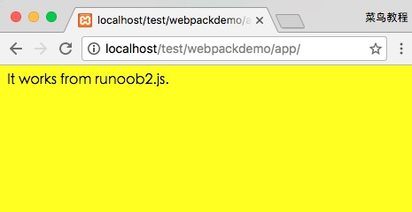

# LOADER

Webpack 本身只能处理 JavaScript 模块，如果要处理其他类型的文件，就需要使用 loader 进行转换。

## 示例

如果我们需要在应用中添加 css 文件，就需要使用到 `css-loader` 和 `style-loader`，他们做两件不同的事情，`css-loader` 会遍历 CSS 文件，然后找到 url() 表达式然后处理他们，`style-loader` 会把原来的 CSS 代码插入页面中的一个 style 标签中。

接下来我们使用以下命令来安装 `css-loader` 和 `style-loader`(全局安装需要参数 -g)。

```shell
cnpm install css-loader style-loader
```

执行以上命令后，会再当前目录生成 node_modules 目录，它就是 css-loader 和 style-loader 的安装目录。

接下来创建一个 style.css 文件，代码如下：

```css
/* app/style.css 文件 */
body {
    background: yellow;
}
```

修改 runoob1.js 文件，代码如下：

```js
// app/runoob1.js 文件
require("!style-loader!css-loader!./style.css");
document.write(require("./runoob2.js"));
```

接下来我们使用 webpack 命令来打包：

```shell
webpack runoob1.js bundle.js
 
Hash: a9ef45165f81c89a4363
Version: webpack 1.12.13
Time: 619ms
    Asset     Size  Chunks             Chunk Names
bundle.js  11.8 kB       0  [emitted]  main
   [0] ./runoob1.js 76 bytes {0} [built]
   [5] ./runoob2.js 46 bytes {0} [built]
    + 4 hidden modules
```

浏览器结果：



### 另外一种写法

require CSS 文件的时候都要写 loader 前缀 `!style-loader!css-loader!`，当然我们可以根据模块类型（扩展名）来自动绑定需要的 loader。 将 runoob1.js 中的 `require("!style-loader!css-loader!./style.css")` 修改为 `require("./style.css")` ：

```js
require("./style.css");
document.write(require("./runoob2.js"));
```

执行：

```shell
webpack runoob1.js bundle.js --module-bind 'css=style-loader!css-loader'
```
