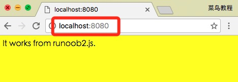

# 开发环境

当项目逐渐变大，webpack 的编译时间会变长，可以通过参数让编译的输出内容带有进度和颜色。

```js
webpack --progress --colors
```

如果不想每次修改模块后都重新编译，那么可以启动**监听模式**。开启监听模式后，没有变化的模块会在编译后缓存到内存中，而不会每次都被重新编译，所以监听模式的整体速度是很快的。

```js
webpack --progress --colors --watch
```

## 开发服务器

当然，我们可以使用 `webpack-dev-server` 开发服务，这样我们就能通过 `localhost:8080` 启动一个 express 静态资源 web 服务器，并且会以监听模式自动运行 webpack，在浏览器打开 `http://localhost:8080/` 或 `http://localhost:8080/webpack-dev-server/` 可以浏览项目中的页面和编译后的资源输出，并且通过一个 socket.io 服务实时监听它们的变化并自动刷新页面。

### 安装

```shell
cnpm install webpack-dev-server -g
```

### 运行

```shell
webpack-dev-server --progress --colors
```

在浏览器打开 `http://localhost:8080/` 输出结果如下：


