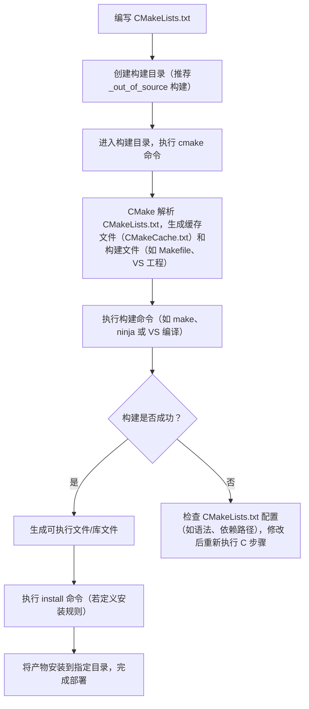

# CMake 基础

**原网页地址**：<https://www.runoob.com/cmake/cmake-basic.html>

## 一、CMakeLists.txt 文件概述

CMakeLists.txt 是 CMake 的核心配置文件，用于定义项目的构建规则、依赖关系、编译选项等关键信息。每个 CMake 项目通常包含一个或多个该文件，其中根目录的 CMakeLists.txt 负责全局配置，子目录的则用于管理子模块的构建逻辑。

## 二、CMakeLists.txt 文件结构与基本语法

CMakeLists.txt 通过一系列 CMake 指令描述构建过程，以下是 11 个核心指令的详细说明，包含语法格式、功能解释及示例：

### 1. 指定 CMake 最低版本要求

- **功能**：声明当前项目所需的最低 CMake 版本，确保构建过程中使用的指令和特性兼容，避免版本过低导致的错误。
- **语法**：`cmake_minimum_required(VERSION <version>)`
- **示例**：`cmake_minimum_required(VERSION 3.10)`  
  表示当前项目至少需要 CMake 3.10 版本才能正常构建。

### 2. 定义项目名称与编程语言

- **功能**：指定项目的名称，并可选地声明项目使用的编程语言（如 C、C++），若不指定语言，CMake 会默认支持 C 和 C++。
- **语法**：`project(<project_name> [<language>...])`  
  其中 `<language>` 可取值为 `C`、`CXX`（代表 C++）、`Fortran` 等。
- **示例**：`project(MyProject CXX)`  
  定义项目名称为 `MyProject`，且仅使用 C++ 语言。

### 3. 生成可执行文件

- **功能**：指定要生成的可执行文件目标（target），并关联构建该目标所需的源文件（如 `.cpp`、`.c` 文件）。
- **语法**：`add_executable(<target> <source_files>...)`  
  其中 `<target>` 是可执行文件的名称，`<source_files>` 是一个或多个源文件路径（空格分隔）。
- **示例**：`add_executable(MyExecutable main.cpp other_file.cpp)`  
  生成名为 `MyExecutable` 的可执行文件，依赖 `main.cpp` 和 `other_file.cpp` 两个源文件。

### 4. 创建库（静态库/动态库）

- **功能**：生成库文件（静态库或动态库）目标，并关联构建该库所需的源文件。静态库以 `.a`（Linux）或 `.lib`（Windows）为后缀，动态库以 `.so`（Linux）或 `.dll`（Windows）为后缀。
- **语法**：`add_library(<target> <library_type> <source_files>...)`  
  其中 `<library_type>` 可选值为 `STATIC`（静态库）、`SHARED`（动态库）；若不指定类型，CMake 会根据项目默认设置选择。
- **示例**：`add_library(MyLibrary STATIC library.cpp)`  
  生成名为 `MyLibrary` 的静态库，依赖源文件 `library.cpp`。

### 5. 链接目标与库

- **功能**：将指定的目标（可执行文件或库）与其他库（系统库、第三方库或自定义库）进行链接，确保目标在编译时能调用库中的函数和资源。
- **语法**：`target_link_libraries(<target> <libraries>...)`  
  其中 `<target>` 是需要链接库的目标名称，`<libraries>` 是一个或多个库的名称（空格分隔）。
- **示例**：`target_link_libraries(MyExecutable MyLibrary)`  
  将可执行文件 `MyExecutable` 与自定义静态库 `MyLibrary` 链接。

### 6. 添加头文件搜索路径（全局）

- **功能**：为项目中所有目标添加头文件搜索路径，编译器会在这些路径中查找 `#include` 指令引用的头文件。
- **语法**：`include_directories(<dirs>...)`  
  其中 `<dirs>` 是一个或多个头文件目录路径（绝对路径或相对路径，相对路径基于当前 CMakeLists.txt 所在目录）。
- **示例**：`include_directories(${PROJECT_SOURCE_DIR}/include)`  
  为所有目标添加头文件搜索路径，路径为项目根目录（`PROJECT_SOURCE_DIR` 是 CMake 预定义变量，代表项目根目录）下的 `include` 文件夹。

### 7. 设置变量值

- **功能**：定义或修改 CMake 变量，变量可用于存储路径、编译选项、源文件列表等信息，方便在配置文件中重复使用和维护。
- **语法**：`set(<variable> <value>...)`  
  其中 `<variable>` 是变量名（大小写敏感），`<value>` 是变量值（可多个，以空格分隔，多个值会被视为列表）。
- **示例**：`set(CMAKE_CXX_STANDARD 11)`  
  定义变量 `CMAKE_CXX_STANDARD` 并赋值为 11，表示项目使用 C++11 标准编译。

### 8. 设置目标的头文件搜索路径（目标关联）

- **功能**：为指定目标单独添加头文件搜索路径，相比 `include_directories()` 更灵活，可精确控制路径的作用范围（公共、私有、接口）。
- **语法**：

  ```cmake
  target_include_directories(TARGET <target_name>
                            [BEFORE | AFTER]  # 可选，指定路径添加顺序（在现有路径前/后）
                            [SYSTEM]          # 可选，标记路径为系统头文件路径（避免编译器警告）
                            [PUBLIC | PRIVATE | INTERFACE]  # 必选，指定路径作用范围
                            [items1...])      # 头文件目录路径列表
  ```

  - `PUBLIC`：路径对当前目标和依赖该目标的其他目标都生效；
  - `PRIVATE`：路径仅对当前目标生效；
  - `INTERFACE`：路径仅对依赖该目标的其他目标生效（常用于库的接口头文件）。
- **示例**：`target_include_directories(MyExecutable PRIVATE ${PROJECT_SOURCE_DIR}/include)`  
  仅为 `MyExecutable` 目标添加 `include` 目录作为私有头文件路径，不影响其他目标。

### 9. 定义安装规则

- **功能**：指定目标（可执行文件、库、头文件等）的安装路径和方式，便于项目构建完成后将产物部署到指定位置（如系统目录或自定义目录）。
- **语法**：

  ```cmake
  install(TARGETS <target1> [target2 ...]
          [RUNTIME DESTINATION <dir>]  # 可执行文件的安装目录
          [LIBRARY DESTINATION <dir>]  # 动态库的安装目录
          [ARCHIVE DESTINATION <dir>]  # 静态库的安装目录
          [INCLUDES DESTINATION [dir ...]]  # 头文件安装目录（供其他项目引用）
          [PRIVATE_HEADER DESTINATION <dir>]  # 私有头文件的安装目录
          [PUBLIC_HEADER DESTINATION <dir>])  # 公共头文件的安装目录
  ```

  其中 `<dir>` 可使用预定义变量（如 `bin`、`lib`，默认对应系统的 `/usr/local/bin`、`/usr/local/lib` 等路径）。
- **示例**：`install(TARGETS MyExecutable RUNTIME DESTINATION bin)`  
  将 `MyExecutable` 可执行文件安装到 `bin` 目录（默认系统路径为 `/usr/local/bin`，Windows 下为 `C:\Program Files\MyProject\bin`）。

### 10. 条件语句

- **功能**：根据条件（如变量值、构建类型）执行不同的配置逻辑，实现构建过程的动态控制（如 Debug 模式和 Release 模式的差异化配置）。
- **语法**：

  ```cmake
  if(<expression>)
    # 条件为真时执行的指令
  elseif(<expression>)
    # 前一个条件为假，当前条件为真时执行的指令
  else()
    # 所有条件均为假时执行的指令
  endif()
  ```

  其中 `<expression>` 可用于判断变量值（如 `STREQUAL` 用于字符串相等判断）、文件是否存在、构建类型等。
- **示例**：

  ```cmake
  if(CMAKE_BUILD_TYPE STREQUAL "Debug")
    message("Debug build")  # 若构建类型为 Debug，输出日志信息
  endif()
  ```

### 11. 自定义命令

- **功能**：为指定目标添加自定义构建步骤（如构建前预处理、构建后生成文件、打印日志等），支持在构建的不同阶段（预构建、预链接、构建后）执行命令。
- **语法**：

  ```cmake
  add_custom_command(
    TARGET <target>  # 关联的目标
    PRE_BUILD | PRE_LINK | POST_BUILD  # 执行时机（构建前/链接前/构建后）
    COMMAND <command1> [ARGS <args1>]  # 要执行的命令及参数
    [WORKING_DIRECTORY <dir>]  # 命令执行的工作目录
    [COMMAND <command2> [ARGS <args2>]]  # 可选，多个命令按顺序执行
    [DEPENDS <depend1> [depend2 ...]]  # 命令依赖的文件（依赖更新时重新执行命令）
    [COMMENT <comment>]  # 构建时显示的注释信息（便于调试）
    [VERBATIM]  # 确保命令参数按原样传递（避免特殊字符解析问题）
  )
  ```

- **示例**：

  ```cmake
  add_custom_command(
    TARGET MyExecutable POST_BUILD
    COMMAND ${CMAKE_COMMAND} -E echo "Build completed."  # 构建后执行"输出构建完成"的命令
  )
  ```

## 三、CMake 变量与缓存

CMake 使用变量存储和传递配置信息，变量分为**普通变量**和**缓存变量**，两者在作用范围和使用场景上有显著区别。

### 1. 普通变量

- **定义方式**：通过 `set(<variable> <value>...)` 指令定义，无 `CACHE` 关键字。
- **作用范围**：仅在当前 CMakeLists.txt 文件及其子目录的配置中生效，不存储到缓存文件，构建过程中无法被用户修改。
- **使用示例**：

  ```cmake
  set(MY_VAR "Hello World")  # 定义普通变量 MY_VAR
  message(STATUS "Variable MY_VAR is ${MY_VAR}")  # 使用变量（通过 ${变量名} 引用），输出日志：Variable MY_VAR is Hello World
  ```

### 2. 缓存变量

- **定义方式**：通过 `set(<variable> <value> CACHE <type> <description>)` 指令定义，需指定 `CACHE` 关键字、变量类型（如 `STRING`、`BOOL`）和描述信息。
- **作用范围**：存储在 CMake 缓存文件（如 `CMakeCache.txt`）中，作用范围覆盖整个项目构建过程，用户可在 CMake 配置阶段（如通过 `ccmake` 或 CMake GUI）修改其值。
- **使用场景**：常用于需要用户输入的配置（如编译选项、第三方库路径），确保用户无需修改 CMakeLists.txt 即可调整构建参数。
- **使用示例**：

  ```cmake
  # 定义缓存变量 MY_CACHE_VAR，默认值为 "DefaultValue"，类型为 STRING，描述为 "A cache variable"
  set(MY_CACHE_VAR "DefaultValue" CACHE STRING "A cache variable")
  message(STATUS "Cache variable MY_CACHE_VAR is ${MY_CACHE_VAR}")  # 使用缓存变量，输出其当前值
  ```

## 四、查找库和包（find_package 指令）

CMake 通过 `find_package()` 指令自动检测和配置外部库（如系统库、第三方库），避免手动指定库的路径和链接选项，简化依赖管理。

### 1. find_package() 基本用法

- **功能**：搜索指定的库或包，并加载其配置信息（如头文件路径、库文件路径、链接选项），若未找到则构建失败（需指定 `REQUIRED` 关键字）。
- **核心语法变体**：
  1. 基础搜索（默认版本，必须找到）：`find_package(<PackageName> REQUIRED)`  
     示例：`find_package(Boost REQUIRED)`  # 搜索 Boost 库，未找到则报错
  2. 指定版本搜索：`find_package(<PackageName> <version> REQUIRED)`  
     示例：`find_package(Boost 1.70 REQUIRED)`  # 搜索至少 1.70 版本的 Boost 库
  3. 指定路径搜索：`find_package(<PackageName> REQUIRED PATHS <path>)`  
     示例：`find_package(OpenCV REQUIRED PATHS /path/to/opencv)`  # 仅在 `/path/to/opencv` 路径下搜索 OpenCV 库

### 2. 使用查找到的库

找到库后，需通过以下指令关联到目标：

- **链接库**：`target_link_libraries(<target> <PackageName>::<Component>)`  
  示例：`target_link_libraries(MyExecutable Boost::Boost)`  # 将 Boost 库链接到 MyExecutable
- **添加头文件路径**：`include_directories(${<PackageName>_INCLUDE_DIRS})`  
  示例：`include_directories(${Boost_INCLUDE_DIRS})`  # 添加 Boost 库的头文件搜索路径（`Boost_INCLUDE_DIRS` 是 find_package 自动定义的变量）
- **添加库文件路径**：`link_directories(${<PackageName>_LIBRARY_DIRS})`  
  示例：`link_directories(${Boost_LIBRARY_DIRS})`  # 添加 Boost 库的库文件搜索路径（`Boost_LIBRARY_DIRS` 是 find_package 自动定义的变量）

### 3. 第三方库使用实例（以 Boost 为例）

以下是一个完整的 CMakeLists.txt 示例，展示如何查找并使用 Boost 库：

```cmake
cmake_minimum_required(VERSION 3.10)  # 最低 CMake 版本要求
project(MyProject CXX)  # 项目名称与语言

find_package(Boost REQUIRED)  # 查找 Boost 库，未找到则报错

add_executable(MyExecutable main.cpp)  # 生成可执行文件，依赖 main.cpp

target_link_libraries(MyExecutable Boost::Boost)  # 将 Boost 库链接到可执行文件
```

## 五、include_directories() 与 target_include_directories() 对比

两者均用于指定头文件搜索路径，但在作用范围、目标关联性等方面差异显著，具体对比如下表：

| 特性                | `include_directories()`                          | `target_include_directories()`                  |
|---------------------|--------------------------------------------------|------------------------------------------------|
| **作用范围**        | 全局作用域，影响当前 CMakeLists.txt 及子目录的所有目标 | 仅作用于显式指定的单个或多个目标，不影响其他目标 |
| **推荐使用场景**    | 简单项目、旧版 CMake 项目（CMake < 3.0）         | 现代 CMake 项目（CMake ≥ 3.0），优先推荐使用   |
| **目标关联性**      | 不直接关联特定目标，可能意外污染其他目标的路径   | 显式绑定到目标，路径与目标逻辑强关联           |
| **可维护性**        | 较差，全局路径过多时难以追踪依赖关系             | 较好，路径归属清晰，便于后期修改和调试         |
| **作用域控制**      | 无法精确控制，所有路径对所有目标生效             | 支持 `PUBLIC`/`PRIVATE`/`INTERFACE`，精确控制路径作用范围 |
| **现代 CMake 推荐** | 不推荐，仅在兼容旧项目时使用                     | 强烈推荐，符合现代 CMake 模块化、目标导向的最佳实践 |

## 六、CMake 基础构建流程（Mermaid 流程图）


