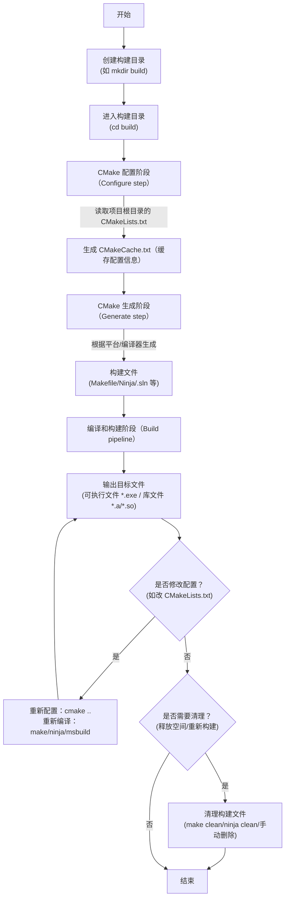

# CMake 构建流程

原文地址：[https://www.runoob.com/cmake/cmake-build-flow.html](https://www.runoob.com/cmake/cmake-build-flow.html)

CMake 构建流程是一套标准化的跨平台项目构建管理流程，核心目标是通过配置文件（`CMakeLists.txt`）生成适配不同平台/编译器的构建文件，最终完成项目编译与目标生成。流程整体分为**创建构建目录、生成构建文件、编译和构建、清理构建文件、重新配置和构建**5个关键步骤，支持“Out-of-source”（源码外）构建以保持源码目录整洁。

## 一、CMake 构建流程总览（Mermaid 流程图）



## 二、各步骤详细说明

### 1. 创建构建目录

#### 核心目的

采用 **“Out-of-source”（源码外）构建** 模式，将构建过程中产生的中间文件（如目标文件、日志）、构建配置文件（如 `CMakeCache.txt`）集中放在独立目录中，**避免污染源代码目录**，同时支持多套构建配置（如 Debug/Release、GCC/CLANG）的隔离管理。

#### 具体操作（以 Linux/macOS 为例）

1. **创建构建目录**：在项目根目录（需包含 `CMakeLists.txt`）下，创建名为 `build` 的目录（名称可自定义，如 `build_debug`）：

   ```bash
   mkdir build
   ```

2. **进入构建目录**：后续所有 CMake 配置、编译命令均在此目录执行，确保构建文件集中存放：

   ```bash
   cd build
   ```

#### 多配置隔离示例

通过创建不同名称的构建目录，可轻松管理多套配置：

- `build_debug_gcc`：GCC 编译器的 Debug 构建（带调试信息，无优化）
- `build_release_gcc`：GCC 编译器的 Release 构建（无调试信息，开启优化）
- `build_debug_clang`：CLANG 编译器的 Debug 构建

### 2. 使用 CMake 生成构建文件

#### 核心目的

根据项目根目录的 `CMakeLists.txt`（CMake 核心配置文件，定义项目名称、目标、依赖、编译选项等），结合当前平台（如 Linux/Windows/macOS）和编译器（如 GCC/MSVC/CLANG），生成适配的**构建系统文件**（如 Makefile、Ninja 脚本、Visual Studio 工程 `.sln`），为后续编译构建提供依据。

#### 关键操作与命令

#### （1）基础配置命令

在构建目录中执行以下命令，指定**源代码目录**（`..` 表示上一级目录，即项目根目录，需确保该目录包含 `CMakeLists.txt`）：

```bash
cmake ..
```

- 作用：CMake 会自动检测当前平台和编译器，生成默认的构建文件（如 Linux 下默认生成 Makefile）。

#### （2）指定构建生成器（-G 选项）

若需手动指定构建系统（而非 CMake 默认选择），可通过 `-G` 选项指定“生成器”，常见示例：

- 生成 Ninja 构建文件（轻量、构建速度快，跨平台）：

  ```bash
  cmake -G "Ninja" ..
  ```

- 生成 Visual Studio 2022 工程文件（64 位）：

  ```bash
  cmake -G "Visual Studio 17 2022" -A x64 ..
  ```

- 生成 Xcode 工程文件（macOS 平台）：

  ```bash
  cmake -G "Xcode" ..
  ```

#### （3）指定构建类型（-DCMAKE_BUILD_TYPE 选项）

通过 `-DCMAKE_BUILD_TYPE` 定义构建模式，影响编译器优化级别和调试信息生成，仅支持 Makefile、Ninja 等构建系统（Visual Studio 通过解决方案配置选择）：

- **Release 模式**：开启最高级别编译器优化（`-O3`），不生成调试信息，适合生产环境：

  ```bash
  cmake -DCMAKE_BUILD_TYPE=Release ..
  ```

- **Debug 模式**：关闭编译器优化（`-O0`），生成完整调试信息（`-g`），适合开发调试：

  ```bash
  cmake -DCMAKE_BUILD_TYPE=Debug ..
  ```

#### （4）检查配置结果

CMake 执行配置命令时，会在终端输出详细日志，需重点关注：

- **成功标志**：日志末尾无 `Error` 或 `Warning`（关键警告需处理），提示“Generating done”。
- **核心信息**：
  - 找到的依赖库（如 `Found Boost: /usr/lib64/boost`）；
  - 项目定义的目标（如 `-- Build targets: MyExecutable, MyLibrary`）；
  - 编译器路径（如 `-- CMAKE_CXX_COMPILER: /usr/bin/g++`）。
- **错误处理**：若提示“Could not find XXX”（依赖缺失）或“Syntax error in CMakeLists.txt”（配置文件语法错误），需先修复再重新配置。

### 3. 编译和构建

#### 核心目的

使用上一步生成的构建文件，调用对应编译器（如 GCC、MSVC）执行**源代码编译**（`.c/.cpp` → `.o/.obj`）和**链接**（`.o/.obj` → 可执行文件/库），最终生成项目目标文件。

#### 不同构建系统的操作命令

#### （1）基于 Makefile 的构建（Linux/macOS 默认）

- **全量编译**：构建所有在 `CMakeLists.txt` 中定义的目标（可执行文件、库）：

  ```bash
  make
  ```

- **增量编译**：`make` 默认支持增量构建，仅重新编译修改过的源代码文件，提升构建效率，直接执行 `make` 即可。
- **指定目标编译**：仅构建项目中的某个特定目标（目标名需在 `CMakeLists.txt` 中通过 `add_executable`/`add_library` 定义）：

  ```bash
  # 示例：仅构建名为 MyExecutable 的可执行文件
  make MyExecutable
  ```

#### （2）基于 Ninja 的构建（跨平台，快速）

Ninja 是轻量级构建系统，构建速度优于 Makefile，命令格式与 Makefile 类似：

- **全量编译**：

  ```bash
  ninja
  ```

- **增量编译**：直接执行 `ninja`，默认支持增量构建。
- **指定目标编译**：

  ```bash
  ninja MyLibrary  # 仅构建名为 MyLibrary 的库文件
  ```

#### （3）基于 Visual Studio 的构建（Windows 平台）

支持**图形界面**和**命令行**两种方式：

- **图形界面操作**：
  1. 在构建目录中找到生成的 `.sln` 工程文件（如 `MyProject.sln`），双击打开 Visual Studio；
  2. 在顶部菜单栏选择构建配置（`Debug`/`Release`）；
  3. 点击「生成」→「生成解决方案」（或按快捷键 `Ctrl+Shift+B`）。
- **命令行操作**：使用 Visual Studio 自带的 `msbuild` 工具（需先配置 Visual Studio 命令行环境，如打开“x64 Native Tools Command Prompt”）：

  ```bash
  # 示例：以 Release 模式构建 MyProject.sln 解决方案
  msbuild MyProject.sln /p:Configuration=Release
  ```

#### 输出结果位置

编译生成的目标文件（可执行文件、库）默认存放在**构建目录根目录**（或 `Debug`/`Release` 子目录，如 Visual Studio），例如：

- Linux：`build/MyExecutable`（可执行文件）、`build/libMyLibrary.so`（动态库）；
- Windows：`build/Release/MyExecutable.exe`、`build/Debug/MyLibrary.lib`（静态库）。

### 4. 清理构建文件

#### 核心目的

删除构建过程中产生的**中间文件**（`.o/.obj`、编译日志）和**目标文件**（可执行文件、库），释放磁盘空间，或为“切换构建类型”“修改配置后重新构建”做准备。

#### 不同构建系统的清理方式

#### （1）基于 Makefile 的清理

若 CMake 生成的 `Makefile` 包含 `clean` 规则（默认生成），执行以下命令清理中间文件和目标文件（保留 `CMakeCache.txt` 和 `Makefile`）：

```bash
make clean
```

#### （2）基于 Ninja 的清理

Ninja 构建文件默认包含 `clean` 目标，执行以下命令清理：

```bash
ninja clean
```

效果与 `make clean` 一致，保留 `CMakeCache.txt` 和 Ninja 脚本。

#### （3）手动清理（彻底清理）

若需删除所有构建相关文件（包括 `CMakeCache.txt`、生成的构建文件、中间文件、目标文件），可直接删除构建目录下的所有内容（保留源代码目录不变）：

```bash
# 在项目根目录执行，删除 build 目录下所有文件（保留 build 目录本身）
rm -rf build/*
```

或直接删除整个构建目录（后续需重新创建并配置）：

```bash
rm -rf build
```

### 5. 重新配置和构建

#### 触发场景

当项目配置发生以下变化时，必须重新执行“配置→构建”流程，否则构建结果会与预期不符：

1. 修改了 `CMakeLists.txt` 文件（如添加新目标、修改编译选项 `-Wall`、更新依赖库路径）；
2. 切换构建类型（如从 Debug 改为 Release）；
3. 调整了系统环境（如更新编译器版本、修改依赖库安装路径）；
4. 新增/删除源代码文件（若 `CMakeLists.txt` 中通过 `file(GLOB)` 自动包含文件，可无需重新配置；若手动指定文件列表，需修改 `CMakeLists.txt` 后重新配置）。

#### 具体操作步骤

1. **重新配置**：在构建目录中重新执行 CMake 配置命令，更新 `CMakeCache.txt` 和构建文件：

   ```bash
   # 基础重新配置（保持原构建类型和生成器）
   cmake ..

   # 若需切换构建类型，需携带 -DCMAKE_BUILD_TYPE 选项
   cmake -DCMAKE_BUILD_TYPE=Debug ..
   ```

2. **重新编译**：使用对应构建系统的编译命令，触发增量或全量构建：
   - Makefile：`make`
   - Ninja：`ninja`
   - Visual Studio：`msbuild MyProject.sln /p:Configuration=Debug`（或图形界面重新生成）

## 三、关键概念补充

1. **CMakeLists.txt**：CMake 的核心配置文件，需放在项目根目录，定义项目名称（`project()`）、目标（`add_executable`/`add_library`）、依赖（`find_package`）、编译选项（`target_compile_options`）等。
2. **CMakeCache.txt**：CMake 配置阶段生成的缓存文件，存储依赖路径、编译器路径、构建类型等信息，避免每次配置重复检测，修改配置后需重新生成（`cmake ..` 会更新该文件）。
3. **Out-of-source 构建**：CMake 推荐的构建模式，核心是“源码目录与构建目录分离”，优势在于：
   - 清理构建文件时仅需删除构建目录，不影响源码；
   - 支持多套构建配置（如 Debug/Release）并行管理。
