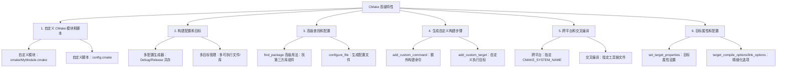

# CMake 高级特性

原文地址：[https://www.runoob.com/cmake/cmake-advanced-features.html](https://www.runoob.com/cmake/cmake-advanced-features.html)

CMake 高级特性是对基础构建流程的扩展，旨在解决复杂项目的个性化配置需求，包括模块复用、多配置管理、第三方依赖查找、自定义构建步骤、跨平台适配及目标精细化控制等场景。以下从六大核心模块展开详细说明，并通过流程图呈现各特性的逻辑关联。

## 一、CMake 高级特性整体框架（Mermaid 流程图）



## 二、各核心特性详细说明

### 1. 自定义 CMake 模块和脚本

核心目标是**复用构建逻辑**：将项目中重复的配置代码（如自定义函数、通用检查逻辑）封装为模块或脚本，减少 `CMakeLists.txt` 冗余，提升配置可维护性。

#### 1.1 自定义 CMake 模块

自定义模块是后缀为 `.cmake` 的文件，通常存放通用函数、宏或配置逻辑，需通过扩展 CMake 模块搜索路径让系统识别。

##### （1）创建步骤

1. **创建模块目录**：在项目根目录下新建 `cmake/` 文件夹（约定俗成的模块存放路径），用于集中管理自定义模块：

   ```txt
   项目结构
   ├── cmake/          # 自定义模块目录
   │   └── MyModule.cmake  # 自定义模块文件
   └── CMakeLists.txt  # 项目主配置文件
   ```

2. **编写模块内容**：在 `MyModule.cmake` 中定义函数、宏或配置逻辑，示例如下（定义一个自定义打印函数）：

   ```cmake
   # MyModule.cmake
   # 自定义函数：打印状态信息
   function(my_custom_function)
       message(STATUS "=== 执行自定义模块中的函数 ===")
       message(STATUS "项目源码目录：${CMAKE_SOURCE_DIR}")
       message(STATUS "构建目录：${CMAKE_BINARY_DIR}")
   endfunction()
   ```

3. **在主配置中引入模块**：在 `CMakeLists.txt` 中先扩展模块搜索路径（告知 CMake 去哪里找自定义模块），再加载模块：

   ```cmake
   # 1. 扩展 CMake 模块搜索路径：添加项目根目录下的 cmake/ 文件夹
   list(APPEND CMAKE_MODULE_PATH "${CMAKE_SOURCE_DIR}/cmake")
   # 2. 加载自定义模块（无需写 .cmake 后缀，CMake 会自动匹配）
   include(MyModule)
   # 3. 调用模块中的自定义函数
   my_custom_function()
   ```

##### （2）核心作用

- **逻辑复用**：多个子项目或模块可共享同一自定义模块（如通用的依赖检查函数）；
- **简化主配置**：将复杂逻辑（如跨平台编译选项判断）转移到模块，使 `CMakeLists.txt` 更简洁。

#### 1.2 使用自定义 CMake 脚本

自定义脚本是独立的 `.cmake` 文件，主要用于执行**一次性配置操作**（如环境变量设置、文件预处理），与模块的区别是：脚本更侧重“执行特定任务”，模块更侧重“提供可复用逻辑”。

##### （1）创建与调用步骤

1. **创建脚本文件**：在项目中新建脚本文件（如 `config.cmake`），编写具体配置逻辑，示例如下（设置编译宏定义）：

   ```cmake
   # config.cmake
   # 根据构建类型设置 DEBUG 宏
   if(CMAKE_BUILD_TYPE STREQUAL "Debug")
       add_definitions(-DDEBUG_MODE)  # 添加编译宏：DEBUG_MODE
       message(STATUS "已启用 Debug 模式，定义 DEBUG_MODE 宏")
   else()
       add_definitions(-DRELEASE_MODE)  # 添加编译宏：RELEASE_MODE
       message(STATUS "已启用 Release 模式，定义 RELEASE_MODE 宏")
   endif()
   ```

2. **在主配置中调用脚本**：通过 `include()` 指令直接加载脚本（需指定脚本完整路径）：

   ```cmake
   # 在 CMakeLists.txt 中调用自定义脚本
   include(${CMAKE_SOURCE_DIR}/config.cmake)
   ```

##### （2）常见使用场景

- 批量设置环境变量；
- 预处理源代码文件（如替换版本号）；
- 条件性启用编译选项（如根据系统版本开启特定功能）。

### 2. 构建配置和目标

核心目标是**精细化管理构建过程**：支持同一项目的多配置共存（如 Debug/Release），并允许定义多个独立目标（如多可执行文件、多库），满足复杂项目的构建需求。

#### 2.1 多配置生成器

多配置生成器允许在**同一构建目录**中同时支持多种构建配置（如 Debug、Release），无需创建多个构建目录（区别于基础流程的“单配置构建”），常见于 Visual Studio、Xcode 等 IDE 生成器。

##### （1）关键配置与使用

1. **设置默认构建配置**：在 `CMakeLists.txt` 中通过 `CACHE` 变量指定默认配置，支持用户后续修改：

   ```cmake
   # 设置默认构建类型为 Release，允许用户通过 cmake -DCMAKE_BUILD_TYPE=Debug 修改
   set(CMAKE_BUILD_TYPE "Release" CACHE STRING "指定构建类型：Debug/Release" FORCE)
   # 限制可选值，避免用户输入无效配置
   set_property(CACHE CMAKE_BUILD_TYPE PROPERTY STRINGS "Debug" "Release")
   ```

2. **IDE 中切换配置**：
   - **Visual Studio**：打开生成的 `.sln` 工程后，通过顶部菜单栏的“解决方案配置”下拉框选择 `Debug` 或 `Release`；
   - **Xcode**：打开 `.xcodeproj` 工程后，通过“Product → Scheme → Edit Scheme”选择构建配置。
3. **命令行切换配置**（针对 Makefile/Ninja 单配置生成器）：需重新执行 CMake 配置命令指定新配置：

   ```bash
   # 从 Release 切换为 Debug 配置
   cmake -DCMAKE_BUILD_TYPE=Debug ..
   make
   ```

##### （2）核心优势

- 减少构建目录冗余：无需创建 `build_debug`、`build_release` 等多个目录；
- IDE 友好：适配 Visual Studio/Xcode 等 IDE 的原生配置切换逻辑。

#### 2.2 构建目标

构建目标指项目中生成的可执行文件（`add_executable`）或库文件（`add_library`），CMake 支持定义多个目标，并为每个目标设置独立的构建设置（如编译宏、优化级别）。

##### （1）定义多个目标

通过多次调用 `add_executable` 或 `add_library` 定义多个目标，示例如下（生成两个可执行文件）：

```cmake
# 项目结构
# ├── src/
# │   ├── main1.cpp  # 第一个可执行文件的源码
# │   └── main2.cpp  # 第二个可执行文件的源码
# └── CMakeLists.txt

# 定义第一个可执行目标：MyExecutable1（依赖 main1.cpp）
add_executable(MyExecutable1 src/main1.cpp)
# 定义第二个可执行目标：MyExecutable2（依赖 main2.cpp）
add_executable(MyExecutable2 src/main2.cpp)
```

##### （2）为目标设置独立属性

通过 `set_target_properties` 为不同目标设置差异化配置（如编译宏、输出路径），示例如下：

```cmake
# 为 MyExecutable1 设置 Debug 宏（编译时定义 DEBUG）
set_target_properties(MyExecutable1 
    PROPERTIES 
    COMPILE_DEFINITIONS "DEBUG"  # 编译宏
    RUNTIME_OUTPUT_DIRECTORY "${CMAKE_BINARY_DIR}/bin/debug"  # 可执行文件输出路径（Debug）
)

# 为 MyExecutable2 设置 Release 宏（编译时定义 RELEASE）
set_target_properties(MyExecutable2 
    PROPERTIES 
    COMPILE_DEFINITIONS "RELEASE"  # 编译宏
    RUNTIME_OUTPUT_DIRECTORY "${CMAKE_BINARY_DIR}/bin/release"  # 可执行文件输出路径（Release）
    COMPILE_OPTIONS "-O3"  # 开启最高级别优化（仅对该目标生效）
)
```

##### （3）目标构建命令

- 构建所有目标：`make`（Makefile）、`ninja`（Ninja）、“生成解决方案”（Visual Studio）；
- 构建指定目标：`make MyExecutable1`（Makefile）、`ninja MyExecutable2`（Ninja）、`msbuild MyProject.sln /t:MyExecutable1`（Visual Studio 命令行）。

### 3. 高级查找和配置

核心目标是**高效管理第三方依赖**和**动态生成配置文件**，解决复杂项目中依赖查找的灵活性问题，以及源码与配置信息的联动需求。

#### 3.1 查找包的高级用法

`find_package()` 是 CMake 查找第三方库（如 Boost、OpenCV）的核心指令，高级用法支持指定库的“组件”、自定义查找路径，确保精准定位依赖。

##### （1）关键用法示例

1. **查找带组件的第三方库**：部分库包含多个组件（如 Boost 的 `filesystem`（文件系统）、`system`（系统接口）），可通过 `COMPONENTS` 指定所需组件，避免加载冗余库：

   ```cmake
   # 查找 Boost 库，且必须包含 filesystem 和 system 组件
   # REQUIRED：若未找到指定组件，CMake 配置失败
   find_package(Boost REQUIRED COMPONENTS filesystem system)
   
   # 若查找成功，链接到目标（MyExecutable）
   if(Boost_FOUND)
       include_directories(${Boost_INCLUDE_DIRS})  # 添加 Boost 头文件路径
       target_link_libraries(MyExecutable ${Boost_LIBRARIES})  # 链接 Boost 库
       message(STATUS "Boost 头文件路径：${Boost_INCLUDE_DIRS}")
       message(STATUS "Boost 库路径：${Boost_LIBRARIES}")
   endif()
   ```

2. **自定义依赖查找路径**：若第三方库未安装在系统默认路径（如 `/usr/lib`、`C:\Program Files`），可通过设置库的根路径变量（如 `BOOST_ROOT`、`OpenCV_DIR`）指定查找位置：

   ```cmake
   # 手动指定 Boost 库的安装根路径（如 Windows 下的 D:\boost_1_83_0）
   set(BOOST_ROOT "/path/to/boost" CACHE PATH "Boost 库安装根路径")
   
   # 基于自定义路径查找 Boost（无需指定组件，仅查找核心库）
   find_package(Boost REQUIRED)
   ```

##### （2）核心变量说明

- `XXX_FOUND`：查找结果标志（如 `Boost_FOUND`），`TRUE` 表示找到；
- `XXX_INCLUDE_DIRS`：库的头文件路径（如 `Boost_INCLUDE_DIRS`）；
- `XXX_LIBRARIES`：库的链接路径（如 `Boost_LIBRARIES`）；
- `XXX_ROOT`：库的安装根路径（需手动设置，如 `BOOST_ROOT`）。

#### 3.2 配置文件和构建选项

通过 `configure_file()` 指令，可将 CMake 中的变量（如项目版本号、构建类型）动态注入到模板文件中，生成最终的源代码配置文件（如 `config.h`），实现“配置信息与源码联动”。

##### （1）使用步骤

1. **创建配置文件模板**：新建模板文件（后缀通常为 `.in`，如 `config.h.in`），通过 `@变量名@` 标记需替换的 CMake 变量：

   ```c
   // config.h.in（模板文件）
   #ifndef CONFIG_H
   #define CONFIG_H
   
   // 项目版本号（从 CMake 变量 PROJECT_VERSION 注入）
   #define PROJECT_VERSION "@PROJECT_VERSION@"
   
   // 构建类型（从 CMake 变量 CMAKE_BUILD_TYPE 注入）
   #define BUILD_TYPE "@CMAKE_BUILD_TYPE@"
   
   // 调试模式开关（根据 CMake 变量判断）
   #if "@CMAKE_BUILD_TYPE@" == "Debug"
       #define ENABLE_DEBUG 1
   #else
       #define ENABLE_DEBUG 0
   #endif
   
   #endif // CONFIG_H
   ```

2. **生成最终配置文件**：在 `CMakeLists.txt` 中调用 `configure_file()`，将模板文件转换为源码可包含的配置文件（默认生成到构建目录）：

   ```cmake
   # 项目版本号（需在 project() 中定义）
   project(MyProject VERSION 1.0.0)
   
   # 生成 config.h：输入模板为 config.h.in，输出为 config.h（路径：${CMAKE_BINARY_DIR}/config.h）
   configure_file(
       ${CMAKE_SOURCE_DIR}/config.h.in  # 输入模板路径
       ${CMAKE_BINARY_DIR}/config.h    # 输出文件路径（构建目录）
       @ONLY  # 仅替换 @变量名@ 标记的内容，避免替换系统环境变量（如 $HOME）
   )
   
   # 告知编译器配置文件所在路径（否则源码无法找到 config.h）
   include_directories(${CMAKE_BINARY_DIR})
   ```

3. **在源码中使用配置文件**：直接包含生成的 `config.h`，即可使用动态注入的配置信息：

   ```cpp
   // main.cpp
   #include <iostream>
   #include "config.h"  // 包含生成的配置文件
   
   int main() {
       std::cout << "项目版本：" << PROJECT_VERSION << std::endl;
       std::cout << "构建类型：" << BUILD_TYPE << std::endl;
       
       #if ENABLE_DEBUG
           std::cout << "当前为 Debug 模式，启用调试日志" << std::endl;
       #else
           std::cout << "当前为 Release 模式，禁用调试日志" << std::endl;
       #endif
       
       return 0;
   }
   ```

##### （2）核心优势

- 配置信息动态更新：修改 CMake 变量（如版本号）后，重新配置即可自动更新 `config.h`；
- 跨平台兼容性：无需手动编写不同平台的配置文件，由 CMake 统一处理。

### 4. 生成自定义构建步骤

核心目标是**扩展构建流程**：在默认的“编译-链接”流程外，添加额外操作（如生成代码、处理资源文件、执行脚本），满足特殊项目需求（如 protobuf 代码生成、资源压缩）。

#### 4.1 自定义命令

`add_custom_command()` 用于定义“触发式”命令：仅当依赖文件变化或输出文件缺失时，才执行命令（如生成文件、编译资源），常用于“生成中间文件”的场景。

##### （1）关键参数与示例

`add_custom_command()` 核心参数：

- `OUTPUT`：命令的输出文件（若该文件不存在或依赖文件更新，命令会重新执行）；
- `COMMAND`：具体执行的命令（可调用系统命令、CMake 内置命令或外部工具）；
- `DEPENDS`：命令的依赖文件（依赖文件变化时，触发命令重新执行）；
- `COMMENT`：构建时的提示信息（可选，提升可读性）。

示例：根据输入文件 `input_file.txt` 生成 `generated_file.txt`：

```cmake
# 定义自定义命令：生成 generated_file.txt
add_custom_command(
    OUTPUT ${CMAKE_BINARY_DIR}/generated_file.txt  # 输出文件（构建目录下）
    COMMAND ${CMAKE_COMMAND} -E echo "正在生成文件..." > ${CMAKE_BINARY_DIR}/generated_file.txt  # 命令：输出文本到文件
    COMMAND ${CMAKE_COMMAND} -E cat ${CMAKE_SOURCE_DIR}/input_file.txt >> ${CMAKE_BINARY_DIR}/generated_file.txt  # 追加输入文件内容
    DEPENDS ${CMAKE_SOURCE_DIR}/input_file.txt  # 依赖文件：input_file.txt 变化时重新生成
    COMMENT "生成 generated_file.txt（依赖 input_file.txt）"  # 构建提示
)
```

##### （2）命令触发方式

自定义命令需绑定到“目标”（如可执行文件、库）或“自定义目标”才能执行，例如将生成的 `generated_file.txt` 绑定到可执行目标：

```cmake
# 定义可执行目标 MyExecutable，依赖 generated_file.txt
add_executable(MyExecutable src/main.cpp ${CMAKE_BINARY_DIR}/generated_file.txt)
```

- 当构建 `MyExecutable` 时，若 `generated_file.txt` 缺失或 `input_file.txt` 变化，会自动执行上述自定义命令。

#### 4.2 自定义目标

`add_custom_target()` 用于定义“独立式”目标：不生成可执行文件或库，仅用于执行特定命令（如清理文件、运行测试脚本），可通过手动指定目标触发执行。

##### （1）创建与执行示例

1. **创建自定义目标**：示例：定义一个目标 `generate_resources`，用于压缩资源文件：

   ```cmake
   # 定义自定义目标：generate_resources（ALL 表示默认构建所有目标时自动执行）
   add_custom_target(generate_resources ALL
       COMMAND ${CMAKE_COMMAND} -E echo "正在压缩资源文件..."  # 提示信息
       COMMAND zip -r ${CMAKE_BINARY_DIR}/resources.zip ${CMAKE_SOURCE_DIR}/resources/  # 压缩资源目录
       DEPENDS ${CMAKE_SOURCE_DIR}/resources/  # 依赖资源目录：目录内容变化时重新执行
       COMMENT "压缩资源文件到 resources.zip"  # 构建提示
   )
   ```

   - `ALL` 关键字：若添加，该目标会在执行 `make`/`ninja` 时自动执行；若不添加，需手动触发。

2. **手动执行自定义目标**：
   - Makefile：`make generate_resources`；
   - Ninja：`ninja generate_resources`；
   - 跨平台通用命令：`cmake --build . --target generate_resources`（无需区分构建系统）。

##### （2）常见使用场景

- 生成代码：调用 protobuf 编译器生成 `.pb.cc`/`.pb.h` 文件；
- 资源处理：压缩图片、编译 shader 脚本；
- 辅助操作：清理日志文件、执行代码格式化工具。

### 5. 跨平台和交叉编译

核心目标是**适配多操作系统和硬件架构**：CMake 原生支持跨平台构建（如 Linux/Windows/macOS），并通过工具链文件实现交叉编译（如为 ARM 架构构建 Linux 程序）。

#### 5.1 跨平台构建

跨平台构建指为“当前主机架构相同但操作系统不同”的环境生成构建文件（如在 Windows 上生成 Windows 程序，在 Linux 上生成 Linux 程序），CMake 会自动检测当前系统并适配。

##### （1）关键配置与示例

1. **手动指定目标系统**：若需强制生成特定系统的构建文件（如在 Linux 上为 Windows 生成 MinGW 构建文件），可通过 `-DCMAKE_SYSTEM_NAME` 指定目标系统：

   ```bash
   # 在 Linux 主机上，生成 Windows 系统的构建文件（需安装 MinGW 编译器）
   cmake -DCMAKE_SYSTEM_NAME=Windows -DCMAKE_CXX_COMPILER=x86_64-w64-mingw32-g++ ..
   ```

2. **跨平台条件判断**：在 `CMakeLists.txt` 中通过 `if(CMAKE_SYSTEM_NAME)` 判断目标系统，设置差异化配置（如链接不同系统的库）：

   ```cmake
   # 根据目标系统设置链接库
   if(CMAKE_SYSTEM_NAME STREQUAL "Linux")
       # Linux 系统：链接 pthread 库（线程库）
       target_link_libraries(MyExecutable pthread)
   elseif(CMAKE_SYSTEM_NAME STREQUAL "Windows")
       # Windows 系统：链接 winmm 库（多媒体库）
       target_link_libraries(MyExecutable winmm)
   elseif(CMAKE_SYSTEM_NAME STREQUAL "Darwin")
       # macOS 系统（Darwin 是 macOS 的内核名称）：链接 CoreFoundation 库
       target_link_libraries(MyExecutable "-framework CoreFoundation")
   endif()
   ```

##### （2）核心系统名称取值

| 目标系统 | CMAKE_SYSTEM_NAME 取值 |
|----------|-------------------------|
| Linux    | Linux                   |
| Windows  | Windows                 |
| macOS    | Darwin                  |
| Android  | Android                 |

#### 5.2 交叉编译

交叉编译指为“与当前主机架构不同”的目标平台构建程序（如在 x86_64 主机上为 ARM 架构的嵌入式设备构建 Linux 程序），核心是通过“工具链文件”指定交叉编译器和目标环境。

##### （1）工具链文件（toolchain.cmake）

工具链文件是包含交叉编译配置的 `.cmake` 文件，需定义目标系统名称、处理器架构、交叉编译器路径等关键信息，示例如下（为 ARM 架构 Linux 设备配置）：

```cmake
# toolchain.cmake（ARM 交叉编译工具链配置）
# 1. 定义目标系统名称（Linux）
set(CMAKE_SYSTEM_NAME Linux)

# 2. 定义目标处理器架构（ARM）
set(CMAKE_SYSTEM_PROCESSOR arm)

# 3. 定义交叉编译器路径（需替换为实际的 ARM 编译器路径）
set(ARM_GCC_PATH "/path/to/arm-linux-gnueabihf-gcc")
set(CMAKE_C_COMPILER ${ARM_GCC_PATH}/arm-linux-gnueabihf-gcc)    # C 编译器
set(CMAKE_CXX_COMPILER ${ARM_GCC_PATH}/arm-linux-gnueabihf-g++)  # C++ 编译器

# 4. 定义目标系统的根文件系统路径（可选，用于查找目标平台的库和头文件）
set(CMAKE_SYSROOT "/path/to/arm-rootfs")

# 5. 禁止在主机上运行目标平台的可执行文件（交叉编译时无需执行）
set(CMAKE_CROSSCOMPILING TRUE)
set(CMAKE_TRY_COMPILE_TARGET_TYPE STATIC_LIBRARY)
```

##### （2）使用工具链文件进行交叉编译

在执行 CMake 配置命令时，通过 `-DCMAKE_TOOLCHAIN_FILE` 指定工具链文件路径：

```bash
# 为 ARM 架构交叉编译：指定工具链文件 toolchain.cmake
cmake -DCMAKE_TOOLCHAIN_FILE=/path/to/toolchain.cmake ..

# 执行构建（生成 ARM 架构的可执行文件）
make
```

##### （3）核心注意事项

- 交叉编译器需与目标架构匹配（如 ARMv7 对应 `arm-linux-gnueabihf-gcc`，ARMv8 对应 `aarch64-linux-gnu-gcc`）；
- 若目标平台有独立的根文件系统（如嵌入式 Linux），需通过 `CMAKE_SYSROOT` 指定，确保 CMake 能找到目标平台的依赖库。

### 6. 目标属性和配置

核心目标是**精细化控制单个目标的编译和链接行为**：通过设置目标属性或直接指定编译/链接选项，实现“不同目标差异化配置”（如某个目标开启警告，另一个目标关闭警告）。

#### 6.1 目标属性

目标属性是描述目标特性的键值对（如编译选项、输出路径、链接库），通过 `set_target_properties()` 指令设置，支持对单个目标进行多维度配置。

##### （1）常用属性与示例

| 属性名称          | 作用                                  | 示例值                          |
|-------------------|---------------------------------------|---------------------------------|
| `COMPILE_OPTIONS` | 目标的编译选项（如警告、优化级别）    | `-Wall -Wextra`（开启所有警告） |
| `LINK_FLAGS`      | 目标的链接选项（如库搜索路径）        | `-L/path/to/custom/lib`         |
| `RUNTIME_OUTPUT_DIRECTORY` | 可执行文件的输出目录          | `${CMAKE_BINARY_DIR}/bin`       |
| `LIBRARY_OUTPUT_DIRECTORY` | 库文件的输出目录              | `${CMAKE_BINARY_DIR}/lib`       |
| `COMPILE_DEFINITIONS` | 目标的编译宏定义（如 `DEBUG`）    | `"DEBUG;ENABLE_LOG"`            |

示例：为 `MyExecutable` 设置多个属性：

```cmake
# 为 MyExecutable 设置目标属性
set_target_properties(MyExecutable
    PROPERTIES
    COMPILE_OPTIONS "-Wall -Werror"  # 开启所有警告，并将警告视为错误
    LINK_FLAGS "-L${CMAKE_SOURCE_DIR}/lib -lm"  # 链接自定义库路径 + 数学库（-lm）
    RUNTIME_OUTPUT_DIRECTORY "${CMAKE_BINARY_DIR}/bin"  # 可执行文件输出到 bin 目录
    COMPILE_DEFINITIONS "PROJECT_NAME=\"MyApp\""  # 定义编译宏：PROJECT_NAME = "MyApp"
)
```

#### 6.2 自定义编译和链接选项

除 `set_target_properties()` 外，CMake 还提供更直观的指令 `target_compile_options()` 和 `target_link_options()`，专门用于设置目标的编译和链接选项，支持指定选项的“作用域”（如 `PRIVATE`、`PUBLIC`）。

##### （1）target_compile_options()：设置编译选项

作用：为特定目标设置编译选项，支持 `PRIVATE`/`PUBLIC`/`INTERFACE` 三种作用域：

- `PRIVATE`：仅当前目标生效，依赖该目标的其他目标不继承；
- `PUBLIC`：当前目标和依赖该目标的其他目标均生效；
- `INTERFACE`：仅依赖该目标的其他目标生效，当前目标不生效。

示例：

```cmake
# 为 MyExecutable 设置 PRIVATE 编译选项：开启所有警告（-Wall）和额外警告（-Wextra）
# 仅 MyExecutable 生效，依赖它的目标（如 MyLibrary）不继承
target_compile_options(MyExecutable PRIVATE -Wall -Wextra)

# 为 MyLibrary 设置 PUBLIC 编译选项：开启 C++17 标准
# MyLibrary 和依赖它的目标（如 MyExecutable）均会启用 C++17
target_compile_options(MyLibrary PUBLIC -std=c++17)
```

##### （2）target_link_options()：设置链接选项

作用：为特定目标设置链接选项，作用域规则与 `target_compile_options()` 一致，常用于指定库搜索路径、链接额外库等。

示例：

```cmake
# 为 MyExecutable 设置 PRIVATE 链接选项：链接自定义库路径（/path/to/my/lib）
# 仅 MyExecutable 链接时生效
target_link_options(MyExecutable PRIVATE -L/path/to/my/lib)

# 为 MyLibrary 设置 PUBLIC 链接选项：链接 pthread 线程库
# MyLibrary 和依赖它的目标（如 MyExecutable）均会链接 pthread
target_link_options(MyLibrary PUBLIC -pthread)
```

##### （3）优势对比

| 指令                  | 适用场景                                  | 优势                                  |
|-----------------------|-------------------------------------------|---------------------------------------|
| `set_target_properties()` | 同时设置多个类型的目标属性（如编译+输出路径） | 功能全面，支持多属性批量设置          |
| `target_compile_options()` | 仅设置编译选项                            | 语义清晰，支持作用域控制，易维护      |
| `target_link_options()`   | 仅设置链接选项                            | 语义清晰，支持作用域控制，易维护      |

## 三、核心特性总结

CMake 高级特性围绕“灵活性”和“可维护性”设计，各特性的典型应用场景如下：

- **自定义模块/脚本**：复用构建逻辑，简化大型项目的 `CMakeLists.txt`；
- **多配置/多目标**：支持同一项目的 Debug/Release 共存，及多可执行文件独立配置；
- **高级查找/配置**：精准管理第三方依赖，动态生成配置文件；
- **自定义构建步骤**：扩展构建流程，支持代码生成、资源处理等特殊操作；
- **跨平台/交叉编译**：适配多操作系统和硬件架构，满足嵌入式、跨端开发需求；
- **目标属性配置**：精细化控制单个目标的编译/链接行为，实现差异化构建。

通过组合使用这些特性，可高效管理从简单应用到大型跨平台项目的构建流程。
