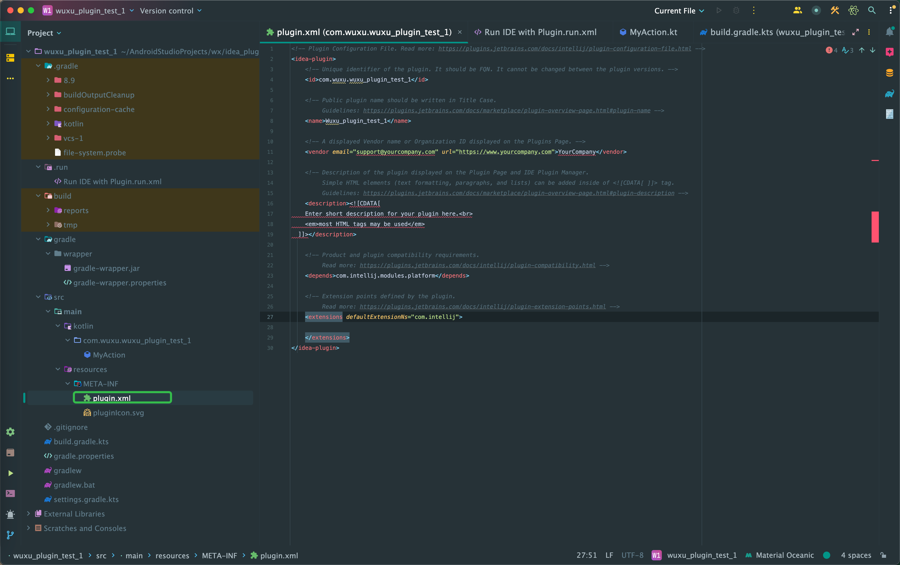

# idea插件开发

[TOC]

## 主体内容

idea插件开发需要会java和kotlin，整体开发了解下面几个关键点即可。

1. 创建项目
2. 项目目录结构
3. 学习API，开发插件
4. 打包
5. 上传插件市场、或是本地使用

---

开发 IntelliJ IDEA 插件是一项能增强 IDE 功能的技能，以下是详细的开发指南：

---

### 一、开发准备

1. **环境要求**
   - IntelliJ IDEA Ultimate 版（社区版功能受限）
   - JDK 11+
   - Gradle 7.0+（官方推荐构建工具）

2. **创建插件项目**
   - 使用 IDEA 内置模板：`File > New > Project > Gradle > IntelliJ Platform Plugin`
   - 配置 `build.gradle`：

     ```gradle
     plugins {
         id 'java'
         id 'org.jetbrains.intellij' version '1.13.3' // 最新版本参考官网
     }
     intellij {
         version = '2023.1' // 目标 IDE 版本
         type = 'IC' // IC=社区版, IU=旗舰版
     }
     ```

---

### 二、插件核心概念

1. **Plugin 入口类**

   ```java
   public class MyPlugin extends PluginApplicationComponent {
       @Override
       public void initComponent() {
           // 插件初始化逻辑
       }
   }
   ```

2. **Action 系统**
   - 用户交互入口（菜单项/工具栏按钮）

   ```java
   public class MyAction extends AnAction {
       @Override
       public void actionPerformed(@NotNull AnActionEvent e) {
           Project project = e.getProject();
           Messages.showInfoMessage("Hello Plugin!", "Greeting");
       }
   }
   ```

3. **注册组件**
   - `plugin.xml` 配置文件：

   ```xml
   <actions>
       <action id="MyAction" class="com.example.MyAction" 
               text="Show Greeting" description="Demo action">
           <add-to-group group-id="ToolsMenu" anchor="first"/>
       </action>
   </actions>
   ```

   

---

### 三、核心 API

1. **PSI (Program Structure Interface)**
   - 访问和操作代码结构

   ```java
   PsiFile psiFile = e.getData(CommonDataKeys.PSI_FILE);
   if (psiFile instanceof PsiJavaFile) {
       PsiClass[] classes = ((PsiJavaFile) psiFile).getClasses();
   }
   ```

2. **VirtualFile 系统**
   - 操作文件和目录

   ```java
   VirtualFile file = e.getData(CommonDataKeys.VIRTUAL_FILE);
   String content = new String(file.contentsToByteArray());
   ```

3. **Editor 操作**
   - 控制文本编辑器

   ```java
   Editor editor = e.getData(CommonDataKeys.EDITOR);
   Document doc = editor.getDocument();
   doc.insertString(0, "// Auto-generated comment\n");
   ```

---

### 四、调试与部署

1. **运行插件**
   - 使用 Gradle 任务：`runIde`
   - 自动启动沙盒环境（默认路径：`build/idea-sandbox`）

2. **调试技巧**
   - 断点调试与普通 Java 程序相同
   - 查看 IntelliJ 内部日志：`Help > Show Log in Explorer`

3. **打包发布**

   ```bash
   gradle buildPlugin  # 生成 plugin.zip
   gradle publishPlugin # 发布到 JetBrains 插件市场
   ```

---

### 五、高级功能

1. **自定义工具窗口**

   ```java
   public class MyToolWindow implements ToolWindowFactory {
       @Override
       public void createToolWindowContent(@NotNull Project project, 
                                        @NotNull ToolWindow toolWindow) {
           JPanel panel = new JPanel();
           panel.add(new JLabel("Custom Tool Window"));
           ContentFactory.getInstance().createContent(panel, "", false);
       }
   }
   ```

2. **设置页配置**

   ```java
   @State(name = "MySettings", storages = @Storage("my_settings.xml"))
   public class AppSettings implements PersistentStateComponent<AppSettings.State> {
       // 实现配置持久化
   }
   ```

3. **代码检测（Inspection）**

   ```java
   public class MyInspection extends LocalInspectionTool {
       @Override
       public ProblemDescriptor[] checkFile(@NotNull PsiFile file, 
                                           @NotNull InspectionManager manager,
                                           boolean isOnTheFly) {
           // 实现代码检查逻辑
       }
   }
   ```

---

### 六、最佳实践

1. **版本兼容性**
   - 在 `build.gradle` 中明确指定兼容版本范围

   ```gradle
   intellij {
       version = '2021.3' // 基础版本
       sinceBuild = '211' 
       untilBuild = '231.*'
   }
   ```

2. **性能优化**
   - 避免阻塞 UI 线程（使用 `ApplicationManager.getApplication().executeOnPooledThread()`）
   - 合理缓存 PSI 元素

3. **权限声明**

   ```xml
   <extensions defaultExtensionNs="com.intellij">
       <applicationService serviceInterface="com.example.MyService" 
                         serviceImplementation="com.example.MyServiceImpl"/>
   </extensions>
   ```

---

### 七、学习资源

1. 技术总是不断演进的，学习时直接看官网最新的文档即可：[官方插件开发文档](https://plugins.jetbrains.com/docs/intellij/welcome.html)
2. [IntelliJ Platform SDK](https://github.com/JetBrains/intellij-sdk-docs)
3. [开源插件示例](https://github.com/JetBrains/intellij-sdk-code-samples)

通过以上步骤，你可以逐步构建功能丰富的 IDEA 插件。建议从简单功能入手，逐步掌握 PSI、编辑器操作等核心 API 的使用。
