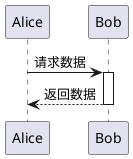
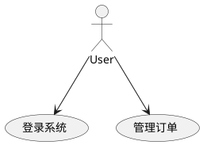

# PlantUML

PlantUML 是一款基于文本描述生成 UML 图表的开源工具，支持多种图表类型（如类图、时序图、用例图等），并可通过简单语法快速生成可视化图表。以下是其核心详解：

---

## **一、PlantUML 的核心优势**

1. **文本驱动**  
   用纯文本编写图表逻辑，易于版本控制（如 Git），方便团队协作。
2. **跨平台支持**  
   支持在线编辑器、IDE 插件（VS Code、IntelliJ 等）、命令行等多种方式。
3. **多图表类型**  
   支持 UML 标准图表（类图、时序图、活动图等）及扩展图表（甘特图、思维导图、JSON/YAML 可视化等）。
4. **自动化集成**  
   可与 Markdown、LaTeX、Confluence 等工具结合，实现文档自动化。

---

## **二、安装与使用**

1. **在线使用**  
   访问 [PlantUML 在线编辑器](https://plantuml.com/zh/)，直接编写代码并实时预览。
2. **本地安装**  
   - 需要 Java 环境和 Graphviz（用于布局渲染）：

     ```bash
     # 安装 Graphviz（以 Ubuntu 为例）
     sudo apt-get install graphviz
     ```

   - 通过 IDE 插件（如 VS Code 的 PlantUML 扩展）一键安装依赖。

---

## **三、基础语法与示例**

### **1. 类图（Class Diagram）**

```plantuml
@startuml
class User {
  -id: int
  +name: string
  +save(): void
}
class Admin --|> User  # 继承
User "1" *-- "0..*" Post  # 组合关系
@enduml
```

- `--|>` 表示继承，`*--` 表示组合关系，`+`/`-` 表示公有/私有成员。

### **2. 时序图（Sequence Diagram）**



- `->` 表示同步消息，`-->` 表示异步消息，`activate`/`deactivate` 标记生命周期。

### **3. 用例图（Use Case Diagram）**



- `actor` 定义参与者，箭头表示用例关联。

---

## **四、高级功能**

1. **样式自定义**  
   修改颜色、字体、箭头样式：

   ```plantuml
   skinparam classFontColor #red
   skinparam arrowColor blue
   ```

2. **复用组件**  
   使用 `!include` 导入外部文件：

   ```plantuml
   !include https://raw.githubusercontent.com/plantuml-stdlib/common/main/common.iuml
   ```

3. **条件与循环**  
   在活动图中使用逻辑控制：

   ```plantuml
   if (条件成立?) then (是)
     :执行操作;
   else (否)
     :结束流程;
   endif
   ```

---

## **五、常见问题**

1. **中文乱码**  
   确保使用支持中文的字体，并设置皮肤参数：

   ```plantuml
   skinparam defaultFontName "微软雅黑"
   ```

2. **布局调整**  
   使用 `hidden` 关系或手动调整元素位置：

   ```plantuml
   [组件A] -[hidden]-> [组件B]
   ```

3. **复杂图表优化**  
   分模块编写，通过 `!include` 拆分文件。

---

## **六、适用场景**

- **敏捷开发**：快速迭代设计文档。
- **技术文档**：与 Markdown 结合生成动态图表。
- **系统设计**：可视化架构和模块关系。

---

## **七、资源推荐**

- **官方文档**：[plantuml.com/zh/](https://plantuml.com/zh/)
- **示例库**：[Github PlantUML 示例](https://github.com/plantuml/plantuml-examples)
- **在线工具**：[PlantText](https://www.planttext.com/)

PlantUML 通过简洁的语法和强大的扩展性，成为开发者高效绘制技术图表的首选工具。尝试从简单图表入手，逐步掌握其丰富功能！
