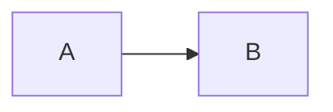
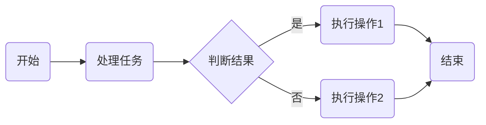
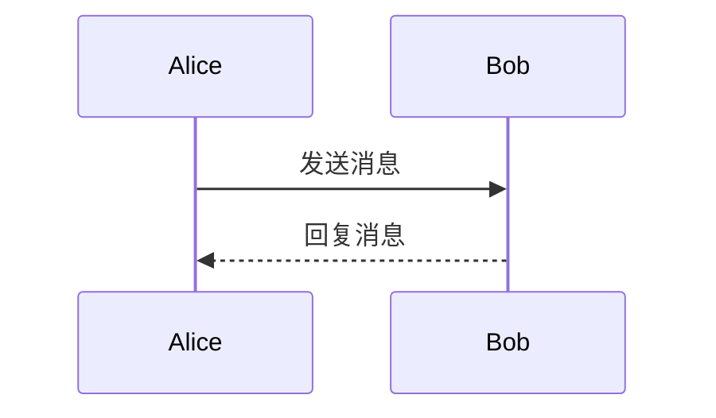
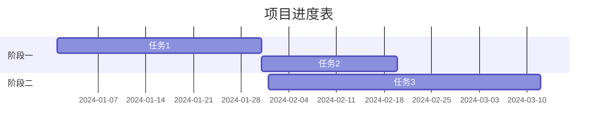
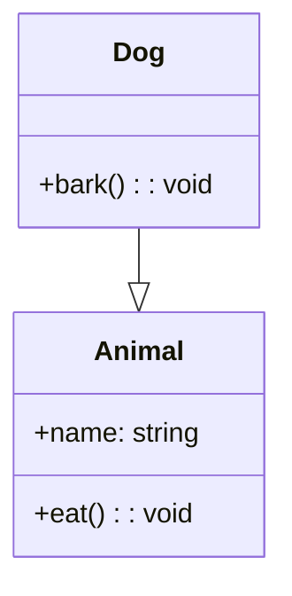
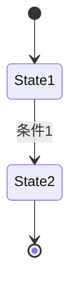
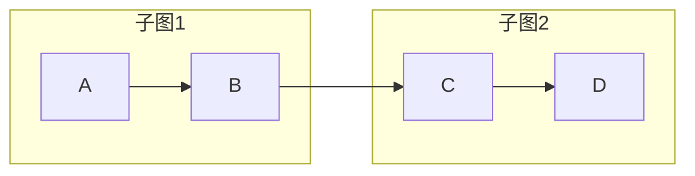

# Mermaid

Mermaid 是一个基于 JavaScript 的工具，它允许你使用文本和代码来创建各种类型的图表和可视化内容，并且能很好地集成到 Markdown 文档中。以下为你详细介绍 Mermaid 的学习内容：

## 1. 环境准备

- **Markdown 编辑器**：许多 Markdown 编辑器支持 Mermaid，例如 Typora（需要开启 Mermaid 支持）、VS Code（安装 Markdown Preview Mermaid Support 扩展）等。
- **网页端**：若要在网页中使用 Mermaid，需引入 Mermaid 的 JavaScript 库。示例代码如下：

```html
<!DOCTYPE html>
<html>

<head>
    <script src="https://cdn.jsdelivr.net/npm/mermaid/dist/mermaid.min.js"></script>
    <script>mermaid.initialize({ startOnLoad: true });</script>
</head>

<body>
    <div class="mermaid">
        graph LR;
        A --> B;
    </div>
</body>

</html>
```

## 2. 基础语法

### 2.1 代码块标识

在 Markdown 里，使用三个反引号（```）开头，紧跟 `mermaid` 关键字，来标识一个 Mermaid 代码块，结束时再用三个反引号。示例：



### 2.2 注释

使用 `%%` 来添加注释，注释不会影响图表的渲染。示例：


## 3. 不同类型图表的语法

### 3.1 流程图（Flowchart）

- **方向定义**：通过 `graph` 关键字后接方向标识符来指定流程图的方向，常见的方向有：
  - `TD`（Top - Down，从上到下）
  - `LR`（Left - Right，从左到右）
  - `BT`（Bottom - Top，从下到上）
  - `RL`（Right - Left，从右到左）

示例（从左到右的流程图）：



- **节点类型**：
  - **圆角矩形**：`A(文本)`
  - **矩形**：`A[文本]`
  - **菱形（用于决策）**：`A{文本}`
  - **圆形**：`A((文本))`
  - **不对称矩形**：`A[/文本/]` 或 `A[\文本\]`

### 3.2 序列图（Sequence Diagram）

- **参与者定义**：使用 `participant` 关键字定义参与交互的对象。
- **消息传递**：用箭头表示消息的方向，`->` 表示无箭头的线，`->>` 表示实心箭头，`-->` 表示虚线箭头。

示例：



### 3.3 甘特图（Gantt Chart）

- **日期格式**：使用 `dateFormat` 定义日期的显示格式，例如 `YYYY - MM - DD`。
- **任务定义**：格式为 `任务名 : 任务标识, 开始日期, 持续时间`。

示例：



### 3.4 类图（Class Diagram）

- **类定义**：使用 `class` 关键字定义类，类之间的关系用不同的箭头表示。
- **关系类型**：`-->` 表示关联关系，`--|>` 表示继承关系等。

示例：



### 3.5 状态图（State Diagram）

- **状态定义**：使用状态名称表示不同的状态。
- **状态转换**：用箭头表示状态之间的转换，可在箭头上添加转换条件。

示例：



## 4. 高级特性

### 4.1 样式定制

可以通过 `classDef` 定义节点样式，然后使用 `class` 关键字将样式应用到节点上。示例：


### 4.2 子图

在流程图中使用 `subgraph` 关键字创建子图，让图表结构更清晰。示例：



## 5. 学习资源

- **官方文档**：Mermaid 的官方文档（<https://mermaid-js.github.io/mermaid/#/> ）是最权威和详细的学习资源，包含了各种图表类型的详细语法和示例。
- **中文文档**：(<https://mermaid.nodejs.cn/intro/>)
- **在线编辑器**：Mermaid Live Editor（<https://mermaid.live/> ）允许你实时编写和预览 Mermaid 代码，方便进行学习和调试。
