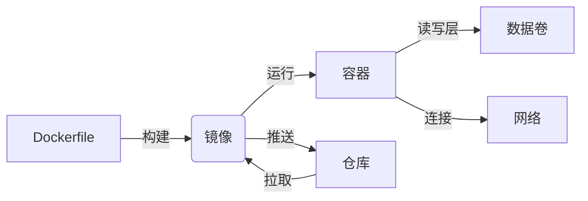

# docker

Docker是一个开源的应用容器引擎，它允许开发者打包他们的应用以及依赖包到一个轻量级、可移植的容器中，然后发布到任何流行的Linux机器上，也可以实现虚拟化。
>简单来说Docker是个容器，可以放置各种应用，包括web服务器如Nginx、Tomcat。作用就是方便跨平台，比如将web网页快速部署在各种类型系统Linux、macOS等。

以下是 **Docker 基础概念** 的清晰总结，涵盖核心组件及其关系，帮助快速理解容器化技术的基本原理：

---

## **一、核心概念**

| 概念                | 说明                                                                 | 类比                  |
|---------------------|----------------------------------------------------------------------|-----------------------|
| **镜像 (Image)**    | 静态的、只读的模板，包含运行应用所需的所有依赖（代码、环境、配置）。 | 类（Class）           |
| **容器 (Container)**| 镜像的运行实例，拥有独立的文件系统、网络和进程空间。                 | 对象（Object）        |
| **仓库 (Registry)** | 存储和分发镜像的服务器（如 Docker Hub、私有仓库）。                  | 应用商店（App Store） |
| **Dockerfile**      | 定义镜像构建步骤的文本文件（包含指令如 `FROM`, `COPY`, `RUN`）。     | 食谱（Recipe）        |
| **数据卷 (Volume)** | 持久化存储容器数据的机制，独立于容器生命周期。                       | 移动硬盘              |
| **网络 (Network)**  | 容器间通信的桥梁（支持桥接、主机、自定义网络等模式）。               | 虚拟交换机            |

---

## **二、核心概念关系**



---

## **三、详细说明**

### **1. 镜像 (Image)**

- **特点**：  
  - 只读，不可修改（通过分层存储实现复用）。  
  - 每一层代表 Dockerfile 中的一个指令。  
- **常用操作**：  

  ```bash
  docker pull ubuntu:22.04    # 拉取镜像
  docker build -t myapp:v1 .  # 构建镜像
  docker push myapp:v1        # 推送镜像到仓库
  ```

### **2. 容器 (Container)**

- **特点**：  
  - 基于镜像创建，包含一个可写层（存储运行时变化）。  
  - 资源隔离（进程、文件系统、网络）。  
- **常用操作**：  

  ```bash
  docker run -d --name web nginx      # 启动容器
  docker exec -it web /bin/bash       # 进入容器
  docker stop web && docker rm web    # 停止并删除容器
  ```

### **3. 仓库 (Registry)**

- **类型**：  
  - **公共仓库**：Docker Hub（默认）、Quay.io。  
  - **私有仓库**：Harbor、Nexus。  
- **示例**：  

  ```bash
  docker login                         # 登录 Docker Hub
  docker tag myapp:v1 user/myapp:v1    # 打标签
  docker push user/myapp:v1            # 推送镜像
  ```

### **4. Dockerfile**

- **核心指令**：  

  | 指令       | 说明                         | 示例                      |
  |------------|------------------------------|---------------------------|
  | `FROM`     | 基础镜像                     | `FROM ubuntu:22.04`       |
  | `COPY`     | 复制文件到镜像               | `COPY ./app /app`         |
  | `RUN`      | 执行命令（构建时）           | `RUN apt-get update`      |
  | `CMD`      | 容器启动时默认执行的命令     | `CMD ["python", "app.py"]`|
  | `EXPOSE`   | 声明暴露的端口               | `EXPOSE 80`               |
  | `ENV`      | 设置环境变量                 | `ENV MY_ENV=production`   |

- **示例**：  

  ```dockerfile
  # 基于 Python 镜像构建
  FROM python:3.9-slim
  # 设置工作目录
  WORKDIR /app
  # 复制依赖文件并安装
  COPY requirements.txt .
  RUN pip install -r requirements.txt
  # 复制应用代码
  COPY . .
  # 启动命令
  CMD ["gunicorn", "--bind", "0.0.0.0:8000", "app:app"]
  ```

### **5. 数据卷 (Volume)**

- **作用**：  
  - 持久化数据（如数据库文件）。  
  - 共享数据（多容器间共享配置）。  
- **操作**：  

  ```bash
  docker volume create mydata         # 创建数据卷
  docker run -v mydata:/data mysql    # 挂载数据卷
  docker volume inspect mydata        # 查看卷详情
  ```

### **6. 网络 (Network)**

- **模式**：  

  | 网络模式       | 说明                              | 适用场景                |
  |----------------|-----------------------------------|-------------------------|
  | `bridge`       | 默认桥接网络（容器间隔离）        | 单主机多容器通信        |
  | `host`         | 共享主机网络命名空间              | 高性能场景（牺牲隔离性）|
  | `overlay`      | 跨主机的容器网络（Swarm/K8s 使用）| 分布式集群              |
  | `自定义网络`   | 用户定义的桥接网络                | 精细控制容器间通信      |

- **操作**：  

  ```bash
  docker network create my-net       # 创建自定义网络
  docker run --network my-net nginx  # 容器加入网络
  ```

---

## **四、容器 vs 虚拟机**

| **特性**         | **容器**                     | **虚拟机 (VM)**            |
|------------------|------------------------------|----------------------------|
| **隔离级别**     | 进程级隔离                   | 硬件级隔离                 |
| **启动速度**     | 秒级                         | 分钟级                     |
| **资源占用**     | 低（共享主机内核）           | 高（需完整操作系统）       |
| **镜像大小**     | 通常为 MB 级                 | 通常为 GB 级               |
| **性能**         | 接近原生                     | 有 Hypervisor 开销         |
| **适用场景**     | 微服务、CI/CD、快速弹性扩展  | 完整操作系统需求、强隔离   |

---

## **五、核心优势**

1. **环境一致性**：开发、测试、生产环境使用相同镜像。  
2. **快速部署**：秒级启动，支持横向扩展。  
3. **资源高效**：共享内核，减少资源浪费。  
4. **可移植性**：一次构建，随处运行（支持 Linux/Windows/macOS）。  

---

## **六、应用场景**

1. **微服务架构**：每个服务独立容器化。  
2. **CI/CD 流水线**：快速构建测试环境。  
3. **本地开发环境**：避免“我机器上能跑”问题。  
4. **云原生应用**：Kubernetes、Serverless 的基础。  

---

通过理解这些基础概念，您将能更好地利用 Docker 实现应用的容器化部署与管理。
