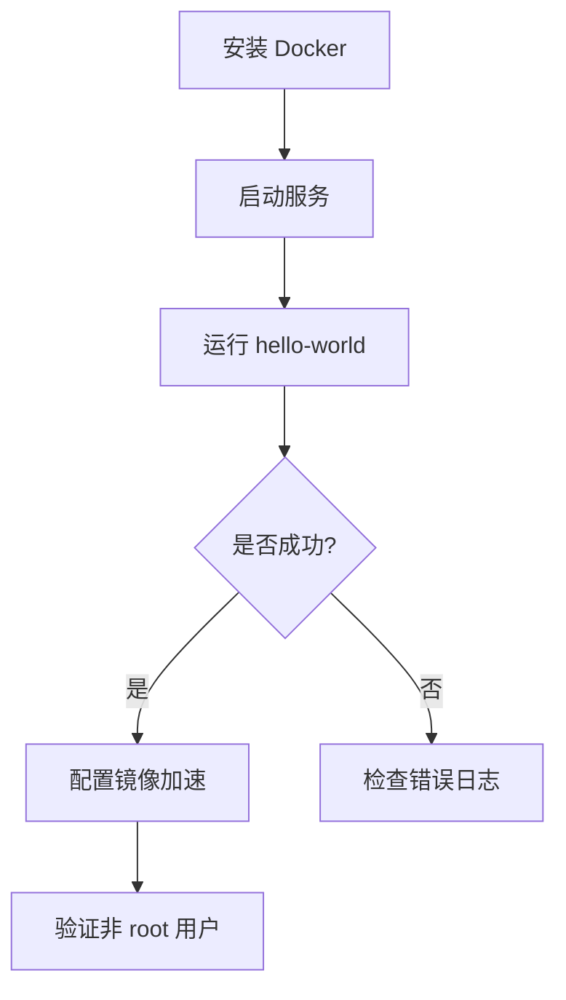

# Docker 在 Linux 系统上的安装与配置指南

以下是 **Docker 在 Linux 系统上的安装与配置指南**，以 Ubuntu/CentOS/Debian 为例：

---

## **一、安装 Docker**

### **1. 卸载旧版本（如有）**

```bash
sudo apt-get remove docker docker-engine docker.io containerd runc  # Ubuntu/Debian
sudo yum remove docker docker-client docker-client-latest docker-common docker-latest docker-latest-logrotate docker-logrotate docker-engine  # CentOS
```

### **2. 安装依赖工具**

```bash
sudo apt-get update && sudo apt-get install -y apt-transport-https ca-certificates curl gnupg lsb-release  # Ubuntu/Debian
sudo yum install -y yum-utils device-mapper-persistent-data lvm2  # CentOS
```

### **3. 添加 Docker 官方 GPG 密钥**

```bash
# Ubuntu/Debian
curl -fsSL https://download.docker.com/linux/ubuntu/gpg | sudo gpg --dearmor -o /usr/share/keyrings/docker-archive-keyring.gpg
# CentOS
sudo yum-config-manager --add-repo https://download.docker.com/linux/centos/docker-ce.repo
```

### **4. 安装 Docker 引擎**

```bash
# Ubuntu/Debian
sudo apt-get update && sudo apt-get install -y docker-ce docker-ce-cli containerd.io
# CentOS
sudo yum install -y docker-ce docker-ce-cli containerd.io
```

### **5. 启动 Docker 并设置开机自启**

```bash
sudo systemctl start docker
sudo systemctl enable docker
```

---

## **二、验证安装**

```bash
sudo docker run hello-world
```

若看到 `Hello from Docker!` 说明安装成功。

---

## **三、配置 Docker**

### **1. 允许非 root 用户使用 Docker（推荐）**

```bash
sudo usermod -aG docker $USER  # 将当前用户加入 docker 组
newgrp docker  # 刷新用户组（或重新登录）
```

### **2. 配置镜像加速器（国内用户必选）**

编辑 `/etc/docker/daemon.json`：

```json
{
  "registry-mirrors": [
    "https://registry.docker-cn.com",
    "https://mirror.ccs.tencentyun.com",
    "https://docker.mirrors.ustc.edu.cn"
  ]
}
```

重启 Docker：

```bash
sudo systemctl daemon-reload
sudo systemctl restart docker
```

### **3. 修改数据存储路径（可选）**

停止 Docker 服务后，修改 `/etc/docker/daemon.json`：

```json
{
  "data-root": "/new/path/to/docker"
}
```

迁移旧数据（若需保留）：

```bash
sudo rsync -avz /var/lib/docker/ /new/path/to/docker
```

---

## **四、Docker Compose 安装**

```bash
# 下载最新版本（替换版本号）
sudo curl -L "https://github.com/docker/compose/releases/download/v2.23.0/docker-compose-$(uname -s)-$(uname -m)" -o /usr/local/bin/docker-compose
sudo chmod +x /usr/local/bin/docker-compose
# 验证
docker-compose --version
```

---

## **五、常用配置优化**

### **1. 日志管理（限制日志大小）**

编辑 `/etc/docker/daemon.json`：

```json
{
  "log-driver": "json-file",
  "log-opts": {
    "max-size": "10m",
    "max-file": "3"
  }
}
```

### **2. 调整默认存储驱动**

查看支持的驱动：

```bash
docker info | grep "Storage Driver"
```

编辑 `/etc/docker/daemon.json`：

```json
{
  "storage-driver": "overlay2"
}
```

---

## **六、防火墙配置（CentOS/Ubuntu）**

```bash
# 开放 Docker 默认端口（如 2375/2376）
sudo ufw allow 2375/tcp
# 或直接禁用防火墙（仅测试环境）
sudo systemctl stop firewalld  # CentOS
sudo ufw disable              # Ubuntu
```

---

## **七、卸载 Docker**

```bash
# Ubuntu/Debian
sudo apt-get purge docker-ce docker-ce-cli containerd.io
sudo rm -rf /var/lib/docker
# CentOS
sudo yum remove docker-ce docker-ce-cli containerd.io
sudo rm -rf /var/lib/docker
```

---

## **附：安装验证流程图**



---

通过以上步骤，您已完成 Docker 的安装与基础配置，可开始构建容器化应用！
