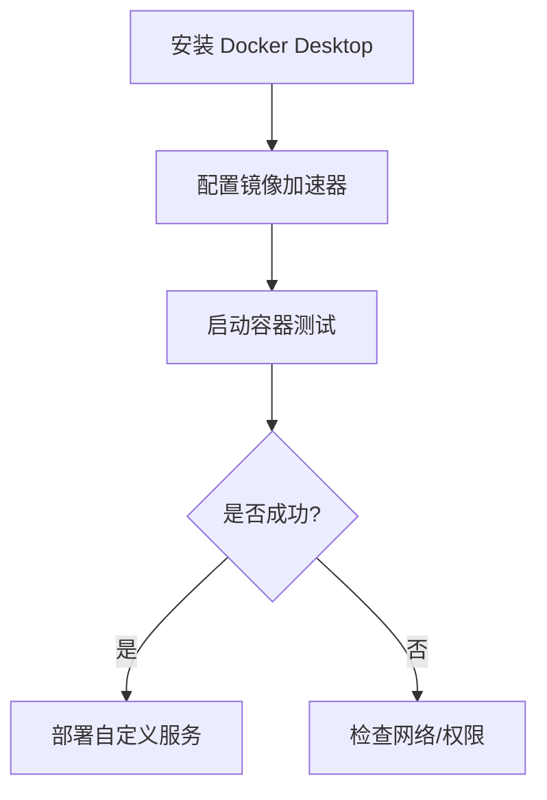

# Docker在macOS 上的安装与配置

以下是 **Docker 在 macOS 上的安装与配置指南**，涵盖 Intel 和 Apple Silicon 芯片（M1/M2/M3）的完整流程：

---

## **一、安装 Docker Desktop**

### **1. 系统要求**

- **macOS 版本**：10.15 (Catalina) 或更高（建议更新到最新版本）。
- **芯片支持**：
  - **Intel 芯片**：所有版本兼容。
  - **Apple Silicon 芯片（M1/M2/M3）**：需安装 Apple 芯片专用版本。

### **2. 下载与安装**

1. **访问官网**：  
   [https://www.docker.com/products/docker-desktop](https://www.docker.com/products/docker-desktop)
2. **选择版本**：  
   - Intel 芯片：下载 **Mac with Intel chip**。  
   - Apple Silicon 芯片：下载 **Mac with Apple chip**。  
3. **安装**：  
   - 双击下载的 `.dmg` 文件，将 Docker 图标拖入 `Applications` 文件夹。  
4. **首次启动**：  
   - 打开 `Applications` → 双击 **Docker Desktop** → 同意服务条款 → 输入系统密码授权安装。

---

## **三、验证安装**

打开终端（Terminal），运行以下命令：

```bash
docker --version          # 查看 Docker 版本
docker-compose --version  # 查看 Docker Compose 版本
docker run hello-world    # 运行测试容器
```

若看到 `Hello from Docker!` 表示安装成功。

---

## **四、配置 Docker**

### **1. 镜像加速器（国内用户必选）**

1. **图形界面配置**：  
   - 点击 Docker Desktop 右上角 **Settings**（齿轮图标）→ **Docker Engine** → 在 JSON 中添加镜像地址：  

     ```json
     {
       "registry-mirrors": [
         "https://registry.docker-cn.com",
         "https://mirror.ccs.tencentyun.com",
         "https://docker.mirrors.ustc.edu.cn"
       ]
     }
     ```

   - 点击 **Apply & Restart** 重启服务。  

2. **命令行验证**：  

   ```bash
   docker info | grep "Registry Mirrors"  # 查看是否生效
   ```

### **2. 资源分配优化**

1. **调整 CPU 和内存**：  
   - **Settings** → **Resources** → 根据需求调整 CPU 核心和内存（建议至少分配 4GB 内存）。  
2. **修改存储路径（可选）**：  
   - **Settings** → **Advanced** → 修改磁盘镜像存储位置（适用于数据盘分区）。

### **3. 启用 Kubernetes（可选）**

- **Settings** → **Kubernetes** → 勾选 **Enable Kubernetes** → 点击 **Apply & Restart**。

---

## **五、常用操作**

### **1. 启动/停止 Docker 服务**

- **启动**：双击 Docker Desktop 应用图标。  
- **停止**：右键菜单栏鲸鱼图标 → **Quit Docker Desktop**。

### **2. 管理容器和镜像**

- **命令行操作**：

  ```bash
  docker ps -a                  # 查看所有容器
  docker images                 # 查看所有镜像
  docker stop <容器ID>          # 停止容器
  docker rm <容器ID>            # 删除容器
  docker rmi <镜像名>           # 删除镜像
  ```

- **图形界面**：  
  Docker Desktop 主界面可直接管理容器、镜像和日志。

---

## **六、常见问题**

### **1. 安装失败**

- **问题**：提示“Docker cannot be installed because Apple Silicon is not supported”。  
  **解决**：确认下载的是 Apple 芯片专用版本。

### **2. 端口冲突**

- **问题**：端口被占用（如 `80` 端口被其他服务占用）。  
  **解决**：修改容器端口映射（例如 `-p 8080:80`）。

### **3. 文件挂载权限问题**

- **问题**：容器内无法访问挂载的宿主机文件。  
  **解决**：在 Docker Desktop 的 **Settings** → **Resources** → **File Sharing** 中添加项目目录。

---

## **七、卸载 Docker**

1. **关闭 Docker Desktop**：右键菜单栏鲸鱼图标 → **Quit Docker Desktop**。  
2. **卸载应用**：  
   - 打开 `Applications` → 将 Docker 拖入废纸篓。  
3. **清理残留文件**：  

   ```bash
   rm -rf ~/.docker
   rm -rf ~/Library/Containers/com.docker.docker
   sudo rm -rf /usr/local/bin/docker*
   ```

---

## **附：开发环境流程图**



---

通过以上步骤，您已在 macOS 上完成 Docker 的安装与配置，可开始构建容器化应用！

---

## IOS 启动 Docker 补充说明

Docker有自己的程序，可以通过点击图标启动程序，打开Docker界面。同时也支持命令方式启动、命令方式运行。下面是IOS的启动方式。在 macOS 系统中，启动 Docker 主要有以下几种方式：

### 1. 通过 Docker Desktop 图形界面启动

这是最简单直观的方式，适合初学者。

- **操作步骤**：
  - 打开“访达”，进入“应用程序”文件夹。
  - 找到 Docker 应用图标并双击打开。
  - 首次启动时，系统可能会提示输入管理员密码，输入密码后 Docker 会开始初始化和启动，启动完成后菜单栏会出现 Docker 图标（鲸鱼图标）。
- **特点**：操作简单，无需记忆命令，还能利用 Docker Desktop 的图形化界面管理容器、镜像等资源。

### 2. 使用命令行启动 Docker Desktop

对于习惯使用命令行的用户，可通过以下命令启动 Docker。

- **使用 `open` 命令**：
  - **前台启动**：在终端输入 `open -a Docker`，此命令会打开 Docker Desktop 应用窗口并启动 Docker 服务。
  - **后台启动**：若不想显示应用窗口，可使用 `open --background -a Docker` 命令，这样 Docker 会在后台默默启动。
- **特点**：方便快捷，可集成到脚本中实现自动化启动。

### 3. 配置开机自启

若希望每次开机时 Docker 自动启动，可进行如下设置：

- **通过 Docker Desktop 设置**：
  - 打开 Docker Desktop，点击菜单栏中的鲸鱼图标。
  - 选择“Preferences”（偏好设置），在“General”（通用）选项卡中，勾选“Start Docker Desktop when you log in”（登录时启动 Docker Desktop）。
- **使用 `launchctl` 命令（高级方式）**：
    >Linux 使用命令：`sudo systemctl` 进行服务管理，macOS 使用命令：`launchctl`。 服务管理命令可以操作docker的服务进程
  - 创建或编辑一个 `plist` 文件，例如 `com.docker.docker.plist`，内容示例如下：

  ```xml
  <?xml version="1.0" encoding="UTF-8"?>
  <!DOCTYPE plist PUBLIC "-//Apple//DTD PLIST 1.0//EN" "http://www.apple.com/DTDs/PropertyList-1.0.dtd">
  <plist version="1.0">
      <dict>
          <key>Label</key>
          <string>com.docker.docker</string>
          <key>Program</key>
          <string>/Applications/Docker.app/Contents/MacOS/Docker</string>
          <key>RunAtLoad</key>
          <true/>
          <key>KeepAlive</key>
          <true/>
      </dict>
  </plist>
  ```

  - 将该文件保存到 `~/Library/LaunchAgents/` 目录下（用户级自启），若要所有用户登录时都自启，可保存到 `/Library/LaunchDaemons/` 目录（需管理员权限）。

  - 加载配置文件，若为用户级自启，执行 `launchctl load ~/Library/LaunchAgents/com.docker.docker.plist`；若为系统级自启，需使用 `sudo launchctl load /Library/LaunchDaemons/com.docker.docker.plist`。

- **特点**：开机自动启动，无需手动干预，提高工作效率。
