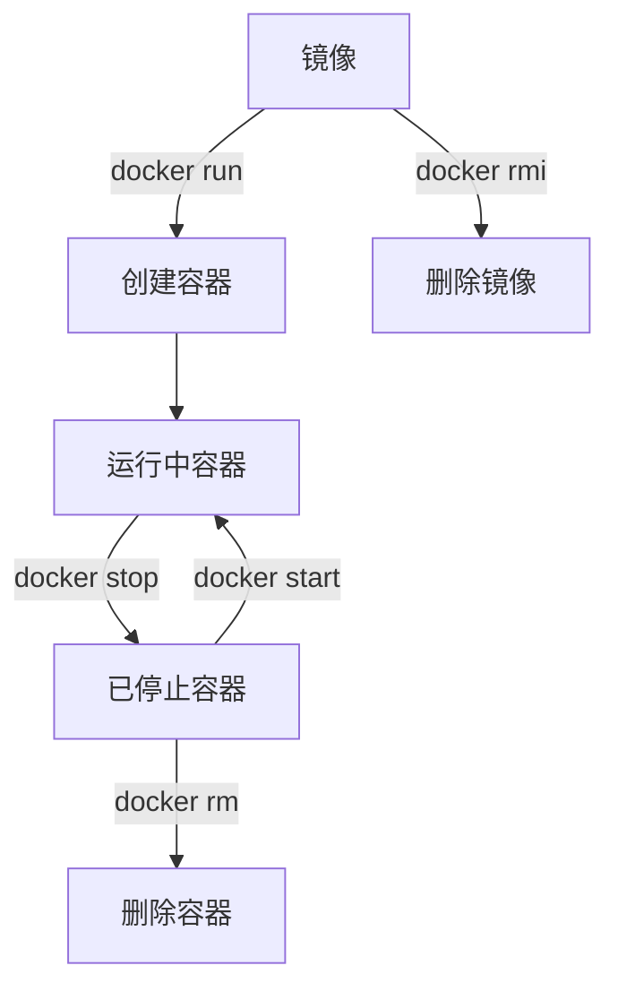

# Docker命令行基础知识

以下是Docker命令行基础知识的分类整理，包含常用命令及其说明、参数示例和注意事项：

---

## **一、镜像管理**

| 命令 | 说明 | 示例 | 参数说明 |
|------|------|------|----------|
| `docker pull` | 拉取镜像 | `docker pull nginx:latest` | `镜像名:标签`（默认标签为`latest`） |
| `docker images` | 列出本地镜像 | `docker images` | `-a` 显示所有镜像（包括中间层） |
| `docker rmi` | 删除镜像 | `docker rmi nginx` | `-f` 强制删除（慎用） |
| `docker build` | 构建镜像 | `docker build -t myapp:v1 .` | `-t` 指定标签，`.` 为Dockerfile路径 |

**示例：**

```bash
# 构建镜像并指定名称
docker build -t my-webapp:1.0 .

# 删除所有悬空镜像（未被任何容器引用的中间层）
docker image prune
```

---

## **二、容器管理**

| 命令 | 说明 | 示例 | 参数说明 |
|------|------|------|----------|
| `docker run` | 创建并启动容器 | `docker run -d -p 8080:80 --name web nginx` | `-d` 后台运行<br>`-p` 端口映射<br>`--name` 指定容器名 |
| `docker ps` | 查看运行中的容器 | `docker ps -a` | `-a` 显示所有容器（包括已停止） |
| `docker start/stop/restart` | 启动/停止/重启容器 | `docker stop web` | 容器名或ID |
| `docker exec` | 在运行中的容器中执行命令 | `docker exec -it web /bin/bash` | `-it` 交互式终端 |
| `docker rm` | 删除容器 | `docker rm web` | `-f` 强制删除运行中的容器 |

**示例：**

```bash
# 启动一个Nginx容器并挂载本地目录
docker run -d --name my-nginx -p 80:80 -v /data/html:/usr/share/nginx/html nginx

# 进入容器并执行命令
docker exec -it my-nginx bash

# 删除所有已停止的容器
docker container prune
```

---

## **三、网络管理**

| 命令 | 说明 | 示例 | 参数说明 |
|------|------|------|----------|
| `docker network ls` | 查看网络列表 | `docker network ls` |  |
| `docker network create` | 创建自定义网络 | `docker network create my-net` | `--driver` 指定驱动（默认bridge） |
| `docker network connect` | 将容器连接到网络 | `docker network connect my-net web` |  |
| `docker network inspect` | 查看网络详情 | `docker network inspect my-net` |  |

**示例：**

```bash
# 创建自定义网络并运行容器
docker network create my-net
docker run -d --name backend --network my-net my-backend:latest
```

---

## **四、数据卷管理**

| 命令 | 说明 | 示例 | 参数说明 |
|------|------|------|----------|
| `docker volume create` | 创建数据卷 | `docker volume create db-data` |  |
| `docker volume ls` | 列出数据卷 | `docker volume ls` |  |
| `docker volume inspect` | 查看卷详情 | `docker volume inspect db-data` |  |
| `docker volume rm` | 删除数据卷 | `docker volume rm db-data` |  |

**示例：**

```bash
# 运行容器并挂载数据卷
docker run -d --name mysql -v db-data:/var/lib/mysql -e MYSQL_ROOT_PASSWORD=123456 mysql:8
```

---

## **五、日志与监控**

| 命令 | 说明 | 示例 | 参数说明 |
|------|------|------|----------|
| `docker logs` | 查看容器日志 | `docker logs -f web` | `-f` 实时跟踪日志 |
| `docker stats` | 查看资源使用情况 | `docker stats` | 动态显示CPU、内存等 |
| `docker top` | 查看容器内进程 | `docker top web` | 类似Linux的`top`命令 |

**示例：**

```bash
# 实时查看日志
docker logs -f my-nginx

# 查看容器资源占用
docker stats --no-stream
```

---

## **六、系统清理**

| 命令 | 说明 | 示例 | 参数说明 |
|------|------|------|----------|
| `docker system prune` | 清理无用资源 | `docker system prune -a` | `-a` 删除所有未使用的镜像（谨慎使用） |

**示例：**

```bash
# 清理所有停止的容器、悬空镜像和未使用的网络
docker system prune
```

---

## **七、常用参数速查**

| 参数 | 说明 | 适用命令 |
|------|------|----------|
| `-d` | 后台运行容器 | `docker run` |
| `-it` | 交互式终端（通常与`/bin/bash`配合） | `docker run`, `docker exec` |
| `-p` | 端口映射（格式：`宿主机端口:容器端口`） | `docker run` |
| `-v` | 挂载卷或目录（格式：`宿主机路径:容器路径`） | `docker run` |
| `-e` | 设置环境变量（如`-e MYSQL_ROOT_PASSWORD=123`） | `docker run` |
| `--name` | 指定容器名称 | `docker run` |

---

## **八、常见误区与注意事项**

1. **`docker run` vs `docker start`**  
   - `run`：从镜像创建**新**容器并启动。  
   - `start`：重启**已存在**的停止状态容器。

2. **删除容器前需停止**  

   ```bash
   docker stop web && docker rm web  # 先停止再删除
   docker rm -f web                 # 强制删除运行中的容器
   ```

3. **镜像与容器的依赖关系**  
   - 若镜像被容器使用，需先删除容器才能删除镜像。

4. **数据持久化**  
   - 容器内数据默认随容器删除而丢失，务必通过**卷（Volume）**或**绑定挂载**持久化。

5. **避免使用`latest`标签**  
   - 生产环境应明确指定镜像版本（如`nginx:1.23`），避免版本冲突。

---

## **九、快速参考流程图**



---

通过掌握这些基础命令，您可以高效管理Docker容器、镜像及资源，为复杂应用的容器化部署打下基础。
