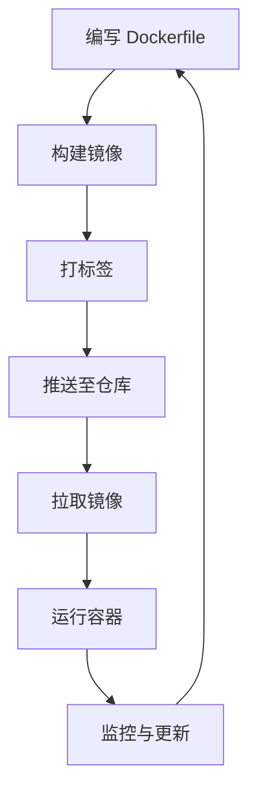

# Docker 镜像构建与管理

以下是关于 **Docker 镜像构建与管理** 的详细指南，涵盖核心操作、优化技巧及常见问题处理：

---

## **一、镜像构建核心操作**

### **1. 使用 Dockerfile 构建镜像**

```bash
docker build -t myapp:v1 .  # 构建并打标签
docker build -f Dockerfile.prod .  # 指定 Dockerfile 文件
```

### **2. 多阶段构建（优化镜像体积）**

```dockerfile
# 第一阶段：构建环境
FROM node:18 AS builder
WORKDIR /app
COPY package.json .
RUN npm install
COPY . .
RUN npm run build

# 第二阶段：生产环境
FROM nginx:alpine
COPY --from=builder /app/dist /usr/share/nginx/html
```

### **3. 构建参数（ARG）与动态配置**

```dockerfile
ARG VERSION=1.0
ENV APP_VERSION=$VERSION
```

```bash
docker build --build-arg VERSION=2.0 -t myapp:v2 .
```

---

## **二、镜像管理操作**

### **1. 查看镜像信息**

```bash
docker images                     # 列出所有镜像
docker image inspect myapp:v1     # 查看镜像详情
docker history myapp:v1           # 查看镜像构建历史
```

### **2. 镜像标签与推送**

```bash
docker tag myapp:v1 registry.example.com/myapp:v1  # 打标签
docker push registry.example.com/myapp:v1          # 推送到仓库
docker pull registry.example.com/myapp:v1          # 拉取镜像
```

### **3. 清理镜像**

```bash
docker rmi myapp:v1                # 删除单个镜像
docker image prune                 # 删除悬空镜像（未被任何容器引用）
docker system prune -a             # 清理所有未使用的镜像和缓存
```

---

## **三、镜像优化技巧**

### **1. 减小镜像体积**

- **选择轻量基础镜像**：如 `alpine`、`slim` 版本。

  ```dockerfile
  FROM python:3.11-slim  # 替代完整版镜像
  ```

- **合并 RUN 指令**：减少层数并清理缓存。

  ```dockerfile
  RUN apt-get update && \
      apt-get install -y curl && \
      rm -rf /var/lib/apt/lists/*
  ```

### **2. 利用构建缓存**

- **固定顺序**：将变动频繁的操作（如 `COPY . .`）放在后面。

  ```dockerfile
  COPY requirements.txt .
  RUN pip install -r requirements.txt  # 依赖安装优先
  COPY . .                             # 代码变动频繁放最后
  ```

### **3. 使用 `.dockerignore` 文件**

- 排除无关文件（如日志、临时文件）：

  ```text
  node_modules
  *.log
  .git
  ```

---

## **四、镜像安全管理**

### **1. 漏洞扫描**

```bash
docker scan myapp:v1  # 使用 Docker Scout（原 Snyk 集成）
```

### **2. 最小化运行时权限**

```dockerfile
RUN groupadd -r appuser && useradd -r -g appuser appuser
USER appuser  # 避免以 root 用户运行
```

### **3. 更新基础镜像**

- 定期更新 `FROM` 中的基础镜像版本，确保安全补丁。

---

## **五、镜像存储与分发**

### **1. 使用镜像仓库**

- **公共仓库**：Docker Hub、GitHub Container Registry。
- **私有仓库**：Harbor、Nexus、AWS ECR。

### **2. 多架构镜像构建**

```bash
# 安装 buildx 插件
docker buildx create --use
# 构建同时支持 amd64 和 arm64 的镜像
docker buildx build --platform linux/amd64,linux/arm64 -t myapp:multi-arch .
```

---

## **六、常见问题处理**

### **1. 构建时依赖安装失败**

- **解决**：检查网络代理或使用国内镜像源。

  ```dockerfile
  RUN npm config set registry https://registry.npmmirror.com
  ```

### **2. 镜像体积过大**

- **解决**：使用多阶段构建，删除临时文件。

### **3. 容器内时区不对**

```dockerfile
ENV TZ=Asia/Shanghai
RUN ln -snf /usr/share/zoneinfo/$TZ /etc/localtime && echo $TZ > /etc/timezone
```

### **4. 镜像拉取速度慢**

- **解决**：配置镜像加速器（修改 `/etc/docker/daemon.json`）。

  ```json
  {
    "registry-mirrors": ["https://mirror.ccs.tencentyun.com"]
  }
  ```

---

## **七、镜像管理流程图**



---

通过以上操作和优化策略，您可以高效构建、管理和维护 Docker 镜像，确保应用在容器化环境中的稳定性和安全性。
