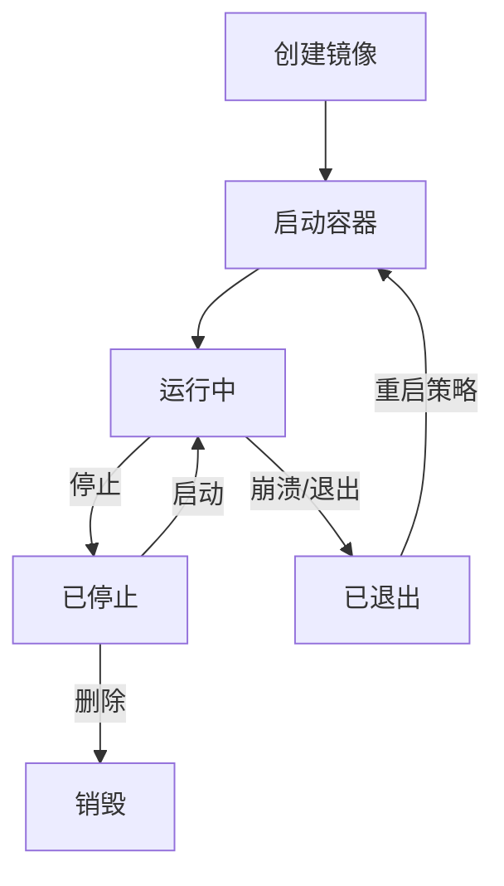
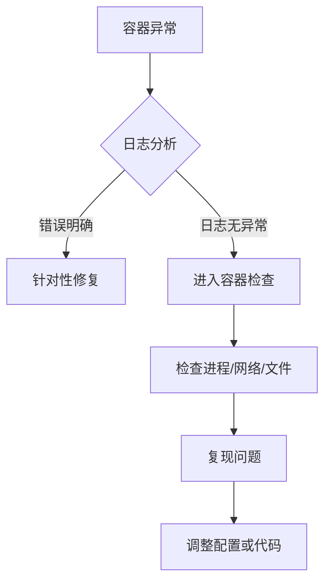

# Docker 容器操作实践

以下是 **Docker 容器操作实践** 的详细指南，涵盖容器生命周期管理、调试技巧、网络与数据操作及常见问题处理：

---

## **一、容器生命周期管理**

### **1. 容器启动**

| 场景 | 命令示例 | 说明 |
|------|----------|------|
| 基础启动 | `docker run -d --name web nginx` | `-d` 后台运行，`--name` 指定容器名 |
| 端口映射 | `docker run -d -p 8080:80 --name web nginx` | 宿主机 8080 → 容器 80 端口 |
| 挂载数据卷 | `docker run -d -v /data:/app/data --name app myapp` | 宿主机目录 `/data` → 容器 `/app/data` |
| 环境变量 | `docker run -d -e DB_HOST=mysql --name app myapp` | 设置容器内环境变量 |
| 资源限制 | `docker run -d --memory=512m --cpus=1 --name app myapp` | 限制内存和 CPU 使用 |

**示例：**

```bash
# 启动一个 Redis 容器并持久化数据
docker run -d --name redis \
  -p 6379:6379 \
  -v redis-data:/data \
  redis:7.0 \
  redis-server --save 60 1
```

---

## **二、容器网络配置**

### **1. 容器间通信**

```bash
# 创建自定义网络
docker network create my-net

# 启动两个容器并加入同一网络
docker run -d --name web --network my-net nginx
docker run -d --name api --network my-net my-api

# 容器内通过服务名通信（如 `ping web`）
```

### **2. 端口暴露与映射**

```bash
# 查看容器映射的端口
docker port web  # 查看容器 web 的端口映射

# 随机映射端口
docker run -d -p 80 --name web nginx
```

---

## **三、数据持久化**

### **1. 挂载宿主机目录**

```bash
# 挂载本地目录到容器
docker run -d --name mysql \
  -v /data/mysql:/var/lib/mysql \
  -e MYSQL_ROOT_PASSWORD=123456 \
  mysql:8.0
```

### **2. 使用命名卷**

```bash
# 创建数据卷
docker volume create db-data

# 挂载数据卷
docker run -d --name mysql \
  -v db-data:/var/lib/mysql \
  mysql:8.0
```

---

## **四、容器监控与调试**

### **1. 查看日志**

```bash
docker logs web          # 查看日志
docker logs -f web       # 实时跟踪日志
docker logs --tail=100 web # 查看最后 100 行
```

### **2. 进入容器调试**

```bash
docker exec -it web /bin/bash   # 进入容器执行 bash
docker exec web ls /app         # 不进入容器直接执行命令
```

### **3. 资源监控**

```bash
docker stats           # 实时查看所有容器资源使用
docker top web         # 查看容器内进程
docker inspect web     # 查看容器详细信息（JSON 格式）
```

---

## **五、常见问题处理**

### **1. 容器启动失败**

```bash
# 查看失败原因
docker logs web

# 以交互模式启动排查
docker run -it --rm myapp sh
```

### **2. 容器网络不通**

```bash
# 检查容器 IP 和网络配置
docker inspect web | grep IPAddress
docker network inspect my-net

# 临时暴露端口调试
docker run -it --rm --network container:web nicolaka/netshoot netstat -tulnp
```

### **3. 容器磁盘空间不足**

```bash
# 清理容器内临时文件
docker exec web sh -c 'rm -rf /tmp/*'

# 扩展数据卷容量（需修改宿主机存储驱动配置）
```

---

## **六、最佳实践**

1. **容器清洁化**  

   ```bash
   # 停止并删除所有容器
   docker stop $(docker ps -aq) && docker rm $(docker ps -aq)
   ```

2. **使用非 root 用户**  

   ```dockerfile
   RUN useradd -m appuser && chown -R appuser /app
   USER appuser
   ```

3. **资源限制**  

   ```bash
   docker run -d --memory=1g --cpus=2 --name app myapp
   ```

4. **容器健康检查**  

   ```dockerfile
   HEALTHCHECK --interval=30s --timeout=3s \
     CMD curl -f http://localhost/health || exit 1
   ```

---

## **七、操作流程图**

### **容器生命周期**



### **调试流程**



---

通过以上实践指南，您可以高效管理 Docker 容器，快速定位和解决问题，确保应用在容器环境中的稳定运行。
