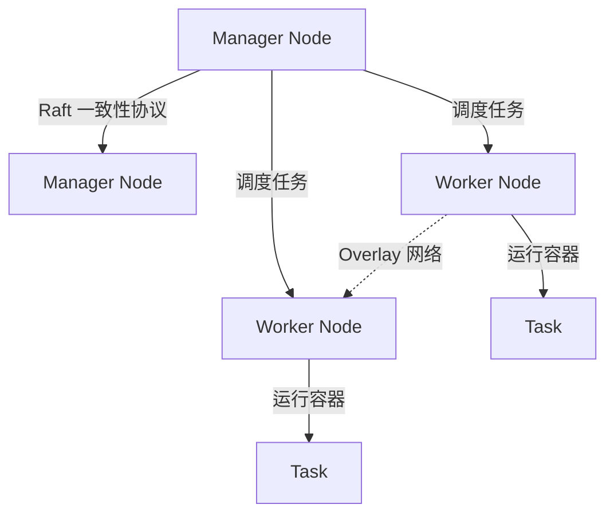

# Docker Swarm

以下是关于 **Docker Swarm** 的详细指南，涵盖核心概念、架构、操作实践及最佳应用场景，帮助您高效管理容器化应用集群：

---

## **一、Docker Swarm 核心概念**

| 概念                | 说明                                                                 |
|---------------------|----------------------------------------------------------------------|
| **节点 (Node)**     | - **Manager 节点**：管理集群状态、调度服务。<br>- **Worker 节点**：运行容器任务。 |
| **服务 (Service)**  | 定义容器副本数、镜像、端口等，是 Swarm 的最小管理单元。              |
| **任务 (Task)**     | 服务的一个具体实例（对应一个运行的容器）。                           |
| **栈 (Stack)**      | 通过 `docker-compose.yml` 文件部署一组服务（类似多服务应用项目）。    |
| **Overlay 网络**    | 跨主机的容器通信网络，支持服务发现与负载均衡。                       |

---

## **二、Swarm 集群架构**



- **Manager 高可用**：至少 3 个 Manager 节点避免单点故障（基于 Raft 算法）。
- **服务调度**：Manager 根据资源情况将任务分配到 Worker 节点。
- **服务发现**：通过内置 DNS 实现容器间通过服务名通信。

---

## **三、Swarm 集群操作实践**

### **1. 初始化集群**

```bash
# 在 Manager 节点执行（替换为实际 IP）
docker swarm init --advertise-addr <MANAGER-IP>
# 输出示例：包含 Worker 加入命令的 token
```

### **2. 加入 Worker 节点**

```bash
# 在 Worker 节点执行（使用上一步生成的 token）
docker swarm join --token SWMTKN-xxxx <MANAGER-IP>:2377
```

### **3. 查看集群状态**

```bash
# 在 Manager 节点执行
docker node ls        # 列出所有节点
docker info           # 查看集群详情
```

---

## **四、服务管理**

### **1. 创建服务**

```bash
# 启动一个 Nginx 服务，映射端口，设置 3 个副本
docker service create \
  --name web \
  --replicas 3 \
  --publish published=8080,target=80 \
  nginx:alpine
```

### **2. 管理服务**

```bash
docker service ls                 # 查看所有服务
docker service ps web             # 查看服务副本状态
docker service scale web=5        # 扩展副本数至 5
docker service update --image nginx:latest web  # 更新镜像版本
docker service rm web             # 删除服务
```

### **3. 滚动更新与回滚**

```bash
# 分批次更新（每次更新 2 个副本，间隔 20 秒）
docker service update \
  --image nginx:1.23 \
  --update-parallelism 2 \
  --update-delay 20s \
  web

# 回滚到上一版本
docker service rollback web
```

---

## **五、网络配置**

### **1. 创建 Overlay 网络**

```bash
docker network create -d overlay my-overlay
```

### **2. 服务使用 Overlay 网络**

```bash
docker service create \
  --name api \
  --network my-overlay \
  --replicas 2 \
  my-api:latest
```

---

## **六、数据持久化**

### **1. 使用 Volume**

```bash
# 创建全局数据卷（所有节点可访问）
docker volume create db-data

# 启动服务并挂载卷
docker service create \
  --name db \
  --mount type=volume,source=db-data,target=/var/lib/mysql \
  mysql:8.0
```

### **2. 使用 Bind Mount（需文件同步）**

```bash
docker service create \
  --name app \
  --mount type=bind,source=/host/data,target=/app/data \
  myapp:latest
```

---

## **七、故障恢复与监控**

### **1. 自动故障恢复**

- **容器崩溃**：Swarm 自动重启新副本。
- **节点宕机**：Manager 将任务调度到其他健康节点。

### **2. 日志管理**

```bash
docker service logs web        # 查看服务日志
docker service logs --tail=100 -f web  # 实时跟踪最新日志
```

### **3. 节点维护**

```bash
# 排空节点（停止任务并迁移）
docker node update --availability drain <NODE-ID>

# 重新激活节点
docker node update --availability active <NODE-ID>
```

---

## **八、最佳实践**

### **1. 资源限制**

```bash
# 限制服务内存和 CPU
docker service create \
  --name app \
  --limit-memory 512M \
  --limit-cpu 1 \
  myapp:latest
```

### **2. 健康检查**

```dockerfile
# 在 Dockerfile 中定义健康检查
HEALTHCHECK --interval=30s --timeout=3s \
  CMD curl -f http://localhost/health || exit 1
```

### **3. 敏感数据管理**

```bash
# 使用 Docker Secrets 管理密码
echo "mysecret" | docker secret create db_password -
docker service create \
  --name db \
  --secret source=db_password,target=db_password \
  mysql:8.0
```

---

## **九、适用场景与限制**

### **1. 适用场景**

- 中小规模集群（通常 ≤ 50 节点）。
- 快速搭建容器化环境，无需复杂配置。
- 需要与 Docker CLI/Compose 无缝集成的场景。

### **2. 局限性**

- 功能较 Kubernetes 简单（如不支持自动扩缩容、复杂调度策略）。
- 社区生态和工具链相对较少。

---

## **十、Swarm vs Kubernetes**

| **特性**         | **Docker Swarm**                  | **Kubernetes**                     |
|------------------|-----------------------------------|------------------------------------|
| 学习曲线         | 低（Docker 原生集成）             | 高（需掌握 Pod/Deployment 等概念） |
| 集群规模         | 中小规模                          | 大规模                             |
| 功能丰富性       | 基础编排功能                      | 高级调度、自动扩缩容、CRD 扩展     |
| 部署复杂度       | 简单（一键初始化）                | 复杂（需配置控制平面、ETCD 等）    |
| 社区生态         | 较弱                              | 极强（CNCF 支持）                  |

---

## **十一、总结**

**Docker Swarm 是轻量级容器编排的理想选择**，适合需要快速搭建、管理简单且对扩展性要求不高的场景。通过结合 `docker-compose.yml` 文件和多节点调度，您能轻松实现服务的部署、扩展和更新。对于大规模或需要高级功能的场景，建议转向 Kubernetes。
