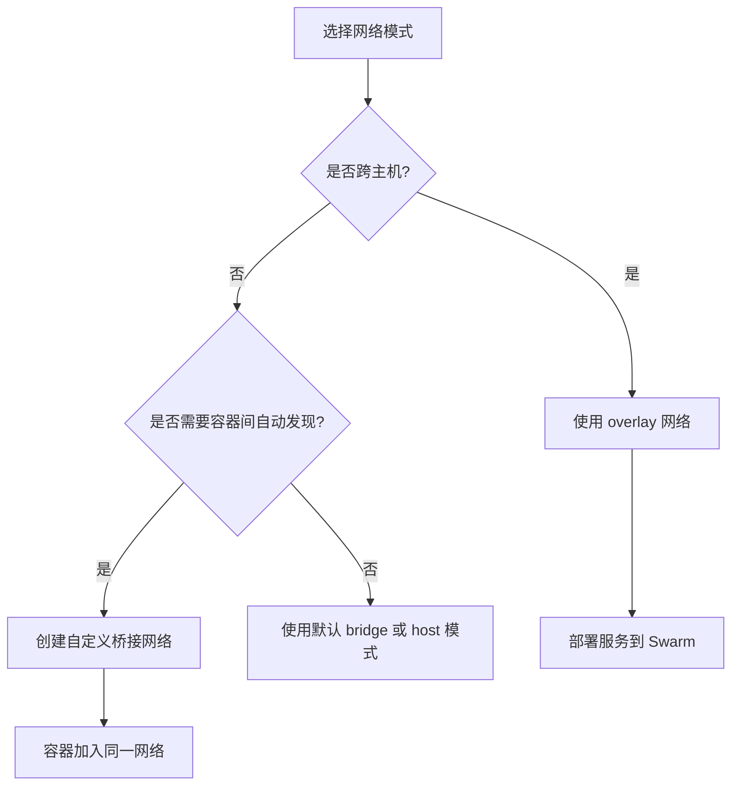

# Docker 网络配置

以下是关于 **Docker 网络配置** 的详细指南，涵盖核心概念、常见模式及实践操作，帮助您高效管理容器间的通信与网络隔离：

---

## **一、Docker 网络模式**

Docker 默认提供以下网络模式，可通过 `--network` 参数指定：

| 网络模式        | 说明                                                                 | 适用场景                        |
|-----------------|----------------------------------------------------------------------|---------------------------------|
| **bridge**      | 默认模式，容器通过虚拟网桥连接到宿主机网络（自动分配私有IP）        | 单主机内容器通信（默认选择）    |
| **host**        | 容器直接共享宿主机的网络命名空间（无隔离，性能高）                  | 高性能需求（如压测工具）        |
| **none**        | 禁用容器网络（需手动配置网络接口）                                  | 特殊安全场景                    |
| **container**   | 共享指定容器的网络命名空间                                          | 容器间紧密协作（如Sidecar模式） |
| **自定义网络**  | 用户创建的桥接/覆盖网络（支持DNS自动发现）                          | 多容器复杂通信场景              |

---

## **二、网络配置操作**

### **1. 查看现有网络**

```bash
docker network ls          # 列出所有网络
docker network inspect bridge  # 查看网络详情（如子网、网关）
```

### **2. 创建自定义网络**

```bash
# 创建桥接网络（默认驱动）
docker network create my-bridge

# 指定子网和网关
docker network create --subnet=192.168.100.0/24 --gateway=192.168.100.1 my-subnet

# 创建 overlay 网络（用于跨主机通信，需Swarm模式）
docker network create -d overlay my-overlay
```

### **3. 容器加入网络**

```bash
# 启动时指定网络
docker run -d --name web --network my-bridge nginx

# 将运行中的容器加入网络
docker network connect my-bridge web
```

### **4. 容器间通信**

- **通过容器名或服务名访问**（仅自定义网络支持DNS解析）：

  ```bash
  # 在同一网络中的容器内执行
  ping web
  curl http://api:8080
  ```

---

## **三、端口映射与外部访问**

### **1. 映射容器端口到宿主机**

```bash
docker run -d -p 8080:80 --name web nginx  # 宿主机8080 → 容器80端口
docker run -d -p 80 --name web nginx       # 随机分配宿主机端口（可通过docker port查看）
```

### **2. 暴露端口（仅声明，不自动映射）**

```dockerfile
# 在 Dockerfile 中声明
EXPOSE 80
```

```bash
# 运行时手动映射
docker run -d -p 8080:80 --name web myapp
```

---

## **四、多主机网络（Docker Swarm）**

### **1. 创建 overlay 网络**

```bash
# 初始化 Swarm 集群
docker swarm init

# 创建 overlay 网络
docker network create -d overlay my-overlay
```

### **2. 部署服务到 overlay 网络**

```bash
docker service create --name web --network my-overlay -p 80:80 nginx
```

---

## **五、网络调试工具**

### **1. 查看容器网络配置**

```bash
docker inspect web | grep IPAddress   # 查看容器IP
docker exec web ip addr              # 查看容器内网络接口
```

### **2. 跨容器网络测试**

```bash
# 使用临时容器测试网络连通性
docker run --rm -it --network my-bridge nicolaka/netshoot ping web

# 网络诊断工具包（nicolaka/netshoot）
docker run --rm -it --network container:web nicolaka/netshoot
```

---

## **六、常见问题与解决**

### **1. 容器无法访问外部网络**

- **检查宿主机防火墙**：

  ```bash
  iptables -L -n | grep DOCKER  # 查看Docker生成的规则
  systemctl stop firewalld      # 临时关闭防火墙（测试用）
  ```

### **2. 容器间无法通信**

- **确认容器在同一网络**：

  ```bash
  docker network inspect my-bridge | grep Containers
  ```

### **3. 端口冲突**

- **修改宿主机映射端口**：

  ```bash
  docker run -d -p 8081:80 --name web2 nginx
  ```

---

## **七、最佳实践**

1. **优先使用自定义网络**：  
   - 默认的 `bridge` 网络不支持DNS自动解析，建议为每个项目创建独立网络。

2. **避免使用 `host` 模式**：  
   - 除非需要极致性能，否则优先使用端口映射保证隔离性。

3. **限制容器间通信**：  

   ```bash
   # 创建网络时限制容器间访问
   docker network create --internal my-internal-net
   ```

4. **跨主机通信选择**：  
   - 单机环境：桥接网络。  
   - 多机环境：Swarm overlay 网络或第三方插件（如 Calico、Weave）。

---

## **八、网络配置流程图**



---

通过合理配置 Docker 网络，您可以实现容器间高效通信、灵活隔离及跨主机扩展，满足不同场景下的应用需求。
